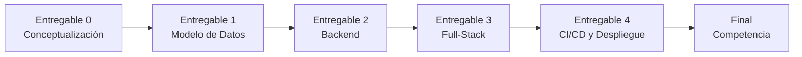

# Entregables y evaluación del curso

> [!info] Origen
> Enunciado del Proyecto Final — Programa Especializado en Fundamentos de Programación y Desarrollo Web Full-Stack.

## Objetivo general (del enunciado del curso)

Diseñar, desarrollar e implementar una aplicación web **full-stack** funcional que resuelva un problema real o una necesidad concreta de un entorno determinado (educativo, comercial, social, etc.). La solución debe incluir:

- Backend
- Frontend
- Persistencia en base de datos
- Integración continua (CI/CD)
- Despliegue en la nube

Esto define el marco dentro del cual se desarrolla [[TesisTrack]] — ver [[Objetivos]] y [[Alcance]] para cómo se traduce a este proyecto en particular.

## Organización

Total de alumnos del curso: 21 (organizados en grupos).

## Tabla de entregables

| # | Nombre | Descripción | Peso | Estado |
|---|--------|-------------|------|--------|
| 0 | Conceptualización | Documento inicial: nombre, contexto, objetivos, justificación y funcionalidades clave | No calificado (solo feedback) | 📝 contenido listo, falta el documento formal |
| 1 | Modelo de Datos | Diagrama Entidad-Relación (ER) y esquema SQL implementado | 15% | ✅ [[#Entregable 1 — Modelo de Datos (15%)\|terminado]] |
| 2 | Backend | API backend conectada a la base de datos, con documentación básica de endpoints | 20% | ✅ [[#Entregable 2 — Backend (20%)\|terminado]] |
| 3 | Aplicación Web Full-Stack | Integración de frontend y backend utilizando Java Spring Boot | 20% | 🔨 en curso — ver [[Desarrollo#Avance]] |
| 4 | CI/CD y Despliegue | Pipeline de CI/CD y despliegue funcional en AWS (u otro proveedor cloud) | 15% | ⬜ sin empezar |
| Final | Competencia Final de Desarrollo Web | Presentación final, demostración funcional, evaluación técnica y pitch del producto | 30% | ⬜ sin empezar |

> [!important] Evaluación
> - Cada entregable (excepto el 0) se califica de 0 a 20.
> - El peso porcentual total suma 100%.
> - Se evalúa calidad técnica, cumplimiento de requerimientos, claridad en la documentación y presentación.
> - La nota final es la media ponderada de los entregables evaluables.

## Entregable 0 — Conceptualización (requisitos)

No calificado, pero define la base del proyecto y recibe feedback personalizado del profesor. Debe contener:

1. **Nombre del proyecto** — claro, representativo del propósito de la solución → ver [[TesisTrack#TesisTrack|nombre definido]]
2. **Contexto** — entorno donde se identificó la necesidad → [[Contexto]]
3. **Objetivos** — qué se pretende lograr → [[Objetivos]]
4. **Justificación** — por qué el problema es relevante → cubierto en [[Problema]]
5. **Funcionalidades clave** — qué hará la aplicación → [[Funcionalidades]]

> [!success] Estado del Entregable 0
> Los contenidos ya están redactados en las notas de [[TesisTrack]] (01 - Proyecto y 02 - Requisitos). Falta consolidarlos en el documento formal a entregar y esperar la retroalimentación del profesor — ver [[Feedback profesor]].

## Entregable 1 — Modelo de Datos (15%)

> [!quote] Lo que pide el enunciado
> Entrega del **Diagrama Entidad-Relación (ER)** y el **esquema SQL implementado en base de datos**.

Qué se entrega y dónde está:

| Lo que piden | Dónde está |
|---|---|
| Diagrama ER | [[Base de datos#Diagrama Entidad-Relación]] — 8 entidades en Mermaid, con atributos y cardinalidades |
| Esquema SQL | [[Base de datos#Esquema SQL]] — DDL de PostgreSQL con claves foráneas, `CHECK` de estados e índices |
| Implementado en base de datos | Entidades JPA en `tesistrack-app/src/main/java/com/tesistrack/model/`; Hibernate crea el esquema |

> [!success] Estado — terminado el 2026-08-16
> Verificado contra PostgreSQL real, no solo compilando: se crean las **8 tablas**, las **13 claves foráneas** y el `UNIQUE (hito_id, version)`. Se cargó el flujo completo de [[Reglas de negocio#Ejemplo de flujo completo]] y se comprobó que el unique rechaza una versión duplicada.

Requirió cerrar antes las [[Decisiones pendientes|decisiones 1, 3, 5 y 6]], que eran las que afectaban al esquema. Los tres supuestos que se tomaron sin una decisión previa están marcados en [[Base de datos#Supuestos tomados al diseñar (no venían de una decisión)]] para revisarlos en grupo.

## Entregable 2 — Backend (20%)

> [!quote] Lo que pide el enunciado
> **API backend conectada a la base de datos**, con **documentación básica de endpoints**.

Qué se entrega y dónde está:

| Lo que piden | Dónde está |
|---|---|
| API backend | 25 endpoints REST sobre 7 recursos, en `tesistrack-app` (`controller/`, `service/`, `dto/`) |
| Conectada a la base de datos | Spring Data JPA sobre PostgreSQL; los repositorios están en `repository/` |
| Documentación de endpoints | [[API]] — tabla por recurso, códigos de error, ejemplos de cuerpo y diagrama del flujo completo |

> [!success] Estado — terminado el 2026-08-16
> **31 pruebas end-to-end** contra PostgreSQL real: recorren el ciclo de [[Reglas de negocio]] (hito → v1 → observación → v2 → resuelta → completado), la cadena asesoría → acuerdo → tarea, el dashboard, y cada regla de permiso incluyendo el aislamiento entre proyectos.

Lo que distingue a esta API: **la autorización se resuelve por pertenencia al proyecto, no solo por rol**. Tener rol `ASESOR` no habilita a tocar un proyecto ajeno. Ver [[Usuarios y roles#Matriz de permisos]].

Requirió cerrar antes las [[Decisiones pendientes|decisiones 2, 4, 7 y 8]], que definen qué rol puede llamar a cada endpoint.

## Tecnologías a usar

Definidas por el enunciado del curso (no opcionales, son requisito de evaluación):

| Capa | Tecnología |
|------|-----------|
| Backend + Frontend integrados | **Java Spring Boot** (entregable 3 lo exige explícitamente) |
| Base de datos | SQL (modelo ER + esquema implementado, entregable 1) |
| CI/CD | Pipeline de integración/despliegue continuo (entregable 4) |
| Despliegue / cloud | **AWS** (u otro proveedor cloud alternativo) |

Ver detalle de cómo esto se traduce a la arquitectura de TesisTrack en [[Arquitectura]].

## Relación entregables ↔ trabajo de diseño ya hecho

- Entregable 0 → [[Contexto]], [[Problema]], [[Objetivos]], [[Alcance]], [[Funcionalidades]]
- Entregable 1 → [[Base de datos]]
- Entregable 2 → [[API]], [[Arquitectura]], [[Funcionalidades]]
- Entregable 3 → [[Arquitectura]], [[Flujo del sistema]], [[Desarrollo]]
- Entregable 4 → [[Arquitectura#Despliegue y CI/CD]]

## Ver también
- [[TesisTrack]]
- [[Decisiones pendientes]]
