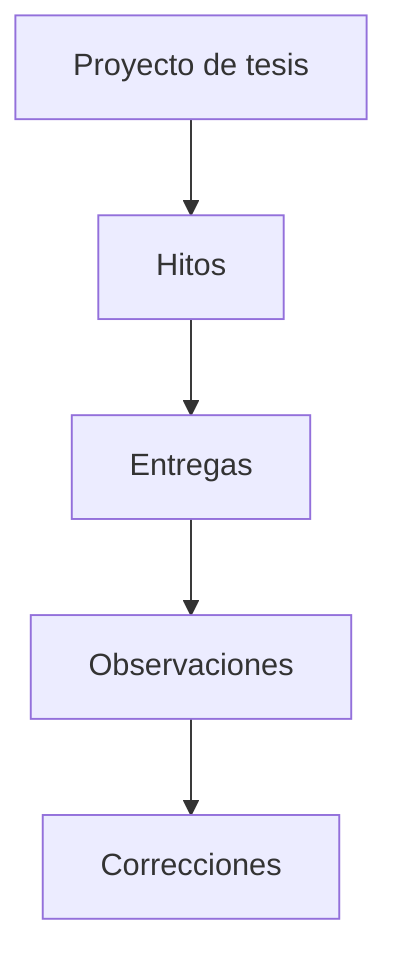
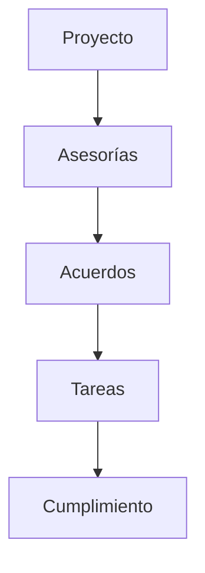
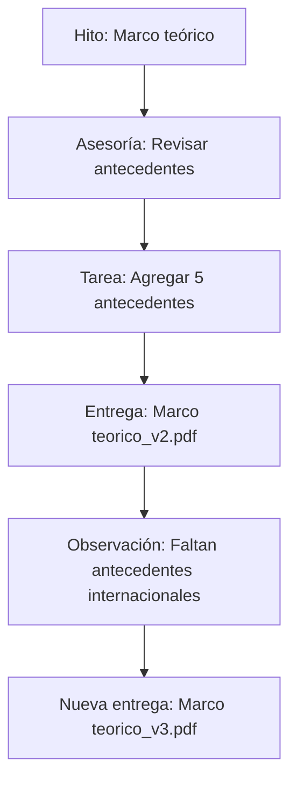
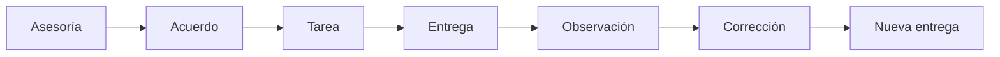

# Reglas de negocio

> [!success] Cerradas el 2026-08-16
> Estas reglas dependían de las [[Decisiones pendientes]], que ya están todas resueltas. El aviso de "en construcción" quedó desfasado y se corrigió el 2026-08-16, al construir la pantalla de Observaciones.

## Relación entre elementos

Cadena de trazabilidad de hitos y entregas:

Cadena paralela de seguimiento de asesorías:

Ambas cadenas alimentan el [[#Historial]] del proyecto.

### Ejemplo de flujo completo

> [!important]
> TesisTrack no solo debe almacenar archivos: debe permitir seguir el proceso que ocurre alrededor de esos archivos.

## Historial

Debe ser posible reconstruir el proceso completo:

Esto permite que un estudiante o asesor consulte qué ocurrió durante el desarrollo de la tesis.

## Reglas ya definidas

| Pregunta | Respuesta | Decisión |
|---|---|---|
| ¿Cómo se relaciona un hito con las entregas? | Cada entrega es una **versión nueva** del hito (v1, v2…); el número lo calcula el backend | [[Decisiones pendientes#Decisión 5 - Relación hito-entrega\|5]] |
| ¿Cómo se relacionan las observaciones con las versiones? | Cuelgan de la **entrega** que las originó, no del hito: lo observado sobre la v1 sigue siendo de la v1 | [[Decisiones pendientes#Decisión 6 - Observaciones y versiones\|6]] |
| ¿Los hitos pueden modificarse después? | Sí, los edita el asesor; solo se borran si no tienen entregas | [[Decisiones pendientes#Decisión 4 - Modificación de hitos\|4]] |

### El ciclo de corrección, en estados

Las dos transiciones automáticas que implementa el backend:

- Subir una entrega deja el hito en `ENTREGADO`, **aunque viniera `OBSERVADO`** — es la reentrega corregida.
- Registrar una observación devuelve el hito a `OBSERVADO`: hay algo que corregir.

Resolver una observación **no** cambia el estado del hito; el asesor lo cierra a mano cuando corresponde.

## Ver también
- [[Hitos]]
- [[Flujo del sistema]]
