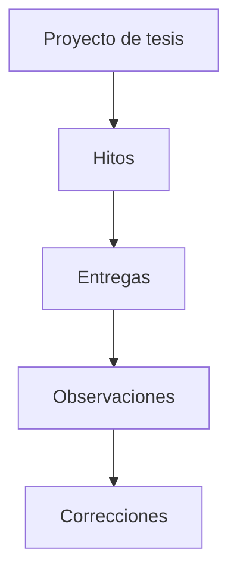
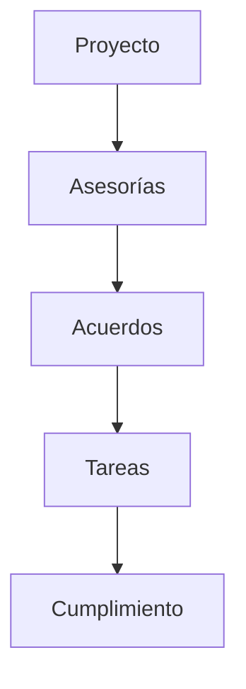
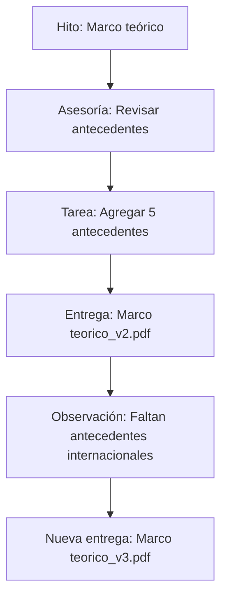
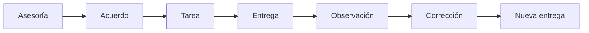

# Reglas de negocio

> [!warning] En construcción
> Estas reglas todavía no están cerradas — dependen de las [[Decisiones pendientes]].

## Relación entre elementos

Cadena de trazabilidad de hitos y entregas:

Cadena paralela de seguimiento de asesorías:

Ambas cadenas alimentan el [[#Historial]] del proyecto.

### Ejemplo de flujo completo

> [!important]
> TesisTrack no solo debe almacenar archivos: debe permitir seguir el proceso que ocurre alrededor de esos archivos.

## Historial

Debe ser posible reconstruir el proceso completo:

Esto permite que un estudiante o asesor consulte qué ocurrió durante el desarrollo de la tesis.

## Reglas pendientes de definir
- ¿Cómo se relaciona un hito con las entregas? → [[Decisiones pendientes#Decisión 5 - Relación hito-entrega]]
- ¿Cómo se relacionan las observaciones con las versiones de una entrega? → [[Decisiones pendientes#Decisión 6 - Observaciones y versiones]]
- ¿Los hitos pueden modificarse después de crear el proyecto? → [[Decisiones pendientes#Decisión 4 - Modificación de hitos]]

## Ver también
- [[Hitos]]
- [[Flujo del sistema]]
