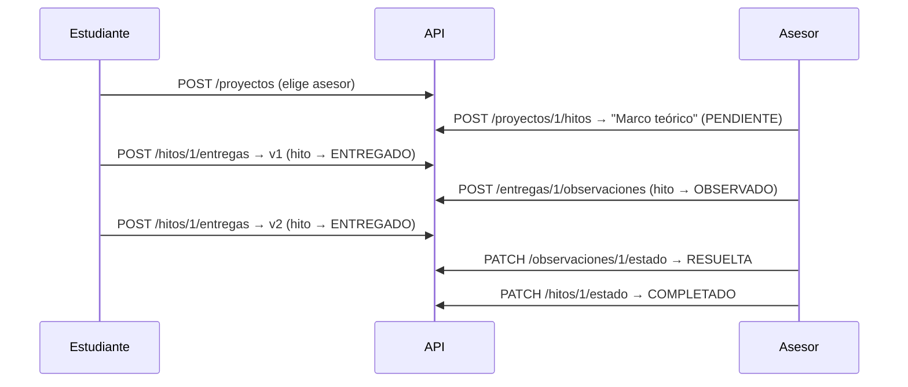

# API REST

> [!success] Estado — implementada y probada el 2026-08-16
> Cubre el [[Entregables y evaluación|Entregable 2 — Backend (20%)]]: API conectada a la base de datos + documentación de endpoints.
>
> Verificada end-to-end con 31 comprobaciones contra PostgreSQL real: el flujo completo de [[Reglas de negocio#Ejemplo de flujo completo]] más las reglas de permiso de cada rol.

Base: `http://localhost:8080/api` en desarrollo (`VITE_API_URL` en el frontend).

## Convenciones

- **Autenticación**: JWT en `Authorization: Bearer <token>`. Todo requiere token salvo `/api/auth/**` y `/api/health`.
- **Errores**: siempre JSON `{"error": "mensaje"}`.

| Código | Cuándo |
|---|---|
| `400` | Validación, JSON malformado, o regla de negocio violada (ej. borrar un hito con entregas) |
| `401` | Sin token, token inválido o expirado, credenciales incorrectas |
| `403` | Autenticado pero sin permiso sobre ese recurso |
| `404` | El recurso no existe |

> [!important] El acceso se resuelve por pertenencia, no por rol
> Tener rol `ASESOR` no habilita a tocar un proyecto ajeno: hay que ser **el** asesor de ese proyecto. Ver [[Usuarios y roles#Matriz de permisos]]. El coordinador es la única excepción: lee todo, no escribe nada.

## Autenticación

| Método | Ruta | Quién | Qué hace |
|---|---|---|---|
| `POST` | `/auth/register` | público | Crea usuario y devuelve `{token, user}`. El rol `COORDINADOR` da 400 (no es autoasignable). Acepta los datos de perfil del [[Decisiones pendientes#Decisión 9 - Qué datos personales pide el registro\|paso 2]] y exige `aceptaPolitica: true` |
| `POST` | `/auth/login` | público | Devuelve `{token, user}` |
| `GET` | `/auth/me` | autenticado | Datos del usuario del token |
| `GET` | `/auth/existe?email=…` | público, **10/min por IP** | `{ "existe": true\|false }`. Avisa en el paso 1 del registro que el correo ya tiene cuenta |

> [!important] El email se normaliza a minúsculas
> `User#setEmail` aplica `toLowerCase(Locale.ROOT)` y todos los lookups normalizan la entrada. `Ana@utec.pe` y `ana@utec.pe` son la misma cuenta. `LoginRequest` y `RegisterRequest` además recortan espacios en el constructor compacto del record, antes de que corra `@Email`.

> [!warning] `/auth/existe` está limitado a propósito
> Es un vector de enumeración de correos. Se aceptó porque `POST /register` ya filtraba el dato al responder "El email ya está registrado", pero `LimitadorConsultas` corta en 10 consultas por minuto y por IP (`429`). El límite es **en memoria y por instancia**: con varias instancias detrás de un balanceador hay que moverlo a Redis o al API Gateway.

## Usuarios

| Método | Ruta | Quién | Qué hace |
|---|---|---|---|
| `GET` | `/usuarios/asesores` | autenticado | Lista de asesores, para que el estudiante elija al crear su proyecto |
| `GET` | `/asesorados` | asesor | Una ficha por estudiante asesorado: avance en hitos, entregas por revisar, observaciones pendientes y tareas vencidas |

> [!important] `UserDto` no incluye los datos de perfil
> `telefono`, `ubicacion`, `carrera` y `organizacion` se guardan pero **no se difunden**: `UserDto` viaja embebido en cada entrega, observación, tarea y asesoría, y agregarlos ahí los publicaría en decenas de respuestas que no los necesitan.

## Áreas (carpetas del asesor)

Agrupan las tesis de un asesor y le dan un **código de invitación**. Ver [[Decisiones pendientes#Decisión 10 - Áreas del asesor|D10]] y [[Decisiones pendientes#Decisión 11 - Cómo entran los asesorados de un asesor privado|D11]].

| Método | Ruta | Quién | Qué hace |
|---|---|---|---|
| `POST` | `/areas` | asesor | Crea una carpeta y le genera un código. 400 si el nombre se repite (sin distinguir mayúsculas) |
| `GET` | `/areas` | asesor | Sus carpetas, **con** el código |
| `PUT` | `/areas/{id}` | dueño | Renombra |
| `DELETE` | `/areas/{id}` | dueño | Borra la carpeta y **desetiqueta** sus proyectos, no los borra |
| `POST` | `/areas/{id}/codigo` | dueño | Genera un código nuevo e invalida el anterior |
| `GET` | `/areas/invitacion/{codigo}` | autenticado, **10/min por IP** | Previsualiza a quién pertenece: `{ area, asesor, asesorEmail }` |

> [!important] El código no viaja en `ProyectoDto`
> El estudiante recibe el área con `AreaDto.sinCodigo(...)`. Si el código saliera ahí, cualquier asesorado podría invitar gente a la carpeta de su asesor.

Formato del código: `TT-` + 6 caracteres de un alfabeto sin `0/O`, `1/I/L`, `5/S`, `8/B` ni `2/Z`, para que se pueda dictar por teléfono sin ambigüedad.

## Actividades del espacio

La consigna que el asesor deja a todos sus asesorados de una vez. Ver [[Decisiones pendientes#Decisión 12 - Cómo se reparte una actividad a todo un espacio|D12]].

| Método | Ruta | Quién | Qué hace |
|---|---|---|---|
| `POST` | `/areas/{id}/actividades` | dueño del área | Crea la actividad y **genera un hito en cada proyecto del área** |
| `GET` | `/areas/{id}/actividades` | dueño | Lista, por `orden` |
| `DELETE` | `/areas/{id}/actividades/{aid}` | dueño | Quita la actividad. Los hitos **con entregas se desenganchan**; los intactos se borran |
| `GET` | `/areas/{id}/tablero` | dueño | Grilla asesorados × actividades con el semáforo |

```jsonc
// POST /api/areas/5/actividades
{ "nombre": "Actividad 1 — Matriz de consistencia", "descripcion": "...", "fechaLimite": "2026-09-15" }
```

> [!important] El reparto también alcanza a quien entra después
> `ProyectoService#sumarAlEspacio` —el único camino de ingreso a un área— reparte las actividades vigentes al proyecto que acaba de entrar, con una guarda que evita duplicar si alguien vuelve a usar el mismo código.

El tablero devuelve `actividades` (las columnas) aparte de `filas`, porque un estudiante que entró tarde podría no tener todas. Cada celda trae `estado` (el `EstadoHito` crudo) y `semaforo`:

| `semaforo` | Sale de |
|---|---|
| `LISTO` | `COMPLETADO` |
| `POR_REVISAR` | `ENTREGADO` |
| `OBSERVADO` | `OBSERVADO` |
| `EN_FALTA` | `PENDIENTE`/`EN_PROCESO` con `fechaLimite` pasada |
| `PENDIENTE` | `PENDIENTE`/`EN_PROCESO` en plazo |
| `SIN_ASIGNAR` | El estudiante no tiene esa actividad |

## Proyectos

| Método | Ruta | Quién | Qué hace |
|---|---|---|---|
| `POST` | `/proyectos` | estudiante | Crea su proyecto. `asesorId` y `codigoInvitacion` son opcionales; **si vienen los dos, manda el código** |
| `GET` | `/proyectos` | autenticado | Estudiante: los suyos. Asesor: los asignados. Coordinador: todos |
| `GET` | `/proyectos/{id}` | con acceso | Detalle |
| `PATCH` | `/proyectos/{id}/asesor` | estudiante del proyecto | Asigna o cambia el asesor. 400 si el usuario indicado no tiene rol `ASESOR` |
| `PATCH` | `/proyectos/{id}/unirse` | estudiante del proyecto | Se suma a una carpeta con el código: asigna asesor **y** área de una sola vez |
| `PATCH` | `/proyectos/{id}/area` | asesor del proyecto | Etiqueta la tesis en una de **sus** carpetas. `areaId: null` la quita |
| `POST` | `/proyectos/{id}/estudiantes` | estudiante del proyecto | Suma un compañero **por su correo** (tesis grupal) |
| `DELETE` | `/proyectos/{id}/estudiantes/{uid}` | estudiante del proyecto | Lo saca, o se va uno mismo. 400 si dejaría la tesis sin nadie |

> [!important] `ProyectoDto` devuelve `estudiantes` (lista), no `estudiante`
> Una tesis puede ser grupal ([[Decisiones pendientes#Decisión 15 - Tesis grupales|D15]]) y todos sus integrantes tienen los mismos permisos: cualquiera entrega, se une a un espacio y arma el grupo. La lista **nunca viene vacía**.
| `GET` | `/proyectos/{id}/dashboard` | con acceso | Resumen: próximos hitos, tareas pendientes, última entrega, observaciones pendientes, últimas 5 asesorías |

```jsonc
// POST /api/proyectos
{ "titulo": "Análisis de la asesoría académica", "descripcion": "...", "asesorId": 2 }

// POST /api/proyectos — entrando por código
{ "titulo": "Análisis de la asesoría académica", "codigoInvitacion": "TT-6HK73P" }
```

> [!note] Cambiar de asesor limpia el área
> El área pertenece al asesor. Si `PATCH /asesor` cambia efectivamente de persona, `ProyectoService` deja el área en `null`: mantenerla dejaría la tesis etiquetada en la carpeta de alguien que ya no la acompaña.

## Hitos

Los crea, edita y borra **el asesor del proyecto** ([[Decisiones pendientes#Decisión 2 - Quién crea los hitos|D2]]).

| Método | Ruta | Quién | Qué hace |
|---|---|---|---|
| `POST` | `/proyectos/{id}/hitos` | asesor del proyecto | Crea un hito. Nace en `PENDIENTE` |
| `GET` | `/proyectos/{id}/hitos` | con acceso | Lista ordenada por `orden` |
| `PUT` | `/hitos/{id}` | asesor del proyecto | Edita nombre, descripción, fecha límite y orden |
| `PATCH` | `/hitos/{id}/estado` | asesor del proyecto | Cambia el estado |
| `DELETE` | `/hitos/{id}` | asesor del proyecto | **400 si el hito ya tiene entregas** ([[Decisiones pendientes#Decisión 4 - Modificación de hitos|D4]]) |

```jsonc
// POST /api/proyectos/1/hitos
{ "nombre": "Marco teórico", "descripcion": "...", "fechaLimite": "2026-09-30", "orden": 1 }
```

Estados: `PENDIENTE` · `EN_PROCESO` · `ENTREGADO` · `OBSERVADO` · `COMPLETADO` (ver [[Hitos]]).

## Entregas

| Método | Ruta | Quién | Qué hace |
|---|---|---|---|
| `POST` | `/hitos/{id}/entregas` | estudiante del proyecto | Crea la versión. **El backend calcula el número**, el cliente no lo manda |
| `GET` | `/hitos/{id}/entregas` | con acceso | Todas las versiones, ordenadas |
| `PUT` | `/entregas/{id}/archivo` | estudiante del proyecto | Sube o reemplaza el documento (`multipart`, campo `archivo`). Máx. **15 MB** |
| `GET` | `/entregas/{id}/archivo` | con acceso | Descarga el documento |
| `PATCH` | `/entregas/{id}/estado` | asesor del proyecto | `EN_REVISION` / `OBSERVADA` / `APROBADA` |

> [!note] El archivo va en dos pasos, no en el mismo cuerpo
> Mezclar JSON y binario obliga a un `multipart` con una parte JSON, que del lado del navegador hay que armar a mano como `Blob`. Dos llamadas simples salen más baratas que una complicada, y además dejan reemplazar el documento de una entrega ya creada **sin generar una versión nueva** — la versión la marca la entrega, no el archivo.
>
> El contenido se guarda en PostgreSQL, en la tabla `archivo_entrega` ([[Decisiones pendientes#Decisión 16 - Dónde se guardan los archivos de las entregas|D16]]). `EntregaDto` trae `tieneArchivo`, `archivoTipo` y `archivoTamano`, pero **nunca los bytes**.

> [!note] Efecto sobre el hito
> Subir una entrega deja el hito en `ENTREGADO`, incluso si venía `OBSERVADO`. Es el retorno `OBSERVADO → ENTREGADO` del ciclo de corrección.

## Observaciones

Cuelgan de la **entrega concreta**, no del hito ([[Decisiones pendientes#Decisión 6 - Observaciones y versiones|D6]]).

| Método | Ruta | Quién | Qué hace |
|---|---|---|---|
| `POST` | `/entregas/{id}/observaciones` | asesor del proyecto | Registra una observación. **Deja el hito en `OBSERVADO`** |
| `GET` | `/entregas/{id}/observaciones` | con acceso | Observaciones de esa versión |
| `PATCH` | `/observaciones/{id}/estado` | asesor del proyecto | `PENDIENTE` ↔ `RESUELTA` |

## Asesorías y acuerdos

| Método | Ruta | Quién | Qué hace |
|---|---|---|---|
| `POST` | `/proyectos/{id}/asesorias` | **estudiante o asesor** del proyecto | Abre una reunión o una consulta. `registradaPor` guarda quién |
| `GET` | `/proyectos/{id}/asesorias` | con acceso | Historial, más reciente primero |
| `POST` | `/asesorias/{id}/acuerdos` | **solo el asesor** del proyecto | Registra un acuerdo de esa reunión |
| `GET` | `/asesorias/{id}/acuerdos` | con acceso | Acuerdos de la reunión |

> [!important] La asimetría es la [[Decisiones pendientes#Decisión 13 - Quién puede abrir una asesoría|Decisión 13]]
> El estudiante **abre** la asesoría —así funciona como canal de consultas— pero **no cierra**: solo el asesor convierte la conversación en acuerdo, y de ahí en tarea.
>
> `crear` usa `verificarLectura`, que también deja pasar al coordinador, así que lleva un rechazo explícito para su rol: el coordinador consulta y no escribe (Decisión 8).

```jsonc
// POST /api/proyectos/1/asesorias
{ "fecha": "2026-08-10T15:00:00Z", "tema": "Revisar antecedentes", "resumen": "..." }
```

## Tareas

| Método | Ruta | Quién | Qué hace |
|---|---|---|---|
| `POST` | `/proyectos/{id}/tareas` | asesor del proyecto | Crea una tarea. `acuerdoId` opcional; 400 si el acuerdo es de otro proyecto |
| `GET` | `/proyectos/{id}/tareas?completada=false` | con acceso | Sin el parámetro devuelve todas |
| `PATCH` | `/tareas/{id}/completar` | responsable **o** asesor | Marca completada y sella la fecha |

## Cómo se ve el flujo completo

Recorrido real que hace la prueba end-to-end, siguiendo [[Reglas de negocio#Ejemplo de flujo completo]]:



## Lo que todavía no hace

- **Los archivos no se suben**: `archivoUrl` guarda una referencia, pero no hay endpoint de upload. Falta decidir S3 vs. filesystem — ver [[Arquitectura#Por definir]].
- **Sin paginación**: los listados devuelven todo. Con el volumen de un proyecto de tesis alcanza; si crece, agregar `Pageable`.
- **Sin login con Google ni recuperación de contraseña** — ver [[Arquitectura#Por definir]].
- **El coordinador no tiene endpoints propios**: usa los mismos y ve todo por la regla de lectura global.

## Ver también
- [[Base de datos]]
- [[Usuarios y roles]]
- [[Reglas de negocio]]
- [[Arquitectura]]
