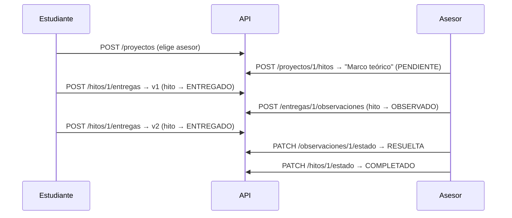

# API REST

> [!success] Estado — implementada y probada el 2026-08-16
> Cubre el [[Entregables y evaluación|Entregable 2 — Backend (20%)]]: API conectada a la base de datos + documentación de endpoints.
>
> Verificada end-to-end con 31 comprobaciones contra PostgreSQL real: el flujo completo de [[Reglas de negocio#Ejemplo de flujo completo]] más las reglas de permiso de cada rol.

Base: `http://localhost:8080/api` en desarrollo (`VITE_API_URL` en el frontend).

## Convenciones

- **Autenticación**: JWT en `Authorization: Bearer <token>`. Todo requiere token salvo `/api/auth/**` y `/api/health`.
- **Errores**: siempre JSON `{"error": "mensaje"}`.

| Código | Cuándo |
|---|---|
| `400` | Validación, JSON malformado, o regla de negocio violada (ej. borrar un hito con entregas) |
| `401` | Sin token, token inválido o expirado, credenciales incorrectas |
| `403` | Autenticado pero sin permiso sobre ese recurso |
| `404` | El recurso no existe |

> [!important] El acceso se resuelve por pertenencia, no por rol
> Tener rol `ASESOR` no habilita a tocar un proyecto ajeno: hay que ser **el** asesor de ese proyecto. Ver [[Usuarios y roles#Matriz de permisos]]. El coordinador es la única excepción: lee todo, no escribe nada.

## Autenticación

| Método | Ruta | Quién | Qué hace |
|---|---|---|---|
| `POST` | `/auth/register` | público | Crea usuario y devuelve `{token, user}`. El rol `COORDINADOR` da 400 (no es autoasignable) |
| `POST` | `/auth/login` | público | Devuelve `{token, user}` |
| `GET` | `/auth/me` | autenticado | Datos del usuario del token |

## Usuarios

| Método | Ruta | Quién | Qué hace |
|---|---|---|---|
| `GET` | `/usuarios/asesores` | autenticado | Lista de asesores, para que el estudiante elija al crear su proyecto |

## Proyectos

| Método | Ruta | Quién | Qué hace |
|---|---|---|---|
| `POST` | `/proyectos` | estudiante | Crea su proyecto. `asesorId` es opcional |
| `GET` | `/proyectos` | autenticado | Estudiante: los suyos. Asesor: los asignados. Coordinador: todos |
| `GET` | `/proyectos/{id}` | con acceso | Detalle |
| `PATCH` | `/proyectos/{id}/asesor` | estudiante del proyecto | Asigna o cambia el asesor. 400 si el usuario indicado no tiene rol `ASESOR` |
| `GET` | `/proyectos/{id}/dashboard` | con acceso | Resumen: próximos hitos, tareas pendientes, última entrega, observaciones pendientes, últimas 5 asesorías |

```jsonc
// POST /api/proyectos
{ "titulo": "Análisis de la asesoría académica", "descripcion": "...", "asesorId": 2 }
```

## Hitos

Los crea, edita y borra **el asesor del proyecto** ([[Decisiones pendientes#Decisión 2 - Quién crea los hitos|D2]]).

| Método | Ruta | Quién | Qué hace |
|---|---|---|---|
| `POST` | `/proyectos/{id}/hitos` | asesor del proyecto | Crea un hito. Nace en `PENDIENTE` |
| `GET` | `/proyectos/{id}/hitos` | con acceso | Lista ordenada por `orden` |
| `PUT` | `/hitos/{id}` | asesor del proyecto | Edita nombre, descripción, fecha límite y orden |
| `PATCH` | `/hitos/{id}/estado` | asesor del proyecto | Cambia el estado |
| `DELETE` | `/hitos/{id}` | asesor del proyecto | **400 si el hito ya tiene entregas** ([[Decisiones pendientes#Decisión 4 - Modificación de hitos|D4]]) |

```jsonc
// POST /api/proyectos/1/hitos
{ "nombre": "Marco teórico", "descripcion": "...", "fechaLimite": "2026-09-30", "orden": 1 }
```

Estados: `PENDIENTE` · `EN_PROCESO` · `ENTREGADO` · `OBSERVADO` · `COMPLETADO` (ver [[Hitos]]).

## Entregas

| Método | Ruta | Quién | Qué hace |
|---|---|---|---|
| `POST` | `/hitos/{id}/entregas` | estudiante del proyecto | Sube una versión. **El backend calcula el número de versión**, el cliente no lo manda |
| `GET` | `/hitos/{id}/entregas` | con acceso | Todas las versiones, ordenadas |

> [!note] Efecto sobre el hito
> Subir una entrega deja el hito en `ENTREGADO`, incluso si venía `OBSERVADO`. Es el retorno `OBSERVADO → ENTREGADO` del ciclo de corrección.

## Observaciones

Cuelgan de la **entrega concreta**, no del hito ([[Decisiones pendientes#Decisión 6 - Observaciones y versiones|D6]]).

| Método | Ruta | Quién | Qué hace |
|---|---|---|---|
| `POST` | `/entregas/{id}/observaciones` | asesor del proyecto | Registra una observación. **Deja el hito en `OBSERVADO`** |
| `GET` | `/entregas/{id}/observaciones` | con acceso | Observaciones de esa versión |
| `PATCH` | `/observaciones/{id}/estado` | asesor del proyecto | `PENDIENTE` ↔ `RESUELTA` |

## Asesorías y acuerdos

| Método | Ruta | Quién | Qué hace |
|---|---|---|---|
| `POST` | `/proyectos/{id}/asesorias` | asesor del proyecto | Registra una reunión |
| `GET` | `/proyectos/{id}/asesorias` | con acceso | Historial, más reciente primero |
| `POST` | `/asesorias/{id}/acuerdos` | asesor del proyecto | Registra un acuerdo de esa reunión |
| `GET` | `/asesorias/{id}/acuerdos` | con acceso | Acuerdos de la reunión |

```jsonc
// POST /api/proyectos/1/asesorias
{ "fecha": "2026-08-10T15:00:00Z", "tema": "Revisar antecedentes", "resumen": "..." }
```

## Tareas

| Método | Ruta | Quién | Qué hace |
|---|---|---|---|
| `POST` | `/proyectos/{id}/tareas` | asesor del proyecto | Crea una tarea. `acuerdoId` opcional; 400 si el acuerdo es de otro proyecto |
| `GET` | `/proyectos/{id}/tareas?completada=false` | con acceso | Sin el parámetro devuelve todas |
| `PATCH` | `/tareas/{id}/completar` | responsable **o** asesor | Marca completada y sella la fecha |

## Cómo se ve el flujo completo

Recorrido real que hace la prueba end-to-end, siguiendo [[Reglas de negocio#Ejemplo de flujo completo]]:



## Lo que todavía no hace

- **Los archivos no se suben**: `archivoUrl` guarda una referencia, pero no hay endpoint de upload. Falta decidir S3 vs. filesystem — ver [[Arquitectura#Por definir]].
- **Sin paginación**: los listados devuelven todo. Con el volumen de un proyecto de tesis alcanza; si crece, agregar `Pageable`.
- **Sin login con Google ni recuperación de contraseña** — ver [[Arquitectura#Por definir]].
- **El coordinador no tiene endpoints propios**: usa los mismos y ve todo por la regla de lectura global.

## Ver también
- [[Base de datos]]
- [[Usuarios y roles]]
- [[Reglas de negocio]]
- [[Arquitectura]]
