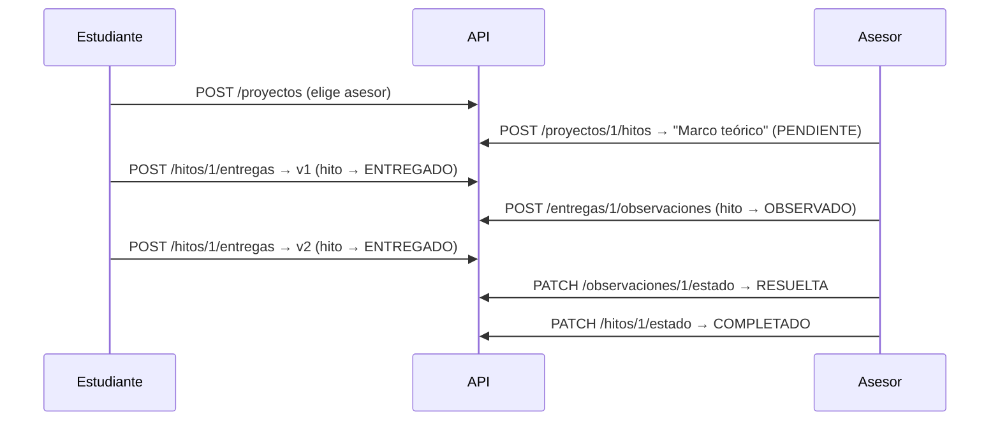

# API REST

> [!success] Estado — implementada y probada el 2026-08-16
> Cubre el [[Entregables y evaluación|Entregable 2 — Backend (20%)]]: API conectada a la base de datos + documentación de endpoints.
>
> Revalidada el 2026-10-07 con **371 comprobaciones HTTP** sobre PostgreSQL descartable (smoke, smoke2, Fases 0, 1 y 1.5). Las pruebas locales siguen fuera del repo; ver [[Desarrollo#Fase 1.5 - Clases y vistas (2026-10-07)]].

Base: `http://localhost:8080/api` en desarrollo (`VITE_API_URL` en el frontend).

## Convenciones

- **Autenticación**: JWT en `Authorization: Bearer <token>`. Las operaciones de registro/login y consulta de existencia de correo, además de `/api/health`, son públicas; `/auth/me` y la preferencia requieren un usuario autenticado.
- **Errores**: siempre JSON `{"error": "mensaje"}`.

| Código | Cuándo |
|---|---|
| `400` | Validación, JSON malformado, o regla de negocio violada (ej. borrar un hito con entregas) |
| `401` | Sin token, token inválido o expirado, credenciales incorrectas |
| `403` | Autenticado pero sin permiso sobre ese recurso |
| `404` | El recurso no existe |
| `413` | Un archivo supera el tope de 15 MB. Mensaje: *"El archivo supera los 15 MB"* |
| `409` | Una restricción de la base impidió la operación (clave foránea, `UNIQUE`). Mensaje legible; el detalle técnico queda solo en el log. Ver [[Decisiones pendientes#Decisión 18 - Qué se lleva un espacio al borrarse\|D18]] |

> [!note] Un 5xx no se muestra crudo
> Cualquier error 5xx que nadie previó lo devuelve Spring como `{"error": "Internal Server Error"}`. El cliente (`client.js`) lo reemplaza por *"Algo falló de nuestro lado…"* en vez de ponerlo en pantalla.

> [!important] El acceso se resuelve por pertenencia, no por rol
> Tener rol `ASESOR` no habilita a tocar un proyecto ajeno: hay que ser **el** asesor de ese proyecto. Ver [[Usuarios y roles#Matriz de permisos]]. El coordinador es la única excepción: lee todo, no escribe nada.

## Autenticación

| Método | Ruta | Quién | Qué hace |
|---|---|---|---|
| `POST` | `/auth/register` | público | Crea usuario y devuelve `{token, user}`. El rol `COORDINADOR` da 400 (no es autoasignable). Acepta los datos de perfil del [[Decisiones pendientes#Decisión 9 - Qué datos personales pide el registro\|paso 2]] y exige `aceptaPolitica: true` |
| `POST` | `/auth/login` | público | Devuelve `{token, user}` |
| `GET` | `/auth/me` | autenticado | Datos del usuario del token |
| `GET` | `/auth/existe?email=…` | público, **10/min por IP** | `{ "existe": true\|false }`. Avisa en el paso 1 del registro que el correo ya tiene cuenta |

> [!important] El email se normaliza a minúsculas
> `User#setEmail` aplica `toLowerCase(Locale.ROOT)` y todos los lookups normalizan la entrada. `Ana@utec.pe` y `ana@utec.pe` son la misma cuenta. `LoginRequest` y `RegisterRequest` además recortan espacios en el constructor compacto del record, antes de que corra `@Email`.

> [!warning] `/auth/existe` está limitado a propósito
> Es un vector de enumeración de correos. Se aceptó porque `POST /register` ya filtraba el dato al responder "El email ya está registrado", pero `LimitadorConsultas` corta en 10 consultas por minuto y por IP (`429`). El límite es **en memoria y por instancia**: con varias instancias detrás de un balanceador hay que moverlo a Redis o al API Gateway.

## Usuarios

| Método | Ruta | Quién | Qué hace |
|---|---|---|---|
| `GET` | `/usuarios/asesores` | autenticado | Solo profesores con asesorías privadas activadas, para elegirlos por nombre al crear una tesis sin clase |
| `GET` | `/asesorados` | asesor | Una ficha por tesis privada del profesor (sin clase), con integrantes, avance, revisiones, observaciones y tareas vencidas |

> [!important] `UserDto` no incluye los datos de perfil
> `telefono`, `ubicacion`, `carrera` y `organizacion` se guardan pero **no se difunden**: `UserDto` viaja embebido en cada entrega, observación, tarea y asesoría, y agregarlos ahí los publicaría en decenas de respuestas que no los necesitan.

## Clases (rutas técnicas /areas)

Agrupan las tesis de un asesor y le dan un **código de invitación**. Ver [[Decisiones pendientes#Decisión 10 - Áreas del asesor|D10]] y [[Decisiones pendientes#Decisión 11 - Cómo entran los asesorados de un asesor privado|D11]].

| Método | Ruta | Quién | Qué hace |
|---|---|---|---|
| `POST` | `/areas` | asesor | Crea una clase y le genera un código. 400 si el nombre se repite (sin distinguir mayúsculas) |
| `GET` | `/areas` | asesor | Sus clases, **con** el código |
| `PUT` | `/areas/{id}` | dueño | Renombra |
| `DELETE` | `/areas/{id}` | dueño | Borra el espacio: **se van sus actividades, materiales (con sus archivos), sesiones y avisos**, y el código; las tesis quedan **desetiquetadas** y **todos sus hitos se quedan** (con `actividad_id = NULL`). `204`. Ver [[Decisiones pendientes#Decisión 18 - Qué se lleva un espacio al borrarse\|D18]] |
| `GET` | `/areas/{id}/espacio` | **miembro**: dueño, estudiante con tesis en él, coordinador | `{ area, asesor, propietario }`. El código solo viaja si `propietario` es `true` |
| `GET` | `/areas/{id}/resumen` | dueño | Qué se lleva el borrado, en números: `{ actividades, tesis, carpetas, materiales, archivos, sesiones, avisos }` |
| `POST` | `/areas/{id}/codigo` | dueño | Genera un código nuevo e invalida el anterior |
| `GET` | `/areas/invitacion/{codigo}` | autenticado, **10/min por IP** | Previsualiza a quién pertenece: `{ area, asesor, asesorEmail }` |

> [!important] El código no viaja en `ProyectoDto`
> El estudiante recibe el área con `AreaDto.sinCodigo(...)`. Si el código saliera ahí, cualquier asesorado podría invitar gente a la carpeta de su asesor.

Formato del código: `TT-` + 6 caracteres de un alfabeto sin `0/O`, `1/I/L`, `5/S`, `8/B` ni `2/Z`, para que se pueda dictar por teléfono sin ambigüedad.

## Actividades del espacio

La consigna que el asesor deja a todos sus asesorados de una vez. Ver [[Decisiones pendientes#Decisión 12 - Cómo se reparte una actividad a todo un espacio|D12]].

| Método | Ruta | Quién | Qué hace |
|---|---|---|---|
| `POST` | `/areas/{id}/actividades` | dueño del área | Crea la actividad y **genera un hito en cada proyecto del área** |
| `GET` | `/areas/{id}/actividades` | miembro | Lista, por `orden`; el estudiante solo consulta |
| `DELETE` | `/areas/{id}/actividades/{aid}` | dueño | Quita la actividad. Los hitos **con entregas se desenganchan**; los intactos se borran |
| `GET` | `/areas/{id}/tablero` | dueño | Grilla asesorados × actividades con el semáforo |

```jsonc
// POST /api/areas/5/actividades
{ "nombre": "Actividad 1 — Matriz de consistencia", "descripcion": "...", "fechaLimite": "2026-09-15" }
```

> [!important] El reparto también alcanza a quien entra después
> `ProyectoService#sumarAlEspacio` —el único camino de ingreso a un área— reparte las actividades vigentes al proyecto que acaba de entrar, con una guarda que evita duplicar si alguien vuelve a usar el mismo código.

El tablero devuelve `actividades` (las columnas) aparte de `filas`, porque un estudiante que entró tarde podría no tener todas. Cada celda trae `estado` (el `EstadoHito` crudo) y `semaforo`:

| `semaforo` | Sale de |
|---|---|
| `LISTO` | `COMPLETADO` |
| `POR_REVISAR` | `ENTREGADO` |
| `OBSERVADO` | `OBSERVADO` |
| `EN_FALTA` | `PENDIENTE`/`EN_PROCESO` con `fechaLimite` pasada |
| `PENDIENTE` | `PENDIENTE`/`EN_PROCESO` en plazo |
| `SIN_ASIGNAR` | El estudiante no tiene esa actividad |

## Materiales del espacio

Carpetas con enlaces y archivos, como un aula. **Miembro** = el dueño, el estudiante con una tesis en el espacio, y el coordinador (solo lectura). Un estudiante ajeno al espacio y otro asesor reciben `403`. Ver [[Decisiones pendientes#Decisión 19 - Cómo se organizan los materiales del espacio|D19]].

| Método | Ruta | Quién | Qué hace |
|---|---|---|---|
| `GET` | `/areas/{id}/carpetas` | miembro | Las carpetas con sus materiales anidados (dos consultas, sin los bytes) |
| `POST` | `/areas/{id}/carpetas` | dueño | Crea una carpeta. `400` si el nombre se repite (sin distinguir mayúsculas) |
| `PUT` | `/carpetas/{id}` | dueño | Renombra |
| `DELETE` | `/carpetas/{id}` | dueño | Borra la carpeta **y sus materiales y archivos**. `204`, irreversible |
| `POST` | `/carpetas/{id}/materiales` | dueño | Crea un material que es un **enlace** `{ titulo, url }`. La `url` tiene que ser `https://` |
| `POST` | `/carpetas/{id}/materiales/archivo` | dueño | Sube un **archivo**: `multipart` con `archivo` y, opcional, `titulo` (si no, el nombre del archivo). Máx. **15 MB** → `413` |
| `PUT` | `/materiales/{id}` | dueño | Cambia el título; la `url` solo si es un enlace (a un archivo no se le puede poner) |
| `DELETE` | `/materiales/{id}` | dueño | Borra el material y sus bytes |
| `GET` | `/materiales/{id}/archivo` | miembro | Descarga como `attachment` (`filename*` UTF-8). `400` si el material es un enlace |

```jsonc
// POST /api/carpetas/1/materiales
{ "titulo": "Banco de temas 2026", "url": "https://drive.google.com/drive/folders/abc" }
```

> [!note] Un espacio nuevo trae tres carpetas
> *Temas de tesis*, *Rúbrica* y *Clases*, que el dueño puede renombrar o borrar. Los espacios que ya existían las recibieron con la migración `V2`.

## Sesiones del espacio

Clases o reuniones para **todo** el espacio, con el enlace que pega el asesor. No se integra ninguna API de videollamadas. Ver [[Decisiones pendientes#Decisión 20 - Reuniones con enlace - sesiones del espacio y asesorías programadas|D20]].

| Método | Ruta | Quién | Qué hace |
|---|---|---|---|
| `GET` | `/areas/{id}/sesiones` | miembro | Todas, por fecha ascendente; la pantalla separa las pasadas |
| `POST` | `/areas/{id}/sesiones` | dueño | Crea una `{ titulo, fechaHora, enlace }`. `400` si el enlace no es `https://` |
| `PUT` | `/sesiones/{id}` | dueño | Reprograma o corrige |
| `DELETE` | `/sesiones/{id}` | dueño | La quita. `204` |

## Próximas reuniones

| Método | Ruta | Quién | Qué hace |
|---|---|---|---|
| `GET` | `/reuniones/proximas` | autenticado | Las sesiones de su espacio y las asesorías programadas de sus tesis, en una lista, las **5** más cercanas |

Cada elemento trae `tipo` (`SESION` o `ASESORIA`), `titulo`, `fechaHora`, `enlace` y de dónde viene (`areaNombre`, `proyectoTitulo`). Una reunión que empezó hace **menos de una hora** sigue apareciendo —quien llega tarde a una clase en curso todavía necesita el botón—. El coordinador recibe una lista vacía. La usan los dos Dashboards.

## Proyectos

| Método | Ruta | Quién | Qué hace |
|---|---|---|---|
| `POST` | `/proyectos` | estudiante | Crea su proyecto. `asesorId` y `codigoInvitacion` son opcionales; **si vienen los dos, manda el código** |
| `GET` | `/proyectos` | autenticado | Estudiante: los suyos. Asesor: los asignados. Coordinador: todos |
| `GET` | `/proyectos/{id}` | con acceso | Detalle |
| `PATCH` | `/proyectos/{id}/asesor` | estudiante del proyecto | Asigna o cambia el asesor. 400 si no tiene rol `ASESOR` o no ofrece asesorías privadas |
| `PATCH` | `/proyectos/{id}/unirse` | estudiante del proyecto | Se suma a una carpeta con el código: asigna asesor **y** área de una sola vez |
| `PATCH` | `/proyectos/{id}/area` | asesor del proyecto | Etiqueta la tesis en una de **sus** carpetas. `areaId: null` la quita |
| `POST` | `/proyectos/{id}/estudiantes` | estudiante del proyecto | Suma un compañero **por su correo** (tesis grupal) |
| `DELETE` | `/proyectos/{id}/estudiantes/{uid}` | estudiante del proyecto | Lo saca, o se va uno mismo. 400 si dejaría la tesis sin nadie |
| `DELETE` | `/proyectos/{id}/asesor` | asesor **o** estudiante del proyecto | Desvincula al asesor y limpia el área. **No borra nada** |
| `DELETE` | `/proyectos/{id}` | grupo de la tesis **o** su asesor | Borra la tesis y las dos cadenas completas. **Irreversible** |

> [!warning] Las dos formas de sacarse un proyecto de encima no son lo mismo
> `DELETE /asesor` es reversible: la tesis queda entera y el estudiante puede sumarse a otro espacio con un código. `DELETE /proyectos/{id}` destruye hitos, entregas con archivos, observaciones, asesorías, acuerdos y tareas — ver [[Decisiones pendientes#Decisión 17 - Quién puede borrar una tesis, y cómo|D17]].
>
> El borrado se hace **explícito y en orden** dentro del service, no confiado a `ON DELETE CASCADE`. Una base creada con Flyway (`V1`) sí tiene 7 cascadas, pero una vieja creada con `ddl-auto=update` no, y el orden a la vista se razona mejor. Ver la nota de actualización en [[Decisiones pendientes#Decisión 17 - Quién puede borrar una tesis, y cómo|D17]].

> [!important] `ProyectoDto` devuelve `estudiantes` (lista), no `estudiante`
> Una tesis puede ser grupal ([[Decisiones pendientes#Decisión 15 - Tesis grupales|D15]]) y todos sus integrantes tienen los mismos permisos: cualquiera entrega, se une a un espacio y arma el grupo. La lista **nunca viene vacía**.
| `GET` | `/proyectos/{id}/dashboard` | con acceso | Resumen: próximos hitos, tareas pendientes, última entrega, observaciones pendientes, últimas 5 asesorías |

```jsonc
// POST /api/proyectos
{ "titulo": "Análisis de la asesoría académica", "descripcion": "...", "asesorId": 2 }

// POST /api/proyectos — entrando por código
{ "titulo": "Análisis de la asesoría académica", "codigoInvitacion": "TT-6HK73P" }
```

> [!note] Cambiar de asesor limpia el área
> El área pertenece al asesor. Si `PATCH /asesor` cambia efectivamente de persona, `ProyectoService` deja el área en `null`: mantenerla dejaría la tesis etiquetada en la carpeta de alguien que ya no la acompaña.

## Hitos

Los crea, edita y borra **el asesor del proyecto** ([[Decisiones pendientes#Decisión 2 - Quién crea los hitos|D2]]).

| Método | Ruta | Quién | Qué hace |
|---|---|---|---|
| `POST` | `/proyectos/{id}/hitos` | asesor del proyecto | Crea un hito. Nace en `PENDIENTE` |
| `GET` | `/proyectos/{id}/hitos` | con acceso | Lista ordenada por `orden` |
| `PUT` | `/hitos/{id}` | asesor del proyecto | Edita nombre, descripción, fecha límite y orden |
| `PATCH` | `/hitos/{id}/estado` | asesor del proyecto | Cambia el estado |
| `DELETE` | `/hitos/{id}` | asesor del proyecto | **400 si el hito ya tiene entregas** ([[Decisiones pendientes#Decisión 4 - Modificación de hitos|D4]]) |

```jsonc
// POST /api/proyectos/1/hitos
{ "nombre": "Marco teórico", "descripcion": "...", "fechaLimite": "2026-09-30", "orden": 1 }
```

Estados: `PENDIENTE` · `EN_PROCESO` · `ENTREGADO` · `OBSERVADO` · `COMPLETADO` (ver [[Hitos]]).

## Entregas

| Método | Ruta | Quién | Qué hace |
|---|---|---|---|
| `POST` | `/hitos/{id}/entregas` | estudiante del proyecto | Crea la versión. **El backend calcula el número**, el cliente no lo manda |
| `GET` | `/hitos/{id}/entregas` | con acceso | Todas las versiones, ordenadas |
| `PUT` | `/entregas/{id}/archivo` | estudiante del proyecto | Sube o reemplaza el documento (`multipart`, campo `archivo`). Máx. **15 MB** |
| `GET` | `/entregas/{id}/archivo` | con acceso | Descarga el documento |
| `PATCH` | `/entregas/{id}/estado` | asesor del proyecto | `EN_REVISION` / `OBSERVADA` / `APROBADA` |

> [!note] El archivo va en dos pasos, no en el mismo cuerpo
> Mezclar JSON y binario obliga a un `multipart` con una parte JSON, que del lado del navegador hay que armar a mano como `Blob`. Dos llamadas simples salen más baratas que una complicada, y además dejan reemplazar el documento de una entrega ya creada **sin generar una versión nueva** — la versión la marca la entrega, no el archivo.
>
> El contenido se guarda en PostgreSQL, en la tabla `archivo_entrega` ([[Decisiones pendientes#Decisión 16 - Dónde se guardan los archivos de las entregas|D16]]). `EntregaDto` trae `tieneArchivo`, `archivoTipo` y `archivoTamano`, pero **nunca los bytes**.

> [!note] Efecto sobre el hito
> Subir una entrega deja el hito en `ENTREGADO`, incluso si venía `OBSERVADO`. Es el retorno `OBSERVADO → ENTREGADO` del ciclo de corrección.

## Observaciones

Cuelgan de la **entrega concreta**, no del hito ([[Decisiones pendientes#Decisión 6 - Observaciones y versiones|D6]]).

| Método | Ruta | Quién | Qué hace |
|---|---|---|---|
| `POST` | `/entregas/{id}/observaciones` | asesor del proyecto | Registra una observación. **Deja el hito en `OBSERVADO`** |
| `GET` | `/entregas/{id}/observaciones` | con acceso | Observaciones de esa versión |
| `PATCH` | `/observaciones/{id}/estado` | asesor del proyecto | `PENDIENTE` ↔ `RESUELTA` |

## Asesorías y acuerdos

| Método | Ruta | Quién | Qué hace |
|---|---|---|---|
| `POST` | `/proyectos/{id}/asesorias` | **estudiante o asesor** del proyecto | Abre una reunión o una consulta. `registradaPor` guarda quién. Sin `estado` nace `REALIZADA`; con `estado: "PROGRAMADA"` se agenda (con `enlace` opcional). **No puede nacer `CANCELADA`** |
| `GET` | `/proyectos/{id}/asesorias` | con acceso | Historial, más reciente primero |
| `PUT` | `/asesorias/{id}` | asesor **o** quien la abrió | Reprograma (`fecha`, `tema`, `enlace`). Solo si sigue `PROGRAMADA` |
| `PATCH` | `/asesorias/{id}/estado` | ver abajo | `PROGRAMADA → REALIZADA` (solo el **asesor**, con `resumen` opcional) o `→ CANCELADA` (asesor o quien la abrió). Una realizada o cancelada no cambia |
| `POST` | `/asesorias/{id}/acuerdos` | **solo el asesor** del proyecto | Registra un acuerdo. **Solo de una asesoría `REALIZADA`**: sobre otra da `400` |
| `GET` | `/asesorias/{id}/acuerdos` | con acceso | Acuerdos de la reunión |

> [!important] La asimetría es la [[Decisiones pendientes#Decisión 13 - Quién puede abrir una asesoría|Decisión 13]]
> El estudiante **abre** la asesoría —así funciona como canal de consultas— pero **no cierra**: solo el asesor convierte la conversación en acuerdo, y de ahí en tarea.
>
> `crear` usa `verificarLectura`, que también deja pasar al coordinador, así que lleva un rechazo explícito para su rol: el coordinador consulta y no escribe (Decisión 8).

```jsonc
// POST /api/proyectos/1/asesorias — registrar una reunión que ya ocurrió (nace REALIZADA)
{ "fecha": "2026-08-10T15:00:00Z", "tema": "Revisar antecedentes", "resumen": "..." }

// POST /api/proyectos/1/asesorias — programar una reunión con enlace
{ "fecha": "2026-10-12T15:00:00Z", "tema": "Revisar el capítulo 1", "estado": "PROGRAMADA",
  "enlace": "https://meet.google.com/abc-defg-hij" }

// PATCH /api/asesorias/7/estado — el asesor la marca realizada y completa el resumen
{ "estado": "REALIZADA", "resumen": "Se acordó rehacer el marco teórico" }
```

> [!note] El Dashboard cuenta solo las realizadas
> `ultimasAsesorias` del Dashboard de un proyecto devuelve únicamente las `REALIZADA`. Las programadas aparecen en [[#Próximas reuniones]].

## Tareas

| Método | Ruta | Quién | Qué hace |
|---|---|---|---|
| `POST` | `/proyectos/{id}/tareas` | asesor del proyecto | Crea una tarea. `acuerdoId` opcional; 400 si el acuerdo es de otro proyecto |
| `GET` | `/proyectos/{id}/tareas?completada=false` | con acceso | Sin el parámetro devuelve todas |
| `PATCH` | `/tareas/{id}/completar` | responsable **o** asesor | Marca completada y sella la fecha |

## Cómo se ve el flujo completo

Recorrido real que hace la prueba end-to-end, siguiendo [[Reglas de negocio#Ejemplo de flujo completo]]:


```mermaid
sequenceDiagram
    participant E as Estudiante
    participant API
    participant A as Asesor

    E->>API: POST /proyectos (elige asesor)
    A->>API: POST /proyectos/1/hitos → "Marco teórico" (PENDIENTE)
    E->>API: POST /hitos/1/entregas → v1 (hito → ENTREGADO)
    A->>API: POST /entregas/1/observaciones (hito → OBSERVADO)
    E->>API: POST /hitos/1/entregas → v2 (hito → ENTREGADO)
    A->>API: PATCH /observaciones/1/estado → RESUELTA
    A->>API: PATCH /hitos/1/estado → COMPLETADO
```

## Lo que todavía no hace

- **Los archivos van en PostgreSQL, no en S3**: tope de 15 MB por archivo, `bytea` en tabla aparte — [[Decisiones pendientes#Decisión 16 - Dónde se guardan los archivos de las entregas|D16]]. Si el volumen creciera, habría que pasar a S3.
- **Sin paginación**: los listados devuelven todo. Con el volumen de un proyecto de tesis alcanza; si crece, agregar `Pageable`.
- **Sin login con Google ni recuperación de contraseña** — ver [[Arquitectura#Por definir]].
- **El coordinador no tiene endpoints propios**: usa los mismos y ve todo por la regla de lectura global.

## Perfil y asesorías privadas

| Método | Ruta | Quién | Qué hace |
|---|---|---|---|
| GET | /auth/me | autenticado | Perfil propio; incluye asesoriasPrivadas (null/true/false) |
| PUT | /auth/me/asesorias-privadas | profesor | Cuerpo `{ "valor": true }` o false. Persiste la preferencia; 400 si falta valor o se intenta desactivar teniendo tesis privadas; 403 para otros roles |

El login/registro también entrega la preferencia. `/usuarios/asesores` filtra quienes ofrecen privadas; `/asesorados` lista solo tesis sin clase. La asignación directa mediante asesorId requiere preferencia TRUE; el código de clase conserva precedencia si se envían ambos. Ver [[Decisiones pendientes#Decisión 24 - Hacer opcionales las asesorías privadas]].

## Clases - Personas y avisos

| Método | Ruta | Quién | Qué hace |
|---|---|---|---|
| GET | /areas/{id}/personas | miembro | Profesor y grupos, con campos filtrados según pertenencia |
| GET | /areas/{id}/avisos | miembro | Avisos, más recientes primero |
| POST | /areas/{id}/avisos | dueño | Publica texto simple `{ "texto": "..." }` |
| DELETE | /avisos/{id} | dueño | Quita un aviso; 204 |

Personas: dueño/coordinador reciben detalles; el estudiante recibe correos/tema/fecha/id de tesis de su propio grupo y **solo nombres e ids de alumnos** para otros grupos, sin semáforo. Quitar de la clase reutiliza `DELETE /proyectos/{id}/asesor`: desvincula grupo, clase y profesor, preservando la tesis. Los cambios de Configuración siguen usando PUT/DELETE /areas y POST /areas/{id}/codigo.

## Dashboard del profesor

`GET /dashboard/asesor`, solo ASESOR: `{ clases, paraRevisar, necesitanAtencion }`. Solo agrega recursos del profesor autenticado. Próximas reuniones conserva su endpoint propio. Ver [[Decisiones pendientes#Decisión 23 - Mostrar un Dashboard agregado del profesor]].

| Campo | Contenido |
|---|---|
| `clases[]` | `id`, `nombre`, `codigo`, `alumnos`, `grupos`, contadores `verde`/`amarillo`/`rojo`/`sinActividad` y `proximaSesion` (`id`, `titulo`, `fechaHora`, `enlace`; `null` si no hay). Una sesión que empezó hace menos de una hora todavía cuenta. |
| `paraRevisar[]` | `entregaId`, `hitoId`, `hito`, `version`, `desde`, `proyectoId`, `tesis`, `alumnos`, `areaId`, `clase` y la `entrega` completa (con el `archivoTipo` verificado, para abrirla en el visor). Agrupado por hito tomando la versión EN_REVISION de mayor número; la más antigua primero. |
| `necesitanAtencion[]` | Grupos atrasados, en riesgo o sin tema, en ese orden: `semaforo`, `hitosEnFalta`, `hitosObservados`, `proximoHito`/`proximoVence` (el hito que vence en ≤3 días sin entrega) y `sinTema`. |

Las reglas del semáforo están en [[Decisiones pendientes#Decisión 26 - Semáforo del grupo - En riesgo en vez de Por atender]].

**Dashboard de una tesis.** `GET /proyectos/{id}/dashboard` (miembros, asesor y coordinador) suma `semaforo`: el del grupo entero, con las mismas reglas. Cada observación (`ObservacionDto`) trae ahora `hitoId` y `hitoNombre`, para listarla sin abrir la entrega.

## Archivos verificados y vista previa

Se conserva la API de subida/descarga y el tope de 15 MB. `archivoTipo` ahora representa la firma verificada, no el MIME declarado: PNG/JPEG/GIF/WebP/PDF o application/octet-stream. V3 corrige metadatos legacy. La descarga sigue siendo attachment; el frontend pide el blob con token y solo previsualiza los cinco formatos permitidos. El enlace externo de entrega debe ser https. Ver [[Decisiones pendientes#Decisión 25 - Previsualizar solo archivos con tipo verificado]].

## Ver también
- [[Base de datos]]
- [[Usuarios y roles]]
- [[Reglas de negocio]]
- [[Arquitectura]]
