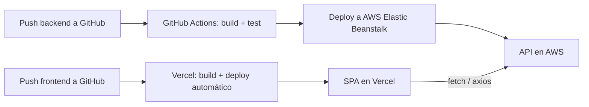

# Arquitectura

> [!warning] Actualización — React es obligatorio
> El profesor exigió explícitamente **React** (versión 18) para el frontend. Esto reemplaza la decisión anterior de Thymeleaf. Se mantiene Spring Boot, pero ahora como **API REST**, no como servidor de vistas.

> [!success] Stack decidido (actualizado)
> Backend Spring Boot (API REST) + Frontend React 18 (SPA separada). Backend en AWS, frontend en Vercel. Dos despliegues en vez de uno, pero React ya no es opcional.

## Stack tecnológico

| Capa | Tecnología | Motivo |
|------|-----------|--------|
| Backend | **Java Spring Boot** (API REST, `@RestController`) | Expone endpoints JSON consumidos por el frontend React. Cumple el Entregable 2 y 3 |
| Frontend | **React 18** (versión exacta fijada, sin `^`/`~` en package.json) | Exigido explícitamente por el profesor. Fijar la versión evita romper código al "actualizar" a mitad de proyecto — ver [[#Por qué fijar la versión de React]] |
| Base de datos | **PostgreSQL** | Elegida sobre MySQL: gratis, muy soportada en AWS RDS (free tier) y en Spring Data JPA |
| Persistencia / ORM | **Spring Data JPA + Hibernate** | Estándar de facto en Spring Boot, evita SQL manual repetitivo |
| Autenticación | **Spring Security + JWT** (email/contraseña) | Backend valida credenciales y controla acceso por rol; el frontend React consume esos endpoints — ver [[Usuarios y roles]]. Login con Google queda pendiente para más adelante (requiere crear OAuth Client ID en Google Cloud Console) |
| CI/CD | **GitHub Actions** (dos pipelines: backend y frontend) | Gratis para repos |
| Despliegue backend | **AWS** — EC2 o Elastic Beanstalk + RDS PostgreSQL (free tier) | Exigido explícitamente en el Entregable 4 |
| Despliegue frontend | **Vercel** (free tier) | Gratis, óptimo para SPAs de React, deploy automático por push |

Ver [[Entregables y evaluación]] para el detalle completo de requisitos por entregable.

## Por qué fijar la versión de React

Dentro de una misma versión mayor (18.x) los cambios son compatibles hacia atrás. Entre versiones mayores (17→18, 18→19) puede haber *breaking changes*: cambia el render root, el comportamiento de efectos en modo estricto, se eliminan APIs viejas, cambian requisitos de compatibilidad de librerías de terceros.

> [!important] Regla
> Fijar la versión exacta de React en `package.json` (sin `^` ni `~`) y commitear `package-lock.json`, para que todo el equipo y el CI/CD usen exactamente React 18.x sin sorpresas a mitad de proyecto.

## Por qué se descartó el monolito con Thymeleaf

Era la propuesta original (ver historial más abajo) pero quedó descartada apenas se confirmó que el profesor pide React específicamente — Thymeleaf no es compatible con ese requisito, ya que renderiza HTML en el servidor en vez de usar un framework de frontend en el cliente.

## Estructura del frontend

> [!success] Definida el 2026-08-16

```
src/
  api/        client.js (fetch + JWT + corte de sesión en 401) y tesistrack.js (endpoints)
  auth/       AuthContext.jsx — sesión, revalidación del token contra /auth/me
  components/ BrandLogo, EstadoBadge, ProgressRing, ui.jsx (Card, PageHead, Vacio…)
  hooks/      useProyectoActivo — proyecto seleccionado, recordado entre pantallas
  layouts/    AppLayout.jsx — barra lateral + topbar, menú según rol
  pages/      Dashboard, Proyectos, Hitos, Login, Pendiente
  styles/     auth.css (login), app.css (panel), brand.css (logo, compartido)
```

- **React Router 6** (versión exacta, igual que React). Rutas privadas detrás de `RutaPrivada`, que espera a que se revalide el token guardado antes de decidir.
- El **menú se arma según el rol**: el coordinador solo ve lo que puede consultar.
- El **logo** sale de `public/logo.png`; si el archivo no está, cae a una marca provisional en SVG.

### La pantalla de bienvenida

El panel izquierdo del login no es decoración: muestra de qué se trata el producto.

Sobre un `<canvas>` animado conviven dos capas. La de ambiente son partículas a la deriva que se enlazan con sus vecinas. La que importa es **la cadena de hitos**: un pulso dorado recorre `Planteamiento → Marco teórico → Metodología` y los va encendiendo, mientras `Resultados` y `Sustentación` quedan tenues. El oro marca lo recorrido y lo apagado, lo que falta — que es literalmente lo que promete el texto al lado ("sabés en qué vas y qué sigue") y lo que pide el [[Alcance]] para el estudiante.

Debajo del texto, una línea de estado acompaña al pulso usando **los mismos badges que el panel**: quien entra ya ve el vocabulario que va a encontrar adentro.

> [!note] Por qué el pulso no llega al final
> Encender los cinco hitos diría "tesis terminada" y contradiría la etiqueta de estado. El recorrido corta en el hito en curso a propósito.

El oro (`#d8b05c`) viene del mundo académico — sello, birrete — y no del azul tech genérico. Se usa solo en el pulso y en la regla del eyebrow.

La entrada es **una sola secuencia escalonada** en orden de lectura, no efectos sueltos. Todo se desactiva con `prefers-reduced-motion`, que además deja el canvas en un estado fijo en vez de animarlo.

### Color de los estados

Los badges de estado llevan **siempre ícono + texto**; el color es refuerzo, nunca el único canal. No es decorativo: `OBSERVADO` (rojo) y `COMPLETADO` (verde) quedan a ΔE 4.1 en deuteranopía — sin la etiqueta, un asesor daltónico no distinguiría "aprobado" de "hay que corregir". La paleta se validó con el validador de contraste antes de fijarla.

## Por definir
- Login con Google (Google Identity Services + verificación de token en backend) — pendiente hasta tener el OAuth Client ID
- Almacenamiento de documentos (entregas y versiones) — ¿S3 o filesystem local en la instancia?
- Detalle del pipeline CI/CD (qué corre en cada paso, para backend y frontend por separado)
- Servicio AWS exacto de compute para el backend: EC2 simple vs Elastic Beanstalk

## Proyecto de código

> [!success] Backend y frontend listos y conectados
> - **Backend** — `e:\CLAUDE\UTEC\tesistrack-app` (Spring Boot 4 + Java 17). API REST, CORS configurado. Compila limpio.
> - **Frontend** — `e:\CLAUDE\UTEC\tesistrack-web` (React **18.3.1**, versión exacta fijada). Scaffolding con Vite.
> - Ambos con git inicializado (sin commit todavía).
> - **Health check probado end-to-end con captura de pantalla en navegador real (Playwright)**: PostgreSQL (Docker) → Spring Boot → React. Cadena completa funcionando.

### Login (email + contraseña)

> [!success] Implementado y verificado end-to-end
> - **Modelo**: `User` (`model/User.java`) con `name`, `email` único, `passwordHash` (BCrypt), `role` (`Role` enum: `ESTUDIANTE`, `ASESOR`, `COORDINADOR`).
> - **Regla de negocio**: el rol `COORDINADOR` no se puede autoasignar en el registro (se asigna manualmente) — decisión tomada al implementar, coherente con [[Usuarios y roles#Coordinador académico]].
> - **JWT**: `JwtService` firma tokens HS256 (claims: email como subject, `role`, `name`), expiración configurable (`app.jwt.expiration-ms`, default 24h). Librería `io.jsonwebtoken` (jjwt) 0.12.6.
> - **Endpoints** (`AuthController`, prefijo `/api/auth`): `POST /register`, `POST /login` (ambos devuelven `{ token, user }`), `GET /me` (protegido, requiere `Authorization: Bearer <token>`).
> - **Seguridad**: `SecurityConfig` en modo stateless (sin sesión), `JwtAuthFilter` valida el token en cada request y carga la autoridad `ROLE_<rol>`. Solo `/api/auth/**` y `/api/health` son públicos; el resto requiere token válido.
> - **Manejo de errores**: `ApiExceptionHandler` devuelve JSON con status correcto — 400 email duplicado / validación, 401 credenciales inválidas.
> - **Frontend**: `LoginForm.jsx` y `RegisterForm.jsx` (con selector de rol Estudiante/Asesor), `api/auth.js` centraliza las llamadas. `App.jsx` persiste la sesión (`token` + `user`) en `localStorage` y alterna entre login/registro/panel logueado.
> - **Verificado con Playwright** (navegador real, no solo curl): registro → sesión iniciada → logout → login con el mismo usuario → sesión iniciada de nuevo. Screenshots confirmando cada paso.
> - **Google login queda pendiente** — decisión explícita de posponerlo hasta tener el OAuth Client ID de Google Cloud Console. Cuando se retome: usar Google Identity Services en el frontend (no `Spring Security oauth2Login` con redirects, por los dominios separados Vercel/AWS) + endpoint backend que verifique el ID token y emita el mismo JWT propio.

## Despliegue y CI/CD

Flujo previsto (a validar en el Entregable 4):



## Ver también
- [[Base de datos]]
- [[Flujo del sistema]]
- [[Entregables y evaluación]]
- [[Usuarios y roles]]
