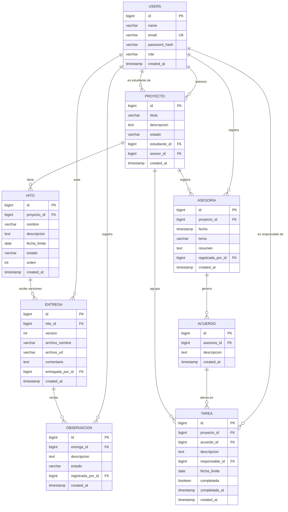

# Base de datos

> [!success] Estado — diseñado el 2026-08-16
> Modelo cerrado para el [[Entregables y evaluación|Entregable 1 — Modelo de Datos (15%)]]. Se pudo diseñar recién después de cerrar las [[Decisiones pendientes|decisiones 1, 3, 5 y 6]], que eran las que afectaban directamente al esquema.

## Motor

PostgreSQL 16 (ver [[Arquitectura]]). Las tablas las genera Hibernate a partir de las entidades JPA (`spring.jpa.hibernate.ddl-auto=update`); el [[#Esquema SQL]] de abajo es el reflejo de esas entidades y es lo que se entrega como esquema del entregable.

## Diagrama Entidad-Relación



## Las dos cadenas de trazabilidad en el esquema

[[Reglas de negocio]] define dos cadenas paralelas. Así se ven traducidas a tablas:

**Cadena de hitos y entregas**
`proyecto` → `hito` → `entrega` (v1, v2, v3…) → `observacion`

**Cadena de asesorías**
`proyecto` → `asesoria` → `acuerdo` → `tarea` → `completada`

Ambas cuelgan de `proyecto`, que es lo que permite reconstruir el historial completo del que habla [[Reglas de negocio#Historial]].

## Decisiones que dieron forma a este esquema

| Decisión | Efecto concreto |
|---|---|
| [[Decisiones pendientes#Decisión 1 - Universidad específica o plataforma general\|D1]] — plataforma general | **No existe** tabla `institucion`. `proyecto` es la raíz. |
| [[Decisiones pendientes#Decisión 3 - Estados del hito\|D3]] — 5 estados | `hito.estado` ∈ `PENDIENTE`, `EN_PROCESO`, `ENTREGADO`, `OBSERVADO`, `COMPLETADO` |
| [[Decisiones pendientes#Decisión 5 - Relación hito-entrega\|D5]] — 1 hito → N entregas | `entrega.hito_id` + `entrega.version`, con `UNIQUE (hito_id, version)`. Reemplaza la auto-relación `ENTREGA→ENTREGA` del ER preliminar: la versión es una columna, no un enlace. |
| [[Decisiones pendientes#Decisión 6 - Observaciones y versiones\|D6]] — observación por versión | `observacion.entrega_id` apunta a la versión exacta que la originó |

## Supuestos tomados al diseñar (no venían de una decisión)

> [!warning] Revisar en grupo
> Estos tres puntos no estaban definidos en ninguna nota. Se resolvieron de la forma más simple para poder avanzar; si alguno no convence, cambiarlo ahora es barato.

1. **Un proyecto tiene un estudiante y un asesor.** `proyecto.estudiante_id` es obligatorio; `proyecto.asesor_id` es nullable (un proyecto puede existir antes de que le asignen asesor). No hay co-asesores ni tesis grupales — encaja con el [[Alcance]], que pide mantener el proyecto cerrado y realista.
2. **`tarea.acuerdo_id` es nullable.** [[Reglas de negocio]] deriva las tareas de un acuerdo, pero [[Funcionalidades]] lista "Crear tarea" como acción suelta. Nullable permite ambas cosas sin romper la cadena cuando sí viene de un acuerdo. `tarea.proyecto_id` sí es obligatorio, para poder listar pendientes de un proyecto sin encadenar tres joins.
3. **`observacion.estado`** ∈ `PENDIENTE`, `RESUELTA`. No sale de D6, sino de [[Funcionalidades]], que pide "marcar estado" y "consultar observaciones pendientes".

## Esquema SQL

```sql
-- ---------------------------------------------------------------
-- TesisTrack — esquema PostgreSQL
-- ---------------------------------------------------------------

CREATE TABLE users (
    id            BIGSERIAL    PRIMARY KEY,
    name          VARCHAR(255) NOT NULL,
    email         VARCHAR(255) NOT NULL UNIQUE,
    password_hash VARCHAR(255) NOT NULL,
    role          VARCHAR(20)  NOT NULL
                  CHECK (role IN ('ESTUDIANTE', 'ASESOR', 'COORDINADOR')),
    created_at    TIMESTAMP    NOT NULL DEFAULT now()
);

CREATE TABLE proyecto (
    id            BIGSERIAL    PRIMARY KEY,
    titulo        VARCHAR(255) NOT NULL,
    descripcion   TEXT,
    estado        VARCHAR(20)  NOT NULL DEFAULT 'EN_CURSO'
                  CHECK (estado IN ('EN_CURSO', 'FINALIZADO', 'SUSPENDIDO')),
    estudiante_id BIGINT       NOT NULL REFERENCES users (id),
    asesor_id     BIGINT       REFERENCES users (id),
    created_at    TIMESTAMP    NOT NULL DEFAULT now()
);

CREATE TABLE hito (
    id           BIGSERIAL    PRIMARY KEY,
    proyecto_id  BIGINT       NOT NULL REFERENCES proyecto (id) ON DELETE CASCADE,
    nombre       VARCHAR(255) NOT NULL,
    descripcion  TEXT,
    fecha_limite DATE,
    estado       VARCHAR(20)  NOT NULL DEFAULT 'PENDIENTE'
                 CHECK (estado IN ('PENDIENTE', 'EN_PROCESO', 'ENTREGADO',
                                   'OBSERVADO', 'COMPLETADO')),
    orden        INTEGER      NOT NULL DEFAULT 0,
    created_at   TIMESTAMP    NOT NULL DEFAULT now()
);

CREATE TABLE entrega (
    id               BIGSERIAL    PRIMARY KEY,
    hito_id          BIGINT       NOT NULL REFERENCES hito (id) ON DELETE CASCADE,
    version          INTEGER      NOT NULL,
    archivo_nombre   VARCHAR(255),
    archivo_url      VARCHAR(500),
    comentario       TEXT,
    entregada_por_id BIGINT       NOT NULL REFERENCES users (id),
    created_at       TIMESTAMP    NOT NULL DEFAULT now(),
    CONSTRAINT uk_entrega_hito_version UNIQUE (hito_id, version)
);

CREATE TABLE observacion (
    id                BIGSERIAL   PRIMARY KEY,
    entrega_id        BIGINT      NOT NULL REFERENCES entrega (id) ON DELETE CASCADE,
    descripcion       TEXT        NOT NULL,
    estado            VARCHAR(20) NOT NULL DEFAULT 'PENDIENTE'
                      CHECK (estado IN ('PENDIENTE', 'RESUELTA')),
    registrada_por_id BIGINT      NOT NULL REFERENCES users (id),
    created_at        TIMESTAMP   NOT NULL DEFAULT now()
);

CREATE TABLE asesoria (
    id                BIGSERIAL    PRIMARY KEY,
    proyecto_id       BIGINT       NOT NULL REFERENCES proyecto (id) ON DELETE CASCADE,
    fecha             TIMESTAMP    NOT NULL,
    tema              VARCHAR(255) NOT NULL,
    resumen           TEXT,
    registrada_por_id BIGINT       NOT NULL REFERENCES users (id),
    created_at        TIMESTAMP    NOT NULL DEFAULT now()
);

CREATE TABLE acuerdo (
    id          BIGSERIAL PRIMARY KEY,
    asesoria_id BIGINT    NOT NULL REFERENCES asesoria (id) ON DELETE CASCADE,
    descripcion TEXT      NOT NULL,
    created_at  TIMESTAMP NOT NULL DEFAULT now()
);

CREATE TABLE tarea (
    id             BIGSERIAL PRIMARY KEY,
    proyecto_id    BIGINT    NOT NULL REFERENCES proyecto (id) ON DELETE CASCADE,
    acuerdo_id     BIGINT    REFERENCES acuerdo (id) ON DELETE SET NULL,
    descripcion    TEXT      NOT NULL,
    responsable_id BIGINT    REFERENCES users (id),
    fecha_limite   DATE,
    completada     BOOLEAN   NOT NULL DEFAULT FALSE,
    completada_at  TIMESTAMP,
    created_at     TIMESTAMP NOT NULL DEFAULT now()
);

-- Índices para las consultas del dashboard
CREATE INDEX idx_proyecto_estudiante ON proyecto (estudiante_id);
CREATE INDEX idx_proyecto_asesor     ON proyecto (asesor_id);
CREATE INDEX idx_hito_proyecto       ON hito (proyecto_id);
CREATE INDEX idx_entrega_hito        ON entrega (hito_id);
CREATE INDEX idx_observacion_entrega ON observacion (entrega_id);
CREATE INDEX idx_asesoria_proyecto   ON asesoria (proyecto_id);
CREATE INDEX idx_acuerdo_asesoria    ON acuerdo (asesoria_id);
CREATE INDEX idx_tarea_proyecto      ON tarea (proyecto_id);
CREATE INDEX idx_tarea_responsable   ON tarea (responsable_id);
```

## Decisiones que este esquema todavía no resuelve

- **Dónde viven los archivos de las entregas.** `entrega.archivo_url` guarda una referencia, pero falta decidir S3 vs. filesystem local — ver [[Arquitectura#Por definir]].
- **Quién puede crear hitos** → [[Decisiones pendientes#Decisión 2 - Quién crea los hitos]]. No afecta al esquema, sí a los endpoints.
- **Si los hitos se pueden modificar después** → [[Decisiones pendientes#Decisión 4 - Modificación de hitos]]. Si la respuesta exige auditoría, haría falta una tabla de historial.
- **Permisos por rol y alcance del coordinador** → [[Decisiones pendientes#Decisión 7 - Permisos por rol]] y [[Decisiones pendientes#Decisión 8 - Alcance del coordinador]]. El coordinador no aparece en ninguna FK: por ahora solo lee.

## Ver también
- [[Hitos]]
- [[Reglas de negocio]]
- [[Arquitectura]]
- [[Entregables y evaluación]]
