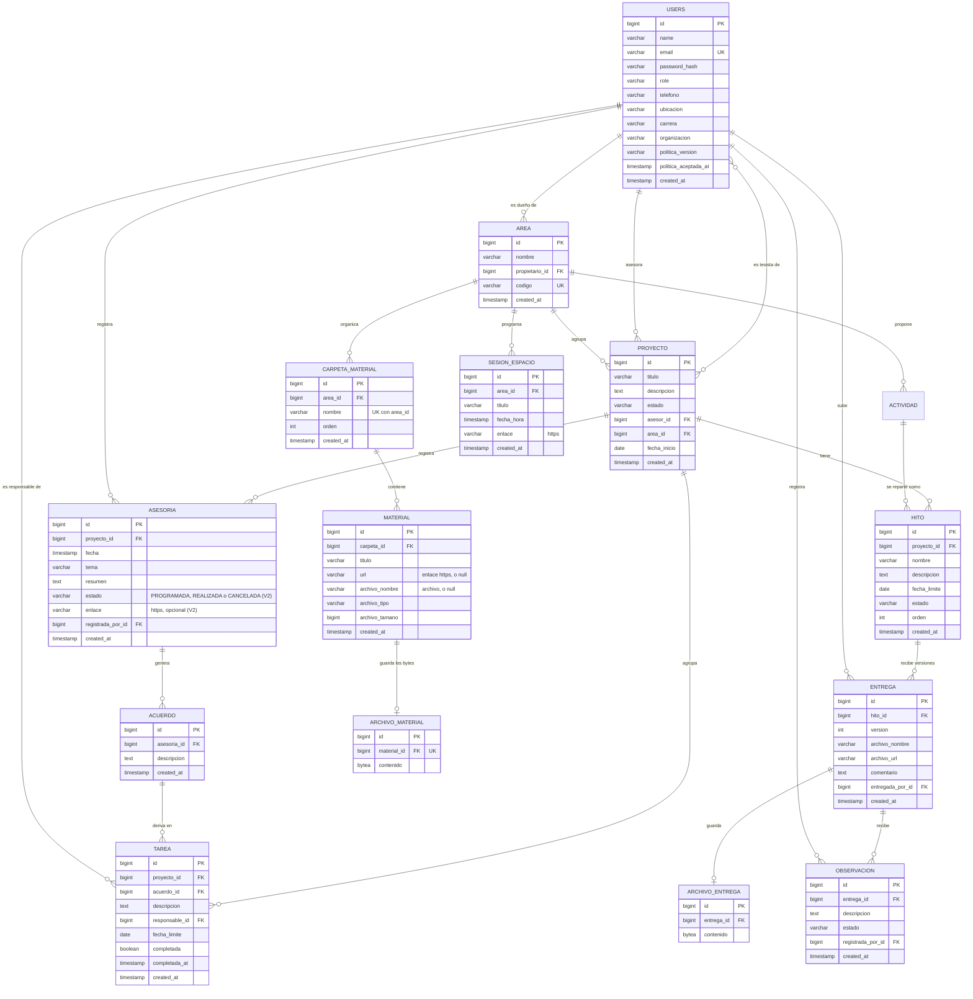

# Base de datos

> [!success] Estado — diseñado el 2026-08-16
> Modelo cerrado para el [[Entregables y evaluación|Entregable 1 — Modelo de Datos (15%)]]. Se pudo diseñar recién después de cerrar las [[Decisiones pendientes|decisiones 1, 3, 5 y 6]], que eran las que afectaban directamente al esquema.

## Motor

PostgreSQL 16 (ver [[Arquitectura]]). Desde el Taller 2 (2026-09-20) **el esquema lo versiona Flyway**: vive en `tesistrack-app/src/main/resources/db/migration/V1__create_initial_schema.sql` y Hibernate solo lo **valida** (`spring.jpa.hibernate.ddl-auto=validate`). El [[#Esquema SQL]] de abajo es ese mismo esquema y es lo que se entrega como esquema del entregable.

> [!important] Cómo se cambia el esquema desde ahora
> Cada cambio va como **migración nueva** (`V2__...`, `V3__...`), **nunca editando la `V1`**: Flyway guarda el checksum de lo ya aplicado y una `V1` modificada hace fallar el arranque en cualquier base que ya la corrió. Con `validate`, si una entidad cambia y la migración no, la aplicación **no arranca**: es el aviso que antes no existía.
>
> En una base vacía Flyway crea todo desde `V1`; en una creada con `ddl-auto=update` (la local vieja) `baseline-on-migrate` la marca en la versión 1 y no recrea nada.

> [!success] Verificado el 2026-10-07 por los tres caminos posibles
> 1. **Base vacía** → aplica `V1` y `V2`, Hibernate `validate` pasa y la aplicación arranca en ~3 s.
> 2. **Base sin historial de Flyway que ya tenía el esquema de `V1`** (la creada con `ddl-auto=update`) → `baseline-on-migrate` la marca en la versión 1 y aplica **solo `V2`**, sin recrear nada.
> 3. **Base con `V1` ya en su historial** (la que levanta `docker compose` hoy) → aplica solo `V2`. Se probó con datos: el espacio, la tesis y la asesoría que ya existían quedaron intactos.
>
> Con `V1` y `V2` quedan **17 tablas** (16 de dominio y el historial de Flyway) y **23 claves foráneas**: 11 `ON DELETE CASCADE`, 1 `SET NULL` (`tarea.acuerdo_id`) y 11 sin acción. Las cascadas **no** cubren `actividad.area_id` ni `hito.actividad_id`: ver la [[Decisiones pendientes#Decisión 18 - Qué se lleva un espacio al borrarse|Decisión 18]].

## Diagrama Entidad-Relación


```mermaid
erDiagram
    USERS }o--o{ PROYECTO : "es tesista de"
    USERS ||--o{ PROYECTO : "asesora"
    ENTREGA ||--o| ARCHIVO_ENTREGA : "guarda"
    PROYECTO ||--o{ HITO : "tiene"
    PROYECTO ||--o{ ASESORIA : "registra"
    PROYECTO ||--o{ TAREA : "agrupa"
    HITO ||--o{ ENTREGA : "recibe versiones"
    ASESORIA ||--o{ ACUERDO : "genera"
    ACUERDO ||--o{ TAREA : "deriva en"
    ENTREGA ||--o{ OBSERVACION : "recibe"
    USERS ||--o{ TAREA : "es responsable de"
    USERS ||--o{ ENTREGA : "sube"
    USERS ||--o{ OBSERVACION : "registra"
    USERS ||--o{ ASESORIA : "registra"
    USERS ||--o{ AREA : "es dueño de"
    AREA ||--o{ PROYECTO : "agrupa"
    AREA ||--o{ ACTIVIDAD : "propone"
    ACTIVIDAD ||--o{ HITO : "se reparte como"
    AREA ||--o{ CARPETA_MATERIAL : "organiza"
    CARPETA_MATERIAL ||--o{ MATERIAL : "contiene"
    MATERIAL ||--o| ARCHIVO_MATERIAL : "guarda los bytes"
    AREA ||--o{ SESION_ESPACIO : "programa"

    USERS {
        bigint id PK
        varchar name
        varchar email UK
        varchar password_hash
        varchar role
        varchar telefono
        varchar ubicacion
        varchar carrera
        varchar organizacion
        varchar politica_version
        timestamp politica_aceptada_at
        timestamp created_at
    }
    AREA {
        bigint id PK
        varchar nombre
        bigint propietario_id FK
        varchar codigo UK
        timestamp created_at
    }
    PROYECTO {
        bigint id PK
        varchar titulo
        text descripcion
        varchar estado
        bigint asesor_id FK
        bigint area_id FK
        date fecha_inicio
        timestamp created_at
    }
    ARCHIVO_ENTREGA {
        bigint id PK
        bigint entrega_id FK
        bytea contenido
    }
    HITO {
        bigint id PK
        bigint proyecto_id FK
        varchar nombre
        text descripcion
        date fecha_limite
        varchar estado
        int orden
        timestamp created_at
    }
    ENTREGA {
        bigint id PK
        bigint hito_id FK
        int version
        varchar archivo_nombre
        varchar archivo_url
        text comentario
        bigint entregada_por_id FK
        timestamp created_at
    }
    OBSERVACION {
        bigint id PK
        bigint entrega_id FK
        text descripcion
        varchar estado
        bigint registrada_por_id FK
        timestamp created_at
    }
    ASESORIA {
        bigint id PK
        bigint proyecto_id FK
        timestamp fecha
        varchar tema
        text resumen
        varchar estado "PROGRAMADA, REALIZADA o CANCELADA (V2)"
        varchar enlace "https, opcional (V2)"
        bigint registrada_por_id FK
        timestamp created_at
    }
    ACUERDO {
        bigint id PK
        bigint asesoria_id FK
        text descripcion
        timestamp created_at
    }
    TAREA {
        bigint id PK
        bigint proyecto_id FK
        bigint acuerdo_id FK
        text descripcion
        bigint responsable_id FK
        date fecha_limite
        boolean completada
        timestamp completada_at
        timestamp created_at
    }
    CARPETA_MATERIAL {
        bigint id PK
        bigint area_id FK
        varchar nombre "UK con area_id"
        int orden
        timestamp created_at
    }
    MATERIAL {
        bigint id PK
        bigint carpeta_id FK
        varchar titulo
        varchar url "enlace https, o null"
        varchar archivo_nombre "archivo, o null"
        varchar archivo_tipo
        bigint archivo_tamano
        timestamp created_at
    }
    ARCHIVO_MATERIAL {
        bigint id PK
        bigint material_id FK "UK"
        bytea contenido
    }
    SESION_ESPACIO {
        bigint id PK
        bigint area_id FK
        varchar titulo
        timestamp fecha_hora
        varchar enlace "https"
        timestamp created_at
    }
```

## Las dos cadenas de trazabilidad en el esquema

[[Reglas de negocio]] define dos cadenas paralelas. Así se ven traducidas a tablas:

**Cadena de hitos y entregas**
`proyecto` → `hito` → `entrega` (v1, v2, v3…) → `observacion`

**Cadena de asesorías**
`proyecto` → `asesoria` → `acuerdo` → `tarea` → `completada`

Ambas cuelgan de `proyecto`, que es lo que permite reconstruir el historial completo del que habla [[Reglas de negocio#Historial]].

## Decisiones que dieron forma a este esquema

| Decisión | Efecto concreto |
|---|---|
| [[Decisiones pendientes#Decisión 1 - Universidad específica o plataforma general\|D1]] — plataforma general | **No existe** tabla `institucion`. `proyecto` es la raíz. |
| [[Decisiones pendientes#Decisión 3 - Estados del hito\|D3]] — 5 estados | `hito.estado` ∈ `PENDIENTE`, `EN_PROCESO`, `ENTREGADO`, `OBSERVADO`, `COMPLETADO` |
| [[Decisiones pendientes#Decisión 5 - Relación hito-entrega\|D5]] — 1 hito → N entregas | `entrega.hito_id` + `entrega.version`, con `UNIQUE (hito_id, version)`. Reemplaza la auto-relación `ENTREGA→ENTREGA` del ER preliminar: la versión es una columna, no un enlace. |
| [[Decisiones pendientes#Decisión 6 - Observaciones y versiones\|D6]] — observación por versión | `observacion.entrega_id` apunta a la versión exacta que la originó |

## Supuestos tomados al diseñar (no venían de una decisión)

> [!warning] Revisar en grupo
> Estos tres puntos no estaban definidos en ninguna nota. Se resolvieron de la forma más simple para poder avanzar; si alguno no convence, cambiarlo ahora es barato.

1. ~~**Un proyecto tiene un estudiante y un asesor.**~~ **Revertido el 2026-08-16** por la [[Decisiones pendientes#Decisión 15 - Tesis grupales|Decisión 15]]: una tesis puede tener **varios estudiantes** (tabla `proyecto_estudiante`), porque el [[Entregable 0 - Conceptualización|Entregable 0]] lo pide. Sigue sin haber co-asesores: `proyecto.asesor_id` es uno solo y nullable.
2. **`tarea.acuerdo_id` es nullable.** [[Reglas de negocio]] deriva las tareas de un acuerdo, pero [[Funcionalidades]] lista "Crear tarea" como acción suelta. Nullable permite ambas cosas sin romper la cadena cuando sí viene de un acuerdo. `tarea.proyecto_id` sí es obligatorio, para poder listar pendientes de un proyecto sin encadenar tres joins.
3. **`observacion.estado`** ∈ `PENDIENTE`, `RESUELTA`. No sale de D6, sino de [[Funcionalidades]], que pide "marcar estado" y "consultar observaciones pendientes".

## Esquema SQL

```sql
-- ---------------------------------------------------------------
-- TesisTrack — esquema PostgreSQL
-- ---------------------------------------------------------------

CREATE TABLE users (
    id            BIGSERIAL    PRIMARY KEY,
    name          VARCHAR(255) NOT NULL,
    email         VARCHAR(255) NOT NULL UNIQUE,   -- siempre en minúsculas
    password_hash VARCHAR(255) NOT NULL,
    role          VARCHAR(20)  NOT NULL
                  CHECK (role IN ('ESTUDIANTE', 'ASESOR', 'COORDINADOR')),
    -- Perfil del paso 2 del registro. Todas nullables: se agregaron sobre filas
    -- existentes y ddl-auto=update no puede poner NOT NULL ahí.
    telefono             VARCHAR(30),
    ubicacion            VARCHAR(120),
    carrera              VARCHAR(120),
    organizacion         VARCHAR(160),
    politica_version     VARCHAR(20),
    politica_aceptada_at TIMESTAMP,
    created_at    TIMESTAMP    NOT NULL DEFAULT now()
);

-- Carpetas del asesor: agrupan sus tesis y dan el código de invitación.
CREATE TABLE area (
    id             BIGSERIAL   PRIMARY KEY,
    nombre         VARCHAR(80) NOT NULL,
    propietario_id BIGINT      NOT NULL REFERENCES users (id),
    codigo         VARCHAR(12) NOT NULL UNIQUE,
    created_at     TIMESTAMP   NOT NULL DEFAULT now(),
    UNIQUE (propietario_id, nombre)
);

CREATE TABLE proyecto (
    id            BIGSERIAL    PRIMARY KEY,
    titulo        VARCHAR(255) NOT NULL,
    descripcion   TEXT,
    estado        VARCHAR(20)  NOT NULL DEFAULT 'EN_CURSO'
                  CHECK (estado IN ('EN_CURSO', 'FINALIZADO', 'SUSPENDIDO')),
    asesor_id     BIGINT       REFERENCES users (id),
    area_id       BIGINT       REFERENCES area (id),  -- nullable: la tesis existe sin carpeta
    fecha_inicio  DATE,
    created_at    TIMESTAMP    NOT NULL DEFAULT now()
);

-- Una tesis puede ser grupal (Decisión 15). Todos sus integrantes tienen los
-- mismos permisos; la lista nunca queda vacía.
CREATE TABLE proyecto_estudiante (
    proyecto_id   BIGINT NOT NULL REFERENCES proyecto (id) ON DELETE CASCADE,
    estudiante_id BIGINT NOT NULL REFERENCES users (id),
    PRIMARY KEY (proyecto_id, estudiante_id)
);

-- Consigna que el asesor reparte a todo un área de una vez.
CREATE TABLE actividad (
    id           BIGSERIAL    PRIMARY KEY,
    area_id      BIGINT       NOT NULL REFERENCES area (id),
    nombre       VARCHAR(255) NOT NULL,
    descripcion  TEXT,
    fecha_limite DATE,
    orden        INTEGER      NOT NULL DEFAULT 0,
    created_at   TIMESTAMP    NOT NULL DEFAULT now()
);

CREATE TABLE hito (
    id           BIGSERIAL    PRIMARY KEY,
    proyecto_id  BIGINT       NOT NULL REFERENCES proyecto (id) ON DELETE CASCADE,
    -- Nullable: los hitos cargados a mano no vienen de ninguna actividad.
    actividad_id BIGINT       REFERENCES actividad (id),
    nombre       VARCHAR(255) NOT NULL,
    descripcion  TEXT,
    fecha_limite DATE,
    estado       VARCHAR(20)  NOT NULL DEFAULT 'PENDIENTE'
                 CHECK (estado IN ('PENDIENTE', 'EN_PROCESO', 'ENTREGADO',
                                   'OBSERVADO', 'COMPLETADO')),
    orden        INTEGER      NOT NULL DEFAULT 0,
    created_at   TIMESTAMP    NOT NULL DEFAULT now()
);

CREATE TABLE entrega (
    id               BIGSERIAL    PRIMARY KEY,
    hito_id          BIGINT       NOT NULL REFERENCES hito (id) ON DELETE CASCADE,
    version          INTEGER      NOT NULL,
    archivo_nombre   VARCHAR(255),
    archivo_url      VARCHAR(500),   -- enlace externo, opcional y complementario
    archivo_tipo     VARCHAR(120),   -- MIME, para devolverlo bien al descargar
    archivo_tamano   BIGINT,         -- también marca si hay documento cargado
    estado           VARCHAR(20)  NOT NULL DEFAULT 'EN_REVISION'
                     CHECK (estado IN ('EN_REVISION', 'OBSERVADA', 'APROBADA')),
    comentario       TEXT,
    entregada_por_id BIGINT       NOT NULL REFERENCES users (id),
    created_at       TIMESTAMP    NOT NULL DEFAULT now(),
    CONSTRAINT uk_entrega_hito_version UNIQUE (hito_id, version)
);

-- El binario va aparte para que listar versiones no traiga los PDF a memoria.
-- bytea y no oid: con @Lob/oid, borrar la fila deja el objeto huérfano.
CREATE TABLE archivo_entrega (
    id         BIGSERIAL PRIMARY KEY,
    entrega_id BIGINT    NOT NULL UNIQUE REFERENCES entrega (id),
    contenido  BYTEA     NOT NULL
);

CREATE TABLE observacion (
    id                BIGSERIAL   PRIMARY KEY,
    entrega_id        BIGINT      NOT NULL REFERENCES entrega (id) ON DELETE CASCADE,
    descripcion       TEXT        NOT NULL,
    estado            VARCHAR(20) NOT NULL DEFAULT 'PENDIENTE'
                      CHECK (estado IN ('PENDIENTE', 'RESUELTA')),
    registrada_por_id BIGINT      NOT NULL REFERENCES users (id),
    created_at        TIMESTAMP   NOT NULL DEFAULT now()
);

CREATE TABLE asesoria (
    id                BIGSERIAL    PRIMARY KEY,
    proyecto_id       BIGINT       NOT NULL REFERENCES proyecto (id) ON DELETE CASCADE,
    fecha             TIMESTAMP    NOT NULL,
    tema              VARCHAR(255) NOT NULL,
    resumen           TEXT,
    registrada_por_id BIGINT       NOT NULL REFERENCES users (id),
    created_at        TIMESTAMP    NOT NULL DEFAULT now()
);

CREATE TABLE acuerdo (
    id          BIGSERIAL PRIMARY KEY,
    asesoria_id BIGINT    NOT NULL REFERENCES asesoria (id) ON DELETE CASCADE,
    descripcion TEXT      NOT NULL,
    created_at  TIMESTAMP NOT NULL DEFAULT now()
);

CREATE TABLE tarea (
    id             BIGSERIAL PRIMARY KEY,
    proyecto_id    BIGINT    NOT NULL REFERENCES proyecto (id) ON DELETE CASCADE,
    acuerdo_id     BIGINT    REFERENCES acuerdo (id) ON DELETE SET NULL,
    descripcion    TEXT      NOT NULL,
    responsable_id BIGINT    REFERENCES users (id),
    fecha_limite   DATE,
    completada     BOOLEAN   NOT NULL DEFAULT FALSE,
    completada_at  TIMESTAMP,
    created_at     TIMESTAMP NOT NULL DEFAULT now()
);

-- Índices para las consultas del dashboard
CREATE INDEX idx_area_propietario    ON area (propietario_id);
CREATE INDEX idx_actividad_area      ON actividad (area_id);
CREATE INDEX idx_hito_actividad      ON hito (actividad_id);
CREATE INDEX idx_proyecto_estudiante ON proyecto (estudiante_id);
CREATE INDEX idx_proyecto_asesor     ON proyecto (asesor_id);
CREATE INDEX idx_proyecto_area       ON proyecto (area_id);
CREATE INDEX idx_hito_proyecto       ON hito (proyecto_id);
CREATE INDEX idx_entrega_hito        ON entrega (hito_id);
CREATE INDEX idx_observacion_entrega ON observacion (entrega_id);
CREATE INDEX idx_asesoria_proyecto   ON asesoria (proyecto_id);
CREATE INDEX idx_acuerdo_asesoria    ON acuerdo (asesoria_id);
CREATE INDEX idx_tarea_proyecto      ON tarea (proyecto_id);
CREATE INDEX idx_tarea_responsable   ON tarea (responsable_id);
```

## Migración V2 - materiales y reuniones

`V2__materiales_y_reuniones.sql` (2026-10-07, Fase 1). Es la primera migración que se escribe **sobre** la `V1` en lugar de reemplazarla. Decisiones que la explican: la [[Decisiones pendientes#Decisión 19 - Cómo se organizan los materiales del espacio|19]] y la [[Decisiones pendientes#Decisión 20 - Reuniones con enlace - sesiones del espacio y asesorías programadas|20]].

| Tabla | Para qué | Notas |
|---|---|---|
| `carpeta_material` | Carpetas de un espacio | `UNIQUE (area_id, nombre)`; `ON DELETE CASCADE` desde `area` |
| `material` | Un enlace **o** un archivo | Los metadatos del archivo viven acá; `ON DELETE CASCADE` desde la carpeta |
| `archivo_material` | Los bytes del archivo | `bytea`, `UNIQUE (material_id)`, aparte para que listar no los cargue; mismo criterio que `archivo_entrega` |
| `sesion_espacio` | Clase para todo el espacio | Fecha y hora, título y enlace; `ON DELETE CASCADE` desde `area` |
| `asesoria` (columnas nuevas) | `estado` y `enlace` | Las filas existentes quedan `REALIZADA` (`DEFAULT`) |

**Restricciones** (la base las exige aunque se escriba sin pasar por la aplicación; se probó que cada una rechaza lo inválido y acepta lo válido):

| Restricción | Regla |
|---|---|
| `ck_material_enlace_o_archivo` | `(url IS NOT NULL) <> (archivo_nombre IS NOT NULL)`: exactamente uno de los dos |
| `ck_material_url_https`, `ck_sesion_enlace_https`, `ck_asesoria_enlace_https` | Todo enlace empieza con `https://` |
| `ck_asesoria_estado` | `PROGRAMADA`, `REALIZADA` o `CANCELADA` |

> [!info] Datos, no solo estructura
> La migración **inserta** las tres carpetas sugeridas (*Temas de tesis*, *Rúbrica*, *Clases*) en cada espacio que ya existía. Los espacios nuevos las reciben al crearse, desde `AreaService`. V2 y V3 incluyen transformación de datos; cada migración corre una sola vez, así que si el asesor las borra después, no vuelven a aparecer.

## Cambios posteriores al Entregable 1

El esquema de arriba ya los incluye. Se listan aparte porque **`ddl-auto=update` no pudo aplicarlos solo** y hubo que correr las migraciones a mano en la base local — el detalle con el SQL está en [[Desarrollo]].

> [!info] Es historia, no una tarea pendiente
> Una base **nueva** (Docker, producción en AWS) no necesita nada de esto: la `V1` ya trae todas esas columnas y tablas. Solo importa si alguien conserva una base creada antes del Taller 2 con `ddl-auto=update`.

| Cambio | Fecha | Por qué no lo pudo hacer Hibernate |
|---|---|---|
| `area` + `proyecto.area_id` | 2026-08-16 | La tabla sí; ver la fila siguiente por la columna `codigo` |
| `area.codigo NOT NULL UNIQUE` | 2026-08-16 | Ya había áreas creadas: hubo que agregar la columna nullable, rellenarla con códigos únicos y recién ahí poner la restricción |
| Perfil en `users` (6 columnas) | 2026-08-16 | Se agregaron **nullables** a propósito: sobre filas existentes no se puede poner `NOT NULL` sin default |
| `actividad` + `hito.actividad_id` | 2026-08-16 | **Ninguna migración manual**: tabla nueva y columna nullable, `ddl-auto=update` las crea solo |
| `proyecto_estudiante` (tesis grupales) | 2026-08-16 | Hibernate crea la tabla de unión pero **no mueve los datos ni borra la columna vieja**. Hay que copiar `estudiante_id` y recién ahí soltarla: sigue siendo `NOT NULL`, así que mientras exista todo alta nueva falla |
| `entrega.estado` | 2026-08-16 | `NOT NULL` sobre una tabla con filas — la misma trampa que `area.codigo` |
| `archivo_entrega` | 2026-08-16 | Tabla nueva, la crea sola. **Ojo**: si llegó a crearse con `contenido oid` (por `@Lob`), hay que borrarla y dejar que se recree como `bytea` |

```sql
-- Tesis grupales: mover el estudiante único a la tabla de unión.
BEGIN;
INSERT INTO proyecto_estudiante (proyecto_id, estudiante_id)
SELECT id, estudiante_id FROM proyecto WHERE estudiante_id IS NOT NULL
ON CONFLICT DO NOTHING;
-- (aborta si algún proyecto quedara sin integrantes)
ALTER TABLE proyecto DROP COLUMN IF EXISTS estudiante_id;
COMMIT;

-- Estado de la entrega: se reconstruye el real, no se aplana todo a EN_REVISION.
BEGIN;
ALTER TABLE entrega ADD COLUMN IF NOT EXISTS estado varchar(20);
UPDATE entrega e SET estado = CASE
    WHEN EXISTS (SELECT 1 FROM observacion o WHERE o.entrega_id = e.id) THEN 'OBSERVADA'
    ELSE 'EN_REVISION' END
WHERE estado IS NULL;
ALTER TABLE entrega ALTER COLUMN estado SET NOT NULL;
COMMIT;
```
| `users.email` a minúsculas | 2026-08-16 | Normalización de datos ya cargados, no un cambio de esquema. Se corrió dentro de una transacción que aborta si dos cuentas colapsan en el mismo email |

> [!warning] El email en minúsculas era un bug latente
> Antes se guardaba y comparaba tal cual se escribía: `Ana@utec.pe` y `ana@utec.pe` podían convivir como dos cuentas, y quien se registraba con mayúsculas **no podía entrar** escribiéndolo en minúsculas. La normalización vive en `User#setEmail` —en la entidad, no en el service— para que ningún camino de escritura deje una fila sin normalizar.

## Decisiones que este esquema todavía no resuelve

- **Dónde viven los archivos de las entregas.** `entrega.archivo_url` guarda una referencia, pero falta decidir S3 vs. filesystem local — ver [[Arquitectura#Por definir]].
- **Quién puede crear hitos** → [[Decisiones pendientes#Decisión 2 - Quién crea los hitos]]. No afecta al esquema, sí a los endpoints.
- **Si los hitos se pueden modificar después** → [[Decisiones pendientes#Decisión 4 - Modificación de hitos]]. Si la respuesta exige auditoría, haría falta una tabla de historial.
- **Permisos por rol y alcance del coordinador** → [[Decisiones pendientes#Decisión 7 - Permisos por rol]] y [[Decisiones pendientes#Decisión 8 - Alcance del coordinador]]. El coordinador no aparece en ninguna FK: por ahora solo lee.

## Migración V3 - clases, avisos y archivos verificados

`V3__clases_avisos_y_archivos_verificados.sql` (2026-10-07, Fase 1.5). No se editan V1 ni V2; una vez aplicada tampoco se reescribe V3. Hibernate conserva ddl-auto=validate.

| Cambio | Regla y datos existentes |
|---|---|
| users.asesorias_privadas BOOLEAN nullable | NULL = todavía no respondió; TRUE/FALSE = elección del profesor |
| proyecto.area_desde TIMESTAMPTZ nullable | Grupos legacy con clase: se usa created_at como aproximación; sin clase: NULL. En la aplicación cambiar de clase reinicia la fecha; quitarla la limpia; reasignar la misma no la altera |
| aviso | id, area_id con ON DELETE CASCADE, texto y created_at; índice por clase y fecha descendente |
| material.archivo_tipo y entrega.archivo_tipo | Se recalculan desde archivo_material/archivo_entrega por magic bytes. PNG, JPEG, GIF87a/GIF89a, WebP y PDF conservan tipo específico; resto octet-stream. Los bytes no cambian |

**Prueba de datos legacy:** base temporal separada dentro de tesistrack-smoke-db; V1 y V2 íntegras, filas con MIME declarado falso, después V3 íntegra: **52 comprobaciones aprobadas**. Incluye 12 casos por tabla (formatos permitidos, SVG, HTML, ZIP/Office, RIFF no WebP, firma truncada y contenido vacío), conservación de bytes, fecha de ingreso, preferencia NULL y enlace sin archivo. La base temporal se elimina al terminar.

El nombre físico area/proyecto no cambia. *Tema por definir* es presentación de un título vacío; la columna titulo sigue NOT NULL y no se implementa todavía el asistente de Fase 2. Ver [[Decisiones pendientes#Decisión 21 - Unificar el vocabulario de la interfaz]] y [[Decisiones pendientes#Decisión 25 - Previsualizar solo archivos con tipo verificado]].

## Migración V4 - mensajes privados

`V4__mensajes_privados.sql` (2026-10-07). No se editan V1, V2 ni V3. Ver [[Decisiones pendientes#Decisión 28 - Mensajes privados entre quienes comparten una tesis]].

| Columna de `mensaje` | Regla |
|---|---|
| `remitente_id`, `destinatario_id` | FK a `users` con `ON DELETE CASCADE`; `CHECK` que impide mandarse un mensaje a uno mismo |
| `texto` | `TEXT NOT NULL`, `CHECK` de 1 a 2000 caracteres sin contar espacios de los bordes (la API valida lo mismo) |
| `created_at` | fecha del envío |
| `leido_at` | `NULL` hasta que el destinatario abre la conversación |

Índices: `(remitente_id, destinatario_id, created_at)`, que sirve para leer una conversación en los dos sentidos, y uno **parcial** sobre `destinatario_id WHERE leido_at IS NULL`, para el contador de no leídos que se consulta en cada pantalla.

**Qué no guarda la tabla:** quién puede escribirle a quién. Eso lo decide el backend con la relación vigente (la tesis compartida). Si la relación se corta, los mensajes siguen ahí y la conversación queda de solo lectura.

Se aplicó sobre una base que ya tenía datos de las fases anteriores sin tocarlos; Hibernate valida el esquema con `ddl-auto=validate`.

## Ver también
- [[Hitos]]
- [[Reglas de negocio]]
- [[Arquitectura]]
- [[Entregables y evaluación]]
