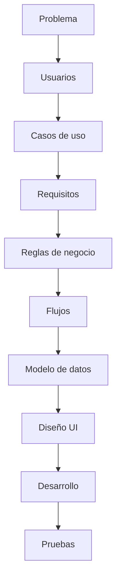

# Flujo del sistema

> [!info] Estado
> Pendiente de diseñar en detalle. Placeholder inicial basado en el contexto del proyecto.

## Flujo de trabajo general (proceso, no aún UI)

## Creación de un proyecto

> [!success] Decidido el 2026-08-16 — lo crea el estudiante

El asesor es **opcional al crear**: el proyecto puede existir sin asesor y asignarse después. Pero hasta que no haya asesor no puede haber hitos, porque los crea él ([[Decisiones pendientes#Decisión 2 - Quién crea los hitos|D2]]).

Se eligió sobre "lo crea el coordinador" porque encaja con [[Alcance|D1, plataforma general]]: no depende de que exista un coordinador cargando todo a mano.

## Por definir
- Flujo del dashboard por rol (el endpoint de resumen ya existe, falta el diseño de la pantalla)

## Ver también
- [[Reglas de negocio]]
- [[Arquitectura]]
- [[Base de datos]]
