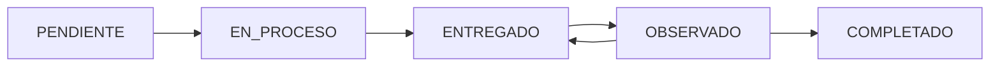

# Hitos

> [!question] Pregunta del profesor
> ¿Cómo vamos a manejar los hitos?

Este es uno de los puntos más importantes por definir. Ver [[Decisiones pendientes]].

## Propuesta actual

Los hitos **no serán completamente rígidos**. Diferentes tesis pueden tener distintas etapas según:

- Universidad
- Carrera
- Tipo de investigación
- Metodología
- Reglamento
- Proceso de asesoría

Ejemplo de estructura posible:
1. Planteamiento del problema
2. Marco teórico
3. Metodología
4. Resultados
5. Discusión
6. Versión final
7. Sustentación

Pero otra tesis podría usar una estructura completamente diferente.

> [!success] Propuesta
> Cada proyecto de tesis tiene sus propios hitos configurables.

## Atributos de un hito

- Nombre
- Descripción
- Fecha límite
- Estado
- Entrega asociada
- Observaciones relacionadas
- Posiblemente: porcentaje de avance

## Estados del hito

> [!success] Decidido el 2026-08-16
> Cinco estados. Ver [[Decisiones pendientes#Decisión 3 - Estados del hito]].

| Estado | Significa |
|--------|-----------|
| `PENDIENTE` | El hito existe pero el estudiante todavía no empezó |
| `EN_PROCESO` | El estudiante está trabajando en él |
| `ENTREGADO` | Hay una entrega subida esperando revisión del asesor |
| `OBSERVADO` | El asesor revisó y registró observaciones a corregir |
| `COMPLETADO` | El asesor dio el hito por cerrado |

El retorno `OBSERVADO → ENTREGADO` ocurre cuando el estudiante sube una nueva versión corrigiendo las observaciones.

## Relación con las entregas

> [!success] Decidido el 2026-08-16
> Un hito tiene **N entregas**: cada versión es una entrega con su propio número. Ver [[Decisiones pendientes#Decisión 5 - Relación hito-entrega]].

## Quién los crea y quién los modifica

> [!success] Decidido el 2026-08-16
> Los crea y los edita **el asesor del proyecto** ([[Decisiones pendientes#Decisión 2 - Quién crea los hitos|D2]]). El estudiante solo los consulta y entrega contra ellos.
>
> Se pueden **editar siempre**, pero solo **borrar si no tienen entregas** ([[Decisiones pendientes#Decisión 4 - Modificación de hitos|D4]]).

Consecuencia: un proyecto sin asesor asignado todavía no puede tener hitos.

## Ver también
- [[Reglas de negocio]]
- [[Funcionalidades]]
