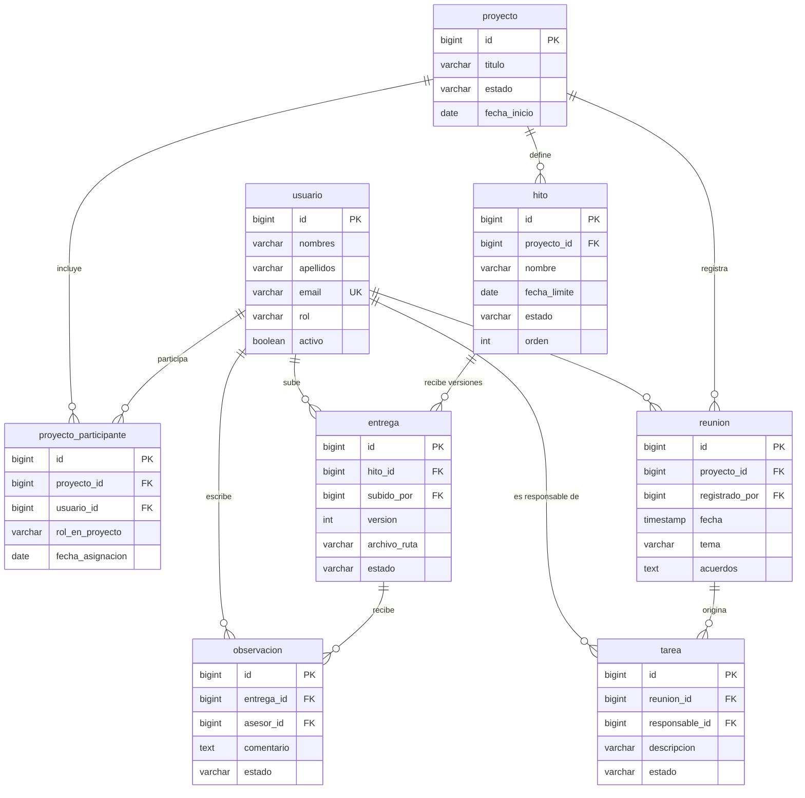

# Taller 1 — Diseño e Implementación de una Base de Datos desde Cero

> [!info] Origen
> Enunciado del taller de las sesiones 13, 14 y 15 (`Taller-Enunciado (1).md`, en la raíz del repo). No es uno de los 5 [[Entregables y evaluación|entregables]] calificados del curso — es un ejercicio de clase, aplicado al propio caso de negocio del grupo.

> [!warning] Rediseñado desde cero el 2026-08-18 — es la primera entrega, no el sistema completo
> La primera versión de esta nota reusaba el esquema de producción de TesisTrack (12 tablas, ya en el Entregable 1). Se descartó: el profesor **todavía no vio nada** de este proyecto, y ese esquema acumula decisiones de iteraciones posteriores (carpetas del asesor, archivos en `bytea`, tesis grupales) que no hacen falta para presentar *una primera versión* razonada.
>
> En su lugar se adoptó el modelo de `TesisTrack_Entidades_Relaciones.md` — una propuesta del grupo, más simple (8 entidades) y con una justificación de diseño más prolija que la que había acá. **Es un modelo distinto al de [[Base de datos]]** (nombres en español, sin tabla `acuerdo`, asesor modelado como participante y no como columna, archivo con ruta externa en vez de `bytea`) — a propósito, porque este taller pide la *primera* versión, no la actual. No implica cambiar el backend ya construido.

## Qué pide el taller, bloque por bloque

| Bloque | Qué pide | Estado |
|---|---|---|
| 1 — Diseño | Caso, usuarios, entidades, relaciones 1:1/1:N/N:M, ERD con PK/FK | ✅ abajo |
| 2 — Esquema | `CREATE TABLE`, constraints, `DEFAULT`, `ON DELETE`/`ON UPDATE` | ✅ abajo |
| 3 — Carga y manipulación | `INSERT`, `UPDATE`, `DELETE` de prueba | ✅ abajo |
| 4 — Consultas | `SELECT`/`JOIN`/`LEFT JOIN`/agregación, 2-3 preguntas de negocio | ⬜ pendiente |
| 5 — Cierre | Presentar caso, alcance y ERD | ⬜ pendiente (reusa el Bloque 1) |

---

## Bloque 1 — Diseño

### 1. Caso de negocio

Durante una tesis, estudiante y asesor generan mucha información —acuerdos de reuniones, tareas pendientes, fechas de entrega, versiones de documentos, observaciones— que hoy queda repartida entre WhatsApp, correo y reuniones sueltas. TesisTrack la centraliza en un solo lugar.

### 2. Usuarios

| Rol         | Puede                                                                                                        |
| ----------- | ------------------------------------------------------------------------------------------------------------ |
| Estudiante  | Consultar su proyecto e hitos, subir entregas, ver observaciones y tareas, revisar el historial de reuniones |
| Asesor      | Gestionar hitos, revisar entregas, dejar observaciones, registrar reuniones y tareas                         |
| Coordinador | Consultar cualquier proyecto — solo lectura, no crea ni edita                                                |

Los tres comparten los mismos atributos y se modelan en **una sola tabla** (`usuario`), diferenciados por el campo `rol`. Si más adelante alguien necesita dos roles a la vez, ahí sí haría falta partir esto en una tabla `rol` y una intermedia — hoy no es el caso.

### 3. Entidades y atributos

Ocho entidades, nomenclatura `snake_case`, tablas en singular.

**`usuario`** — cualquier persona que accede al sistema.

| Atributo | Tipo | Restricción |
|---|---|---|
| `id` | BIGINT | **PK** |
| `nombres` | VARCHAR(100) | NOT NULL |
| `apellidos` | VARCHAR(100) | NOT NULL |
| `email` | VARCHAR(150) | NOT NULL, **UNIQUE** — es la credencial de acceso |
| `password_hash` | VARCHAR(255) | NOT NULL |
| `rol` | VARCHAR(20) | NOT NULL, CHECK ∈ `ESTUDIANTE`, `ASESOR`, `COORDINADOR` |
| `activo` | BOOLEAN | NOT NULL, DEFAULT `TRUE` — desactivar sin borrar |
| `creado_en` | TIMESTAMP | NOT NULL, DEFAULT ahora |

**`proyecto`** — la tesis. Contenedor principal.

| Atributo | Tipo | Restricción |
|---|---|---|
| `id` | BIGINT | **PK** |
| `titulo` | VARCHAR(250) | NOT NULL |
| `descripcion` | TEXT | NULL |
| `estado` | VARCHAR(20) | NOT NULL, CHECK ∈ `EN_CURSO`, `PAUSADO`, `FINALIZADO`, `CANCELADO` |
| `fecha_inicio` | DATE | NOT NULL |
| `fecha_fin_estimada` | DATE | NULL |
| `creado_en` | TIMESTAMP | NOT NULL |

**`proyecto_participante`** *(tabla intermedia)* — resuelve la N:M entre `usuario` y `proyecto`. Un mismo registro sirve para estudiantes, asesor o coasesor, distinguidos por `rol_en_proyecto`.

| Atributo           | Tipo        | Restricción                                          |
| ------------------ | ----------- | ---------------------------------------------------- |
| `id`               | BIGINT      | **PK** (llave sustituta)                             |
| `proyecto_id`      | BIGINT      | **FK** → `proyecto.id`, NOT NULL                     |
| `usuario_id`       | BIGINT      | **FK** → `usuario.id`, NOT NULL                      |
| `rol_en_proyecto`  | VARCHAR(20) | NOT NULL, CHECK ∈ `ESTUDIANTE`, `ASESOR`, `COASESOR` |
| `fecha_asignacion` | DATE        | NOT NULL                                             |
|                    |             |                                                      |

Restricción adicional: `UNIQUE (proyecto_id, usuario_id)` — una persona no está dos veces en el mismo proyecto.

**`hito`** — puntos de control planificados: plan de tesis, marco teórico, borrador final…

| Atributo | Tipo | Restricción |
|---|---|---|
| `id` | BIGINT | **PK** |
| `proyecto_id` | BIGINT | **FK** → `proyecto.id`, NOT NULL |
| `nombre` | VARCHAR(150) | NOT NULL |
| `descripcion` | TEXT | NULL |
| `fecha_limite` | DATE | NOT NULL |
| `estado` | VARCHAR(20) | NOT NULL, CHECK ∈ `PENDIENTE`, `EN_PROGRESO`, `COMPLETADO`, `VENCIDO` |
| `orden` | INT | NOT NULL |

Restricción adicional: `UNIQUE (proyecto_id, orden)`.

**`reunion`** — cada asesoría registrada. Los acuerdos van como texto libre; lo que se vuelve compromiso con responsable y plazo pasa a ser una `tarea`.

| Atributo | Tipo | Restricción |
|---|---|---|
| `id` | BIGINT | **PK** |
| `proyecto_id` | BIGINT | **FK** → `proyecto.id`, NOT NULL |
| `registrado_por` | BIGINT | **FK** → `usuario.id`, NOT NULL |
| `fecha` | TIMESTAMP | NOT NULL |
| `tema` | VARCHAR(200) | NOT NULL |
| `resumen` | TEXT | NULL |
| `acuerdos` | TEXT | NULL |
| `modalidad` | VARCHAR(20) | NULL, CHECK ∈ `PRESENCIAL`, `VIRTUAL` |

**`tarea`** — compromisos que salen de una reunión.

| Atributo | Tipo | Restricción |
|---|---|---|
| `id` | BIGINT | **PK** |
| `reunion_id` | BIGINT | **FK** → `reunion.id`, NOT NULL |
| `responsable_id` | BIGINT | **FK** → `usuario.id`, NOT NULL |
| `descripcion` | VARCHAR(300) | NOT NULL |
| `fecha_limite` | DATE | NULL |
| `estado` | VARCHAR(20) | NOT NULL, CHECK ∈ `PENDIENTE`, `COMPLETADA` |
| `fecha_completado` | TIMESTAMP | NULL |

**`entrega`** — cada versión de documento subida contra un hito.

| Atributo | Tipo | Restricción |
|---|---|---|
| `id` | BIGINT | **PK** |
| `hito_id` | BIGINT | **FK** → `hito.id`, NOT NULL |
| `subido_por` | BIGINT | **FK** → `usuario.id`, NOT NULL |
| `version` | INT | NOT NULL — correlativo dentro del hito |
| `archivo_nombre` | VARCHAR(255) | NOT NULL |
| `archivo_ruta` | VARCHAR(500) | NOT NULL |
| `archivo_tipo` | VARCHAR(100) | NULL |
| `archivo_tamano` | BIGINT | NULL |
| `comentario` | TEXT | NULL |
| `fecha_entrega` | TIMESTAMP | NOT NULL |
| `estado` | VARCHAR(20) | NOT NULL, CHECK ∈ `ENVIADA`, `EN_REVISION`, `OBSERVADA`, `APROBADA` |

Restricción adicional: `UNIQUE (hito_id, version)`.

**`observacion`** — comentarios del asesor sobre una entrega específica.

| Atributo | Tipo | Restricción |
|---|---|---|
| `id` | BIGINT | **PK** |
| `entrega_id` | BIGINT | **FK** → `entrega.id`, NOT NULL |
| `asesor_id` | BIGINT | **FK** → `usuario.id`, NOT NULL |
| `comentario` | TEXT | NOT NULL |
| `estado` | VARCHAR(20) | NOT NULL, CHECK ∈ `PENDIENTE`, `ATENDIDA` |
| `fecha` | TIMESTAMP | NOT NULL |

### 4. Relaciones 1:1, 1:N y N:M

**N:M — la única del modelo, y la más importante.** `usuario` ↔ `proyecto`: un asesor guía varios proyectos, un proyecto tiene varios participantes (uno o dos estudiantes, un asesor, eventualmente un coasesor). Resuelta con `proyecto_participante`, que descompone la N:M en dos 1:N:

```
usuario  1 ──< proyecto_participante >── N  proyecto
```

No es un par de llaves sin más: tiene atributos propios (`rol_en_proyecto`, `fecha_asignacion`), lo que confirma que modelarla como entidad es correcto y no un artificio.

**1:N — once relaciones.**

*De composición (el hijo no existe sin el padre):*

| Padre | Hijo |
|---|---|
| `proyecto` | `hito` |
| `proyecto` | `reunion` |
| `hito` | `entrega` |
| `entrega` | `observacion` |
| `reunion` | `tarea` |

*De autoría, todas desde `usuario`:*

| Padre     | Hijo          | FK               |
| --------- | ------------- | ---------------- |
| `usuario` | `reunion`     | `registrado_por` |
| `usuario` | `entrega`     | `subido_por`     |
| `usuario` | `observacion` | `asesor_id`      |
| `usuario` | `tarea`       | `responsable_id` |

*Derivadas de la tabla intermedia:* `usuario` → `proyecto_participante`, `proyecto` → `proyecto_participante`.

**1:1 — no existe ninguna, y eso es correcto, no una omisión.** Se evaluaron dos candidatas y se descartaron:

- **`hito` ↔ entrega aprobada.** Se podría guardar `entrega_aprobada_id` en `hito`. Se descarta porque es **derivable**: alcanza con consultar la entrega del hito cuyo estado sea `APROBADA`. Agregar la columna sería redundancia con riesgo de inconsistencia.
- **`usuario` ↔ perfil.** Separar credenciales de datos personales en dos tablas 1:1 es válido en sistemas grandes. Se descarta por innecesario acá: `usuario` tiene pocos atributos, dividirla solo agrega un `JOIN` a cada consulta.

Una relación 1:1 suele ser señal de que dos tablas deberían ser una sola — que no aparezca ninguna acá es indicio de que el modelo está bien consolidado.

### 5. Resumen de llaves

| Tabla                   | PK   | FK                              | Restricciones únicas        |
| ----------------------- | ---- | ------------------------------- | --------------------------- |
| `usuario`               | `id` | —                               | `email`                     |
| `proyecto`              | `id` | —                               | —                           |
| `proyecto_participante` | `id` | `proyecto_id`, `usuario_id`     | `(proyecto_id, usuario_id)` |
| `hito`                  | `id` | `proyecto_id`                   | `(proyecto_id, orden)`      |
| `reunion`               | `id` | `proyecto_id`, `registrado_por` | —                           |
| `tarea`                 | `id` | `reunion_id`, `responsable_id`  | —                           |
| `entrega`               | `id` | `hito_id`, `subido_por`         | `(hito_id, version)`        |
| `observacion`           | `id` | `entrega_id`, `asesor_id`       | —                           |

**Totales:** 8 tablas, 8 PK, 11 FK, 4 restricciones únicas.

> [!note] Por qué `proyecto_participante` usa llave sustituta y no `(proyecto_id, usuario_id)` como PK compuesta
> Simplifica el mapeo con JPA en Spring Boot, permite referenciar el registro si el modelo crece, y mantiene la nomenclatura uniforme (todas las tablas tienen `id`). La unicidad del par se garantiza igual con el `UNIQUE`. Ambas opciones son defendibles — lo importante es tener el argumento a mano si preguntan.

### 6. Diagrama Entidad-Relación



### 7. Notas para sustentar

Tres preguntas que probablemente salgan en la defensa:

**¿Por qué el rol es un campo y no una tabla?** Los tres roles son fijos y conocidos, y un usuario tiene uno solo. Un `CHECK` alcanza. Si más adelante alguien necesita ser asesor y coordinador a la vez, ahí habría que crear `rol` y una intermedia `usuario_rol` — segunda relación N:M.

**¿Por qué los acuerdos no son una entidad?** Un acuerdo sin responsable ni plazo es texto descriptivo, y va como campo en `reunion`. Cuando adquiere responsable y fecha se convierte en `tarea`, que sí es entidad porque tiene estado y ciclo de vida propio.

**¿Cómo se arma el historial cronológico?** No hay tabla `historial`. La línea de tiempo se construye con una consulta que une `reunion`, `entrega` y `observacion` del proyecto, ordenadas por fecha. Si más adelante el rendimiento lo justifica, se agregaría una tabla `evento_proyecto` alimentada en cada registro — no hace falta para esta versión.

### 8. Guion para presentar

> [!quote] Caso de negocio y usuarios
> "TesisTrack centraliza el seguimiento de una tesis. Hoy esa información —acuerdos, tareas, versiones de documentos, observaciones— vive repartida entre WhatsApp, correo y reuniones sueltas. El sistema tiene tres roles: el **estudiante**, que sube entregas y consulta observaciones; el **asesor**, que gestiona hitos y registra reuniones; y el **coordinador**, que solo consulta, no opera."

> [!quote] Entidades
> "Identificamos ocho entidades. El centro es `proyecto`, la tesis. De ahí cuelgan `hito`, `entrega` y `observacion` —el seguimiento del documento— y `reunion` con `tarea` —el seguimiento de las reuniones. `usuario` representa a cualquier persona, diferenciada por su rol."

> [!quote] Relaciones
> "Tenemos una relación muchos a muchos: un usuario participa en varios proyectos, y un proyecto tiene varios participantes. La resolvimos con `proyecto_participante`, que además guarda el rol de esa persona en ese proyecto puntual —estudiante, asesor o coasesor. El resto son relaciones uno a muchos. Y evaluamos si había alguna uno a uno; no encontramos ninguna que se justifique, y lo explicamos: los dos candidatos que evaluamos son derivables o innecesarios, así que preferimos no forzarlos."

> [!quote] ERD
> *(señalar pantalla)* "Acá se ve todo junto: `proyecto` en el centro, la tabla intermedia hacia `usuario`, y las dos cadenas de trazabilidad a los costados."

---

## Bloque 2 — Esquema

### 1. Acciones referenciales — criterio general

Dos reglas, no una por tabla:

| Origen del borrado | Acción | Por qué |
|---|---|---|
| Se borra un `proyecto`, `hito`, `reunion` o `entrega` | **`ON DELETE CASCADE`** | Sus hijos (`hito`, `reunion`, `proyecto_participante`, `entrega`, `tarea`, `observacion`) no tienen sentido sin el padre — son de composición, ver [[#4. Relaciones 1:1, 1:N y N:M\|Bloque 1 §4]] |
| Se borra un `usuario` | **`ON DELETE RESTRICT`** | Un sistema cuyo propósito es la trazabilidad no puede perder al autor de una observación o al responsable de una tarea. No se borra: se marca `activo = FALSE` |

**`ON UPDATE NO ACTION`** en todas las FK — es el default de PostgreSQL, y se declara explícito para no dejarlo a la duda. Todas las PK son `BIGSERIAL` autogeneradas y nunca se actualizan, así que no hay nada que propagar.

### 2. `CREATE TABLE`

```sql
-- ---------------------------------------------------------------
-- TesisTrack — Taller 1, esquema v1 (8 tablas)
-- ---------------------------------------------------------------

CREATE TABLE usuario (
    id            BIGSERIAL     PRIMARY KEY,
    nombres       VARCHAR(100)  NOT NULL,
    apellidos     VARCHAR(100)  NOT NULL,
    email         VARCHAR(150)  NOT NULL UNIQUE,
    password_hash VARCHAR(255)  NOT NULL,
    rol           VARCHAR(20)   NOT NULL
                  CHECK (rol IN ('ESTUDIANTE', 'ASESOR', 'COORDINADOR')),
    activo        BOOLEAN       NOT NULL DEFAULT TRUE,
    creado_en     TIMESTAMP     NOT NULL DEFAULT now()
);

CREATE TABLE proyecto (
    id                 BIGSERIAL    PRIMARY KEY,
    titulo             VARCHAR(250) NOT NULL,
    descripcion        TEXT,
    estado             VARCHAR(20)  NOT NULL DEFAULT 'EN_CURSO'
                       CHECK (estado IN ('EN_CURSO', 'PAUSADO', 'FINALIZADO', 'CANCELADO')),
    fecha_inicio       DATE         NOT NULL DEFAULT CURRENT_DATE,
    fecha_fin_estimada DATE,
    creado_en          TIMESTAMP    NOT NULL DEFAULT now()
);

-- Resuelve la N:M usuario<->proyecto (Bloque 1 §4). rol_en_proyecto distingue
-- estudiante, asesor o coasesor dentro de un mismo proyecto.
CREATE TABLE proyecto_participante (
    id               BIGSERIAL    PRIMARY KEY,
    proyecto_id      BIGINT       NOT NULL
                      REFERENCES proyecto (id) ON DELETE CASCADE ON UPDATE NO ACTION,
    usuario_id       BIGINT       NOT NULL
                      REFERENCES usuario (id) ON DELETE RESTRICT ON UPDATE NO ACTION,
    rol_en_proyecto  VARCHAR(20)  NOT NULL
                      CHECK (rol_en_proyecto IN ('ESTUDIANTE', 'ASESOR', 'COASESOR')),
    fecha_asignacion DATE         NOT NULL DEFAULT CURRENT_DATE,
    CONSTRAINT uk_participante UNIQUE (proyecto_id, usuario_id)
);

CREATE TABLE hito (
    id           BIGSERIAL    PRIMARY KEY,
    proyecto_id  BIGINT       NOT NULL
                 REFERENCES proyecto (id) ON DELETE CASCADE ON UPDATE NO ACTION,
    nombre       VARCHAR(150) NOT NULL,
    descripcion  TEXT,
    fecha_limite DATE         NOT NULL,
    estado       VARCHAR(20)  NOT NULL DEFAULT 'PENDIENTE'
                 CHECK (estado IN ('PENDIENTE', 'EN_PROGRESO', 'COMPLETADO', 'VENCIDO')),
    orden        INT          NOT NULL,
    CONSTRAINT uk_hito_orden UNIQUE (proyecto_id, orden)
);

CREATE TABLE reunion (
    id             BIGSERIAL    PRIMARY KEY,
    proyecto_id    BIGINT       NOT NULL
                    REFERENCES proyecto (id) ON DELETE CASCADE ON UPDATE NO ACTION,
    registrado_por BIGINT       NOT NULL
                    REFERENCES usuario (id) ON DELETE RESTRICT ON UPDATE NO ACTION,
    fecha          TIMESTAMP    NOT NULL,
    tema           VARCHAR(200) NOT NULL,
    resumen        TEXT,
    acuerdos       TEXT,
    modalidad      VARCHAR(20)
                   CHECK (modalidad IN ('PRESENCIAL', 'VIRTUAL'))
);

CREATE TABLE tarea (
    id               BIGSERIAL    PRIMARY KEY,
    reunion_id       BIGINT       NOT NULL
                      REFERENCES reunion (id) ON DELETE CASCADE ON UPDATE NO ACTION,
    responsable_id   BIGINT       NOT NULL
                      REFERENCES usuario (id) ON DELETE RESTRICT ON UPDATE NO ACTION,
    descripcion      VARCHAR(300) NOT NULL,
    fecha_limite     DATE,
    estado           VARCHAR(20)  NOT NULL DEFAULT 'PENDIENTE'
                      CHECK (estado IN ('PENDIENTE', 'COMPLETADA')),
    fecha_completado TIMESTAMP
);

CREATE TABLE entrega (
    id             BIGSERIAL    PRIMARY KEY,
    hito_id        BIGINT       NOT NULL
                    REFERENCES hito (id) ON DELETE CASCADE ON UPDATE NO ACTION,
    subido_por     BIGINT       NOT NULL
                    REFERENCES usuario (id) ON DELETE RESTRICT ON UPDATE NO ACTION,
    version        INT          NOT NULL,
    archivo_nombre VARCHAR(255) NOT NULL,
    archivo_ruta   VARCHAR(500) NOT NULL,
    archivo_tipo   VARCHAR(100),
    archivo_tamano BIGINT,
    comentario     TEXT,
    fecha_entrega  TIMESTAMP    NOT NULL DEFAULT now(),
    estado         VARCHAR(20)  NOT NULL DEFAULT 'ENVIADA'
                   CHECK (estado IN ('ENVIADA', 'EN_REVISION', 'OBSERVADA', 'APROBADA')),
    CONSTRAINT uk_entrega_version UNIQUE (hito_id, version)
);

CREATE TABLE observacion (
    id         BIGSERIAL   PRIMARY KEY,
    entrega_id BIGINT      NOT NULL
               REFERENCES entrega (id) ON DELETE CASCADE ON UPDATE NO ACTION,
    asesor_id  BIGINT      NOT NULL
               REFERENCES usuario (id) ON DELETE RESTRICT ON UPDATE NO ACTION,
    comentario TEXT        NOT NULL,
    estado     VARCHAR(20) NOT NULL DEFAULT 'PENDIENTE'
               CHECK (estado IN ('PENDIENTE', 'ATENDIDA')),
    fecha      TIMESTAMP   NOT NULL DEFAULT now()
);
```

### 3. Índices

PostgreSQL crea el índice de la PK y de cada `UNIQUE` solo — el resto hay que pedirlo, y **las FK no se indexan automáticamente** (a diferencia de MySQL/InnoDB), así que sin esto cada `JOIN` hace un recorrido completo.

```sql
-- Sobre columnas que arman las pantallas del panel
CREATE INDEX idx_hito_proyecto_fecha    ON hito (proyecto_id, fecha_limite);
CREATE INDEX idx_entrega_hito_version   ON entrega (hito_id, version DESC);
CREATE INDEX idx_observacion_entrega    ON observacion (entrega_id, estado);
CREATE INDEX idx_tarea_responsable      ON tarea (responsable_id, estado);
CREATE INDEX idx_reunion_proyecto_fecha ON reunion (proyecto_id, fecha DESC);
CREATE INDEX idx_participante_usuario   ON proyecto_participante (usuario_id);

-- FK que no quedan cubiertas por ninguno de los de arriba
CREATE INDEX idx_reunion_registrado_por ON reunion (registrado_por);
CREATE INDEX idx_entrega_subido_por     ON entrega (subido_por);
CREATE INDEX idx_observacion_asesor     ON observacion (asesor_id);
```

| Índice | Para qué |
|---|---|
| `hito (proyecto_id, fecha_limite)` | Próximos hitos del proyecto, ordenados |
| `entrega (hito_id, version DESC)` | Traer la última versión sin escanear todas |
| `observacion (entrega_id, estado)` | Contar observaciones pendientes |
| `tarea (responsable_id, estado)` | Pendientes de un usuario |
| `reunion (proyecto_id, fecha DESC)` | Historial de asesorías, más reciente primero |
| `proyecto_participante (usuario_id)` | Proyectos de un usuario al iniciar sesión |

### 4. `DEFAULT` automáticos

Ya están en el DDL de arriba, resumidos: `usuario.creado_en`, `proyecto.creado_en`/`fecha_inicio`, `proyecto.estado` (`'EN_CURSO'`), `usuario.activo` (`TRUE`), `hito.estado` (`'PENDIENTE'`), `entrega.fecha_entrega`/`estado` (`'ENVIADA'`), `observacion.fecha`/`estado` (`'PENDIENTE'`), `proyecto_participante.fecha_asignacion`.

---

## Bloque 3 — Carga y manipulación

### 1. Escenario

Tres tesis, siete personas, en distintos puntos del proceso — a propósito, para que las consultas del Bloque 4 tengan algo real que mostrar:

| Proyecto | Integrantes | Asesor | Situación |
|---|---|---|---|
| Rutas de transporte urbano | Diego (solo) | Jorge | Un hito **vencido**, para el reporte de atrasos |
| Trazabilidad de cadena de frío | Valeria + Andrés (grupal) | Patricia, con Jorge de **coasesor** | El ciclo de corrección completo: entrega observada → corregida |
| Deserción estudiantil | Lucía (sola) | **sin asignar** | Para el `LEFT JOIN` del Bloque 4 — un proyecto sin participante `ASESOR` |

Los `INSERT` van en el orden que obligan las FK: `usuario` → `proyecto` → `proyecto_participante` → `hito` → `reunion` → `tarea` → `entrega` → `observacion`.

### 2. `INSERT INTO`

```sql
-- ---------------------------------------------------------------
-- usuario
-- ---------------------------------------------------------------
INSERT INTO usuario (nombres, apellidos, email, password_hash, rol) VALUES
    ('María',   'Rojas',      'coordinador@tesistrack.com',     '$2a$10$hashDemo1', 'COORDINADOR'),
    ('Jorge',   'Salinas',    'jorge.salinas@tesistrack.com',   '$2a$10$hashDemo2', 'ASESOR'),
    ('Patricia','Núñez',      'patricia.nunez@tesistrack.com',  '$2a$10$hashDemo3', 'ASESOR'),
    ('Diego',   'Ramírez',    'diego.ramirez@tesistrack.com',   '$2a$10$hashDemo4', 'ESTUDIANTE'),
    ('Valeria', 'Castillo',   'valeria.castillo@tesistrack.com','$2a$10$hashDemo5', 'ESTUDIANTE'),
    ('Andrés',  'Paredes',    'andres.paredes@tesistrack.com',  '$2a$10$hashDemo6', 'ESTUDIANTE'),
    ('Lucía',   'Fernández',  'lucia.fernandez@tesistrack.com', '$2a$10$hashDemo7', 'ESTUDIANTE');

-- ---------------------------------------------------------------
-- proyecto
-- ---------------------------------------------------------------
INSERT INTO proyecto (titulo, descripcion, estado, fecha_inicio) VALUES
    ('Sistema de recomendación de rutas de transporte urbano con aprendizaje por refuerzo',
     'Optimiza rutas de transporte público usando un agente entrenado sobre datos históricos.',
     'EN_CURSO', '2026-03-03'),
    ('Plataforma de trazabilidad de cadena de frío para productos agrícolas',
     'Monitoreo de temperatura con sensores IoT durante el transporte de productos perecederos.',
     'EN_CURSO', '2026-03-10'),
    ('Detección temprana de deserción estudiantil mediante modelos predictivos',
     'Modelo predictivo sobre datos académicos para alertar riesgo de abandono.',
     'EN_CURSO', '2026-04-01');

-- ---------------------------------------------------------------
-- proyecto_participante
-- ---------------------------------------------------------------
INSERT INTO proyecto_participante (proyecto_id, usuario_id, rol_en_proyecto) VALUES
    ((SELECT id FROM proyecto WHERE titulo LIKE 'Sistema de recomendación de rutas%'),
     (SELECT id FROM usuario WHERE email = 'diego.ramirez@tesistrack.com'), 'ESTUDIANTE'),
    ((SELECT id FROM proyecto WHERE titulo LIKE 'Sistema de recomendación de rutas%'),
     (SELECT id FROM usuario WHERE email = 'jorge.salinas@tesistrack.com'), 'ASESOR'),

    ((SELECT id FROM proyecto WHERE titulo LIKE 'Plataforma de trazabilidad%'),
     (SELECT id FROM usuario WHERE email = 'valeria.castillo@tesistrack.com'), 'ESTUDIANTE'),
    ((SELECT id FROM proyecto WHERE titulo LIKE 'Plataforma de trazabilidad%'),
     (SELECT id FROM usuario WHERE email = 'andres.paredes@tesistrack.com'), 'ESTUDIANTE'),
    ((SELECT id FROM proyecto WHERE titulo LIKE 'Plataforma de trazabilidad%'),
     (SELECT id FROM usuario WHERE email = 'patricia.nunez@tesistrack.com'), 'ASESOR'),
    ((SELECT id FROM proyecto WHERE titulo LIKE 'Plataforma de trazabilidad%'),
     (SELECT id FROM usuario WHERE email = 'jorge.salinas@tesistrack.com'), 'COASESOR'),

    ((SELECT id FROM proyecto WHERE titulo LIKE 'Detección temprana de deserción%'),
     (SELECT id FROM usuario WHERE email = 'lucia.fernandez@tesistrack.com'), 'ESTUDIANTE');
    -- Deserción estudiantil queda sin ASESOR a propósito

-- ---------------------------------------------------------------
-- hito
-- ---------------------------------------------------------------
INSERT INTO hito (proyecto_id, nombre, fecha_limite, estado, orden) VALUES
    ((SELECT id FROM proyecto WHERE titulo LIKE 'Sistema de recomendación de rutas%'), 'Plan de tesis',    '2026-04-15', 'COMPLETADO',  1),
    ((SELECT id FROM proyecto WHERE titulo LIKE 'Sistema de recomendación de rutas%'), 'Marco teórico',    '2026-06-01', 'EN_PROGRESO', 2),
    ((SELECT id FROM proyecto WHERE titulo LIKE 'Sistema de recomendación de rutas%'), 'Metodología',      '2026-08-01', 'VENCIDO',     3),
    ((SELECT id FROM proyecto WHERE titulo LIKE 'Sistema de recomendación de rutas%'), 'Borrador final',   '2026-11-15', 'PENDIENTE',   4),

    ((SELECT id FROM proyecto WHERE titulo LIKE 'Plataforma de trazabilidad%'), 'Plan de tesis', '2026-04-20', 'COMPLETADO',  1),
    ((SELECT id FROM proyecto WHERE titulo LIKE 'Plataforma de trazabilidad%'), 'Marco teórico', '2026-07-01', 'EN_PROGRESO', 2),
    ((SELECT id FROM proyecto WHERE titulo LIKE 'Plataforma de trazabilidad%'), 'Prototipo',     '2026-09-30', 'PENDIENTE',   3);
    -- Deserción estudiantil todavía no tiene hitos: sin asesor, no hay quien los cargue

-- ---------------------------------------------------------------
-- reunion
-- ---------------------------------------------------------------
INSERT INTO reunion (proyecto_id, registrado_por, fecha, tema, resumen, acuerdos, modalidad) VALUES
    ((SELECT id FROM proyecto WHERE titulo LIKE 'Sistema de recomendación de rutas%'),
     (SELECT id FROM usuario WHERE email = 'jorge.salinas@tesistrack.com'),
     '2026-04-10 15:00', 'Revisión de plan de tesis', 'Se revisó el alcance propuesto.',
     'Ajustar el alcance del capítulo 2', 'VIRTUAL'),
    ((SELECT id FROM proyecto WHERE titulo LIKE 'Sistema de recomendación de rutas%'),
     (SELECT id FROM usuario WHERE email = 'jorge.salinas@tesistrack.com'),
     '2026-06-20 10:00', 'Avance de marco teórico', 'Bibliografía insuficiente en la sección 2.3.',
     'Agregar 5 referencias más de los últimos 3 años', 'PRESENCIAL'),

    ((SELECT id FROM proyecto WHERE titulo LIKE 'Plataforma de trazabilidad%'),
     (SELECT id FROM usuario WHERE email = 'patricia.nunez@tesistrack.com'),
     '2026-04-18 09:00', 'Kickoff del proyecto', 'Primera reunión con ambos tesistas.',
     'Definir arquitectura de sensores IoT', 'PRESENCIAL'),
    ((SELECT id FROM proyecto WHERE titulo LIKE 'Plataforma de trazabilidad%'),
     (SELECT id FROM usuario WHERE email = 'jorge.salinas@tesistrack.com'),
     '2026-07-05 16:00', 'Revisión de prototipo', 'El coasesor aportó mirada de campo.',
     'Validar con un caso real de exportadora', 'VIRTUAL');

-- ---------------------------------------------------------------
-- tarea
-- ---------------------------------------------------------------
INSERT INTO tarea (reunion_id, responsable_id, descripcion, fecha_limite, estado, fecha_completado) VALUES
    ((SELECT id FROM reunion WHERE tema = 'Revisión de plan de tesis'),
     (SELECT id FROM usuario WHERE email = 'diego.ramirez@tesistrack.com'),
     'Reescribir el alcance del capítulo 2 según lo acordado', '2026-04-25', 'COMPLETADA', '2026-04-23 18:30'),
    ((SELECT id FROM reunion WHERE tema = 'Avance de marco teórico'),
     (SELECT id FROM usuario WHERE email = 'diego.ramirez@tesistrack.com'),
     'Sumar 5 referencias de 2023-2026 al marco teórico', '2026-07-01', 'PENDIENTE', NULL),
    ((SELECT id FROM reunion WHERE tema = 'Kickoff del proyecto'),
     (SELECT id FROM usuario WHERE email = 'valeria.castillo@tesistrack.com'),
     'Investigar proveedores de sensores IoT de temperatura', '2026-05-01', 'COMPLETADA', '2026-04-29 12:00'),
    ((SELECT id FROM reunion WHERE tema = 'Revisión de prototipo'),
     (SELECT id FROM usuario WHERE email = 'andres.paredes@tesistrack.com'),
     'Contactar a una exportadora para el piloto', '2026-07-20', 'PENDIENTE', NULL);

-- ---------------------------------------------------------------
-- entrega
-- ---------------------------------------------------------------
INSERT INTO entrega (hito_id, subido_por, version, archivo_nombre, archivo_ruta, archivo_tipo, estado, fecha_entrega) VALUES
    ((SELECT id FROM hito WHERE nombre = 'Plan de tesis' AND proyecto_id = (SELECT id FROM proyecto WHERE titulo LIKE 'Sistema de recomendación de rutas%')),
     (SELECT id FROM usuario WHERE email = 'diego.ramirez@tesistrack.com'), 1,
     'plan_tesis_v1.pdf', 's3://tesistrack/entregas/plan_tesis_v1.pdf', 'application/pdf', 'APROBADA', '2026-04-08 11:00'),

    ((SELECT id FROM hito WHERE nombre = 'Marco teórico' AND proyecto_id = (SELECT id FROM proyecto WHERE titulo LIKE 'Sistema de recomendación de rutas%')),
     (SELECT id FROM usuario WHERE email = 'diego.ramirez@tesistrack.com'), 1,
     'marco_teorico_v1.pdf', 's3://tesistrack/entregas/marco_teorico_v1.pdf', 'application/pdf', 'OBSERVADA', '2026-06-15 09:20'),
    ((SELECT id FROM hito WHERE nombre = 'Marco teórico' AND proyecto_id = (SELECT id FROM proyecto WHERE titulo LIKE 'Sistema de recomendación de rutas%')),
     (SELECT id FROM usuario WHERE email = 'diego.ramirez@tesistrack.com'), 2,
     'marco_teorico_v2.pdf', 's3://tesistrack/entregas/marco_teorico_v2.pdf', 'application/pdf', 'EN_REVISION', '2026-08-10 17:45'),

    ((SELECT id FROM hito WHERE nombre = 'Plan de tesis' AND proyecto_id = (SELECT id FROM proyecto WHERE titulo LIKE 'Plataforma de trazabilidad%')),
     (SELECT id FROM usuario WHERE email = 'valeria.castillo@tesistrack.com'), 1,
     'plan_tesis_v1.pdf', 's3://tesistrack/entregas/cadena_frio_plan_v1.pdf', 'application/pdf', 'APROBADA', '2026-04-15 10:00'),
    ((SELECT id FROM hito WHERE nombre = 'Marco teórico' AND proyecto_id = (SELECT id FROM proyecto WHERE titulo LIKE 'Plataforma de trazabilidad%')),
     (SELECT id FROM usuario WHERE email = 'andres.paredes@tesistrack.com'), 1,
     'marco_teorico_v1.pdf', 's3://tesistrack/entregas/cadena_frio_marco_v1.pdf', 'application/pdf', 'ENVIADA', '2026-08-16 08:30');

-- ---------------------------------------------------------------
-- observacion
-- ---------------------------------------------------------------
INSERT INTO observacion (entrega_id, asesor_id, comentario, estado, fecha) VALUES
    ((SELECT id FROM entrega WHERE archivo_nombre = 'marco_teorico_v1.pdf' AND version = 1
       AND hito_id = (SELECT id FROM hito WHERE nombre = 'Marco teórico' AND proyecto_id = (SELECT id FROM proyecto WHERE titulo LIKE 'Sistema de recomendación de rutas%'))),
     (SELECT id FROM usuario WHERE email = 'jorge.salinas@tesistrack.com'),
     'Falta profundizar en los antecedentes nacionales', 'ATENDIDA', '2026-06-16 08:00'),
    ((SELECT id FROM entrega WHERE archivo_nombre = 'marco_teorico_v2.pdf'),
     (SELECT id FROM usuario WHERE email = 'jorge.salinas@tesistrack.com'),
     'Revisar formato de citas APA', 'PENDIENTE', '2026-08-11 09:15');
```

### 3. `UPDATE` — transiciones reales del flujo

```sql
-- Resolver la observación pendiente sobre la v2 del marco teórico
UPDATE observacion
SET estado = 'ATENDIDA'
WHERE comentario = 'Revisar formato de citas APA';

-- Aprobar esa misma entrega, ya corregida
UPDATE entrega
SET estado = 'APROBADA'
WHERE archivo_nombre = 'marco_teorico_v2.pdf';

-- El hito pasa a completado porque su última versión quedó aprobada
UPDATE hito
SET estado = 'COMPLETADO'
WHERE nombre = 'Marco teórico'
  AND proyecto_id = (SELECT id FROM proyecto WHERE titulo LIKE 'Sistema de recomendación de rutas%');

-- Diego completa la tarea que tenía vencida
UPDATE tarea
SET estado = 'COMPLETADA', fecha_completado = now()
WHERE descripcion LIKE 'Sumar 5 referencias%';

-- Un estudiante se da de baja del sistema: no se borra, se desactiva (ver DELETE más abajo)
UPDATE usuario
SET activo = FALSE
WHERE email = 'lucia.fernandez@tesistrack.com';
```

### 4. `DELETE FROM` — y qué pasa cuando la restricción frena el borrado

```sql
-- Una tarea duplicada que se cargó dos veces por error: se puede borrar sin problema
INSERT INTO tarea (reunion_id, responsable_id, descripcion, fecha_limite, estado)
VALUES ((SELECT id FROM reunion WHERE tema = 'Kickoff del proyecto'),
        (SELECT id FROM usuario WHERE email = 'valeria.castillo@tesistrack.com'),
        'Investigar proveedores de sensores IoT de temperatura', '2026-05-01', 'PENDIENTE');
        -- (duplicada sin querer)

DELETE FROM tarea
WHERE descripcion = 'Investigar proveedores de sensores IoT de temperatura'
  AND estado = 'PENDIENTE';
-- Borra solo la copia sin completar; la original (COMPLETADA) queda intacta

-- Andrés deja el proyecto grupal (sigue Valeria sola) — no rompe nada porque
-- proyecto_participante no es padre de ninguna otra tabla
DELETE FROM proyecto_participante
WHERE usuario_id = (SELECT id FROM usuario WHERE email = 'andres.paredes@tesistrack.com')
  AND proyecto_id = (SELECT id FROM proyecto WHERE titulo LIKE 'Plataforma de trazabilidad%');

-- Intento de borrar a Diego directamente: falla por el RESTRICT (Bloque 2 §1) —
-- tiene entregas, tareas y reuniones registradas a su nombre.
DELETE FROM usuario WHERE email = 'diego.ramirez@tesistrack.com';
-- ERROR:  update or delete on table "usuario" violates foreign key constraint
--         "entrega_subido_por_fkey" on table "entrega"

-- La forma correcta de "borrar" a alguien con historial:
UPDATE usuario SET activo = FALSE WHERE email = 'diego.ramirez@tesistrack.com';
```

### 5. Verificación — las restricciones responden

```sql
-- Email duplicado -> viola el UNIQUE de usuario.email
INSERT INTO usuario (nombres, apellidos, email, password_hash, rol)
VALUES ('Otro', 'Diego', 'diego.ramirez@tesistrack.com', 'x', 'ESTUDIANTE');
-- ERROR:  duplicate key value violates unique constraint "usuario_email_key"

-- Rol fuera del dominio -> viola el CHECK
INSERT INTO usuario (nombres, apellidos, email, password_hash, rol)
VALUES ('Test', 'Rol', 'rol.invalido@tesistrack.com', 'x', 'ADMIN');
-- ERROR:  new row for relation "usuario" violates check constraint "usuario_rol_check"

-- Mismo orden dos veces en el mismo proyecto -> viola UNIQUE (proyecto_id, orden)
INSERT INTO hito (proyecto_id, nombre, fecha_limite, orden)
VALUES ((SELECT id FROM proyecto WHERE titulo LIKE 'Sistema de recomendación de rutas%'),
        'Hito duplicado', '2026-12-01', 1);
-- ERROR:  duplicate key value violates unique constraint "uk_hito_orden"
```

Las tres fallan como deberían — confirma que los `CHECK` y `UNIQUE` del Bloque 2 están haciendo su trabajo, no son decoración.

---

## Bloques 4 a 5 — pendientes

Se completan cuando digas "sigamos con el Bloque 4": las consultas de negocio sobre estos datos, y por último el cierre (reusa el Bloque 1).

## Ver también
- [[Taller 1 - Exposición (ERD, caso y esquema)]] — recorte de los tres primeros entregables, listo para mostrar
- [[Taller 1 - Diálogo de sustentación (Bloques 1 y 2)]] — guion pregunta-respuesta para la defensa oral
- [[Base de datos]] — el esquema de producción (12 tablas), para cuando haga falta compararlos
- [[Entregables y evaluación]]
- [[Reglas de negocio]]
