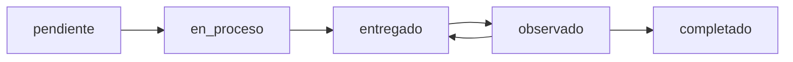
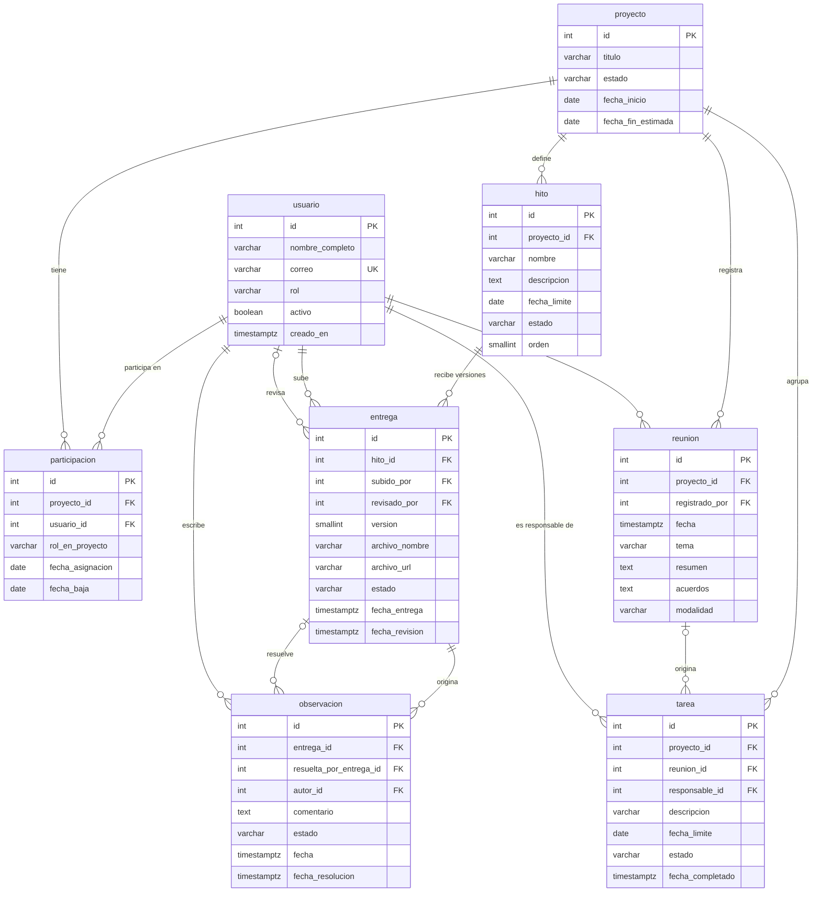

# Taller 1 — Bloque 1: Diseño

> [!info] Contexto
> Parte de [[Taller 1 - Enunciado]]. Caso de negocio: TesisTrack — ver [[Contexto]], [[Problema]], [[Objetivos]] y [[Alcance]].

> [!success] Modelo revisado el 2026-08-19
> La primera versión de esta nota se contrastó contra [[Funcionalidades]], [[Usuarios y roles]], [[Hitos]] y [[Reglas de negocio]], y se corrigieron los huecos encontrados. Las **8 entidades no cambiaron** —estaban bien identificadas—; lo que se reforzó fue la capa de atributos y restricciones. El detalle de cada corrección está en [[#Apéndice — qué se corrigió y por qué]].

## 1. Caso de negocio

TesisTrack centraliza el seguimiento del proceso de asesoría de tesis. Hoy esa información —acuerdos de reunión, tareas pendientes, versiones de documentos, observaciones del asesor— queda dispersa entre WhatsApp, correo y reuniones sueltas, y ni estudiante ni asesor tienen una vista clara del estado real del proyecto. El sistema no es un gestor académico completo: su único foco es dar **trazabilidad** al proceso de asesoría.

## 2. Usuarios

| Rol | Qué hace en el sistema |
|---|---|
| **Estudiante** | Ve su proyecto y sus hitos, sube entregas, consulta observaciones y tareas asignadas |
| **Asesor** | Define hitos, revisa entregas, deja observaciones, registra reuniones y las tareas que salen de ellas |
| **Coordinador** | Solo consulta cualquier proyecto — no crea ni edita nada |

Los tres roles comparten los mismos datos personales, así que se modelan en una única tabla `usuario` diferenciada por un campo `rol`. No se justifica una tabla `rol` aparte porque cada persona tiene un solo rol a la vez en el sistema.

> [!note] El rol global no alcanza para autorizar
> [[Usuarios y roles]] fija que el acceso se resuelve por **pertenencia al proyecto**, no solo por rol: un usuario con rol `asesor` no puede tocar un proyecto que no le fue asignado. Por eso el rol dentro de cada proyecto vive en `participacion`, no en `usuario`.

## 3. Entidades y atributos

Ocho entidades, nomenclatura `snake_case`, tablas en singular. Los dominios cerrados se implementan con **`VARCHAR` + `CHECK`**, no con `ENUM` nativo — ver [[#Por qué VARCHAR + CHECK y no ENUM]].

**`usuario`** — cualquier persona que entra al sistema.

| Atributo | Tipo | Restricción |
|---|---|---|
| `id` | INTEGER | **PK** |
| `nombre_completo` | VARCHAR(150) | NOT NULL |
| `correo` | VARCHAR(150) | NOT NULL, **UNIQUE** |
| `clave_hash` | VARCHAR(255) | NOT NULL |
| `rol` | VARCHAR(20) | NOT NULL, CHECK ∈ `estudiante`, `asesor`, `coordinador` |
| `activo` | BOOLEAN | NOT NULL, DEFAULT `true` |
| `creado_en` | TIMESTAMPTZ | NOT NULL, DEFAULT ahora |

**`proyecto`** — la tesis en sí, contenedor de todo lo demás.

| Atributo | Tipo | Restricción |
|---|---|---|
| `id` | INTEGER | **PK** |
| `titulo` | VARCHAR(250) | NOT NULL |
| `resumen` | TEXT | NULL |
| `estado` | VARCHAR(20) | NOT NULL, CHECK ∈ `en_curso`, `pausado`, `finalizado`, `cancelado` |
| `fecha_inicio` | DATE | NOT NULL |
| `fecha_fin_estimada` | DATE | NULL — fecha objetivo de sustentación |
| `creado_en` | TIMESTAMPTZ | NOT NULL, DEFAULT ahora |

**`participacion`** *(tabla intermedia)* — quién participa en qué proyecto y con qué rol dentro de él.

| Atributo | Tipo | Restricción |
|---|---|---|
| `id` | INTEGER | **PK** |
| `proyecto_id` | INTEGER | **FK** → `proyecto.id`, NOT NULL |
| `usuario_id` | INTEGER | **FK** → `usuario.id`, NOT NULL |
| `rol_en_proyecto` | VARCHAR(20) | NOT NULL, CHECK ∈ `estudiante`, `asesor`, `coasesor` |
| `fecha_asignacion` | DATE | NOT NULL, DEFAULT hoy |
| `fecha_baja` | DATE | NULL — si se llena, la persona dejó el proyecto |

Restricciones adicionales:

- `UNIQUE (proyecto_id, usuario_id)` — una persona aparece una sola vez por proyecto.
- **Índice único parcial** — un proyecto tiene a lo sumo **un asesor activo**:
  ```sql
  CREATE UNIQUE INDEX uq_un_asesor_por_proyecto
      ON participacion (proyecto_id)
      WHERE rol_en_proyecto = 'asesor' AND fecha_baja IS NULL;
  ```
  El `UNIQUE` común no sirve acá: evita duplicar personas, no roles. Sin el índice parcial nada impide tres asesores en el mismo proyecto.

> [!note] Se da de baja, no se borra
> Sacar la fila cuando alguien deja el proyecto borraría el historial de quién asesoró antes. En un sistema cuyo propósito es la trazabilidad eso es inaceptable, así que se marca `fecha_baja` — mismo criterio que `usuario.activo`.

**`hito`** — puntos de control planificados del proyecto (plan de tesis, marco teórico, borrador final...). Configurables por proyecto: cada tesis define los suyos.

| Atributo | Tipo | Restricción |
|---|---|---|
| `id` | INTEGER | **PK** |
| `proyecto_id` | INTEGER | **FK** → `proyecto.id`, NOT NULL |
| `nombre` | VARCHAR(150) | NOT NULL |
| `descripcion` | TEXT | NULL |
| `fecha_limite` | DATE | NOT NULL |
| `estado` | VARCHAR(20) | NOT NULL, DEFAULT `pendiente`, CHECK ∈ `pendiente`, `en_proceso`, `entregado`, `observado`, `completado` |
| `orden` | SMALLINT | NOT NULL |
| `creado_en` | TIMESTAMPTZ | NOT NULL, DEFAULT ahora |

Restricción adicional: `UNIQUE (proyecto_id, orden)`.

Los cinco estados son los de [[Hitos]], y hacen visible el ciclo de corrección completo:



> [!warning] No hay estado `vencido` — es información derivada
> Un hito atrasado se detecta con `fecha_limite < CURRENT_DATE AND estado NOT IN ('completado')`. Guardarlo como estado obligaría a un job nocturno que actualice filas, y entre corrida y corrida la tabla mentiría. Lo que se calcula no se almacena.

**`reunion`** — cada asesoría registrada. Los acuerdos van como texto libre dentro de la reunión; solo cuando un acuerdo tiene responsable y plazo se independiza como `tarea`.

| Atributo | Tipo | Restricción |
|---|---|---|
| `id` | INTEGER | **PK** |
| `proyecto_id` | INTEGER | **FK** → `proyecto.id`, NOT NULL |
| `registrado_por` | INTEGER | **FK** → `usuario.id`, NOT NULL |
| `fecha` | TIMESTAMPTZ | NOT NULL |
| `tema` | VARCHAR(200) | NOT NULL |
| `resumen` | TEXT | NULL — qué se conversó |
| `acuerdos` | TEXT | NULL — a qué se llegó |
| `modalidad` | VARCHAR(20) | NULL, CHECK ∈ `presencial`, `virtual` |

**`tarea`** — compromiso puntual con responsable y plazo.

| Atributo | Tipo | Restricción |
|---|---|---|
| `id` | INTEGER | **PK** |
| `proyecto_id` | INTEGER | **FK** → `proyecto.id`, NOT NULL |
| `reunion_id` | INTEGER | **FK** → `reunion.id`, **NULL** — solo si nació en una reunión |
| `responsable_id` | INTEGER | **FK** → `usuario.id`, NOT NULL |
| `descripcion` | VARCHAR(300) | NOT NULL |
| `fecha_limite` | DATE | NULL |
| `estado` | VARCHAR(20) | NOT NULL, DEFAULT `pendiente`, CHECK ∈ `pendiente`, `completada` |
| `fecha_completado` | TIMESTAMPTZ | NULL |
| `creado_en` | TIMESTAMPTZ | NOT NULL, DEFAULT ahora |

> [!important] La tarea pertenece al proyecto, no a la reunión
> Colgarla solo de `reunion` obligaba a inventar una reunión falsa para cualquier pendiente suelto (*"manda el consentimiento informado"*), y el panel de "tareas pendientes del proyecto" necesitaba dos saltos (`tarea → reunion → proyecto`). Con `proyecto_id` propio la tarea se consulta directo, y `reunion_id` queda como el origen **opcional** que preserva la trazabilidad cuando sí salió de una asesoría.
>
> *Contrapartida:* `tarea.proyecto_id` podría discrepar del proyecto de su reunión. Se blinda con FK compuesta — `reunion` lleva `UNIQUE (id, proyecto_id)` y `tarea` referencia el par `(reunion_id, proyecto_id)`.

**`entrega`** — cada versión de documento subida contra un hito.

| Atributo | Tipo | Restricción |
|---|---|---|
| `id` | INTEGER | **PK** |
| `hito_id` | INTEGER | **FK** → `hito.id`, NOT NULL |
| `subido_por` | INTEGER | **FK** → `usuario.id`, NOT NULL |
| `version` | SMALLINT | NOT NULL — correlativo dentro del hito |
| `archivo_nombre` | VARCHAR(255) | NOT NULL — el nombre que ve el usuario |
| `archivo_url` | VARCHAR(500) | NOT NULL — dónde está guardado |
| `comentario` | TEXT | NULL — nota del estudiante al subirla |
| `estado` | VARCHAR(20) | NOT NULL, DEFAULT `enviada`, CHECK ∈ `enviada`, `observada`, `aprobada` |
| `fecha_entrega` | TIMESTAMPTZ | NOT NULL, DEFAULT ahora |
| `revisado_por` | INTEGER | **FK** → `usuario.id`, NULL — quién la revisó |
| `fecha_revision` | TIMESTAMPTZ | NULL — cuándo |

Restricción adicional: `UNIQUE (hito_id, version)`. El correlativo lo calcula el backend (`MAX(version) + 1`); el `UNIQUE` es lo que hace segura esa operación ante dos subidas simultáneas — la segunda falla y se reintenta.

**`observacion`** — comentario del asesor sobre una entrega puntual, no sobre el hito en general.

| Atributo | Tipo | Restricción |
|---|---|---|
| `id` | INTEGER | **PK** |
| `entrega_id` | INTEGER | **FK** → `entrega.id`, NOT NULL — la entrega que la originó |
| `autor_id` | INTEGER | **FK** → `usuario.id`, NOT NULL |
| `comentario` | TEXT | NOT NULL |
| `estado` | VARCHAR(20) | NOT NULL, DEFAULT `pendiente`, CHECK ∈ `pendiente`, `atendida` |
| `fecha` | TIMESTAMPTZ | NOT NULL, DEFAULT ahora |
| `resuelta_por_entrega_id` | INTEGER | **FK** → `entrega.id`, NULL — la entrega que la corrigió |
| `fecha_resolucion` | TIMESTAMPTZ | NULL |

> [!tip] Las dos FK a `entrega` son lo que cierra la trazabilidad
> [[Reglas de negocio]] describe la cadena `Observación → Corrección → Nueva entrega`. Sin `resuelta_por_entrega_id` el modelo se corta en "Observación": marcar `atendida` es un booleano que no dice **qué versión** resolvió el comentario. Con las dos FK —una al origen, otra a la corrección— el asesor reconstruye el proceso completo.
>
> *Para el Bloque 2:* esa segunda FK va `ON DELETE SET NULL`, no `CASCADE` — borrar la entrega correctora no debe borrar la observación.

> [!note] Se llama `autor_id`, no `asesor_id`
> Nombrar la columna por un rol la amarra: si mañana observa un coasesor, el nombre miente. La FK apunta a `usuario`, no a "asesor".

## 4. Relaciones 1:1, 1:N y N:M

**N:M — la única del modelo.** `usuario` ↔ `proyecto`: un asesor guía varios proyectos; un proyecto tiene varios participantes (uno o dos estudiantes, un asesor, a veces un coasesor). Se resuelve con `participacion`:

```
usuario  1 ──< participacion >── N  proyecto
```

Tiene atributos propios (`rol_en_proyecto`, `fecha_asignacion`, `fecha_baja`), lo que confirma que amerita ser tabla y no solo un par de llaves.

**1:N — el resto del modelo.**

*De composición (el hijo no tiene sentido sin el padre):*

| Padre | Hijo | FK |
|---|---|---|
| `proyecto` | `hito` | `proyecto_id` |
| `proyecto` | `reunion` | `proyecto_id` |
| `proyecto` | `tarea` | `proyecto_id` |
| `hito` | `entrega` | `hito_id` |
| `entrega` | `observacion` | `entrega_id` |

*De origen (opcional — el hijo puede existir sin el padre):*

| Padre | Hijo | FK |
|---|---|---|
| `reunion` | `tarea` | `reunion_id` (NULL) |
| `entrega` | `observacion` | `resuelta_por_entrega_id` (NULL) |

*De autoría (quién generó o atendió el registro), todas desde `usuario`:*

| Hijo | FK |
|---|---|
| `reunion` | `registrado_por` |
| `entrega` | `subido_por` |
| `entrega` | `revisado_por` (NULL) |
| `observacion` | `autor_id` |
| `tarea` | `responsable_id` |

**1:1 — ninguna, y es la decisión correcta.** Se evaluó una candidata y se descartó: `hito` ↔ su entrega aprobada. Podría guardarse `entrega_aprobada_id` en `hito`, pero es información **derivable** (la entrega del hito con estado `aprobada`) — agregar la columna solo introduce riesgo de inconsistencia. Una relación 1:1 casi siempre es señal de que dos tablas deberían fusionarse; que no aparezca ninguna acá respalda que el modelo está bien separado.

## 5. Diagrama Entidad-Relación



## 6. Resumen de llaves

| Tabla           | PK   | FK                                                  | Restricciones únicas                                         |
| --------------- | ---- | --------------------------------------------------- | ------------------------------------------------------------ |
| `usuario`       | `id` | —                                                   | `correo`                                                     |
| `proyecto`      | `id` | —                                                   | —[[]]                                                        |
| `participacion` | `id` | `proyecto_id`, `usuario_id`                         | `(proyecto_id, usuario_id)` · índice parcial de asesor único |
| `hito`          | `id` | `proyecto_id`                                       | `(proyecto_id, orden)`                                       |
| `reunion`       | `id` | `proyecto_id`, `registrado_por`                     | `(id, proyecto_id)` — para la FK compuesta de `tarea`        |
| `tarea`         | `id` | `proyecto_id`, `reunion_id`, `responsable_id`       | —                                                            |
| `entrega`       | `id` | `hito_id`, `subido_por`, `revisado_por`             | `(hito_id, version)`                                         |
| `observacion`   | `id` | `entrega_id`, `resuelta_por_entrega_id`, `autor_id` | —                                                            |

**Total: 8 entidades, 8 PK, 14 FK, 1 relación N:M, 12 relaciones 1:N, 0 relaciones 1:1.**

## Apéndice — qué se corrigió y por qué

Registro de la revisión del 2026-08-19 contra los requisitos del vault. Ninguna corrección agregó entidades: las 8 originales estaban bien.

| Tabla | Corrección | Motivo |
|---|---|---|
| `hito` | Estados → los 5 de [[Hitos]] (`pendiente`, `en_proceso`, `entregado`, `observado`, `completado`) | La versión anterior usaba 4 estados que contradecían la Decisión 3, y al no tener `entregado`/`observado` borraba del modelo el ciclo de corrección |
| `hito` | Se eliminó `vencido` | Es derivable de `fecha_limite`; almacenarlo obliga a un job nocturno y deja la tabla desactualizada entre corridas |
| `hito` | + `descripcion` | [[Hitos]] lo lista como atributo |
| `reunion` | + `resumen`, + `modalidad` | [[Funcionalidades]] pide literal registrar fecha, tema, **resumen** y acuerdos |
| `observacion` | + `resuelta_por_entrega_id`, + `fecha_resolucion` | Sin esto la cadena de [[Reglas de negocio]] se cortaba: no se podía saber **qué entrega** corrigió una observación |
| `observacion` | `asesor_id` → `autor_id` | Nombrar la FK por un rol la amarra; un coasesor también observa |
| `entrega` | + `revisado_por`, + `fecha_revision` | No se podía responder "¿quién aprobó esto y cuándo?" en un sistema cuyo fin es la trazabilidad |
| `entrega` | + `archivo_nombre` | Con solo la URL no se puede mostrar un nombre legible en pantalla |
| `tarea` | + `proyecto_id` NOT NULL, `reunion_id` pasa a NULL | Permite tareas sueltas sin inventar reuniones, y evita dos saltos para listar pendientes del proyecto |
| `tarea` | + `fecha_completado` | El `estado` cambiaba sin dejar rastro de cuándo |
| `participacion` | + `fecha_baja` + índice único parcial | Nada impedía tres asesores en un proyecto, y sacar la fila borraba el historial de asesoría |
| `proyecto` | + `fecha_fin_estimada` | Fecha objetivo de sustentación, útil para el panel de estado |
| *(todas)* | `ENUM` → `VARCHAR` + `CHECK` | Ver abajo |

### Por qué `VARCHAR` + `CHECK` y no `ENUM`

Agregar un valor a un `CREATE TYPE` requiere `ALTER TYPE`, y quitar uno es prácticamente imposible sin recrear el tipo y todas las columnas que lo usan. Los estados de este proyecto **ya cambiaron una vez** —la corrección de `hito` en esta misma revisión lo demuestra—, así que conviene el mecanismo que se modifica con un `ALTER TABLE ... DROP CONSTRAINT` y listo. Además el enunciado del taller pide `CHECK` explícitamente entre los constraints a aplicar.

### Limitación conocida, resuelta fuera de la BD

Nada impide que un usuario con `rol = 'estudiante'` figure como `asesor` en `participacion`. Cerrarlo en la base requeriría una FK compuesta `(usuario_id, rol)` contra un `UNIQUE (id, rol)` en `usuario`, más una tabla de combinaciones válidas — sobredimensionado para una primera versión. Se valida en el backend y queda documentado acá.

## Ver también
- [[Taller 1 - Enunciado]]
- [[Reglas de negocio]]
- [[Hitos]]
- [[Usuarios y roles]]
