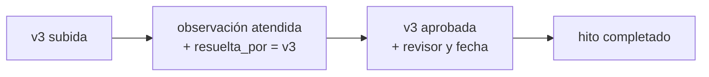

# Taller 1 — Bloque 3: Carga y manipulación de datos

> [!info] Contexto
> Parte de [[Taller 1 - Enunciado]]. Corre sobre el esquema de [[Taller 1 - Bloque 2 (Esquema)]]. El script completo es `03_datos.sql`, en la raíz del repo del taller.

> [!abstract] Qué pide el bloque
> Insertar datos de prueba con `INSERT INTO`, practicar `UPDATE` y `DELETE FROM` sobre el esquema propio, y verificar que los datos respeten las restricciones y relaciones definidas.

## 1. El escenario — datos elegidos, no rellenos

Tres tesis en puntos distintos del proceso. Cada una existe para que el Bloque 4 tenga algo real que consultar:

| Proyecto | Integrantes | Asesor | Para qué está |
|---|---|---|---|
| **Rutas de transporte urbano** | Diego | Jorge | El **ciclo de corrección completo**: v1 observada → v2 → v3 aprobada. Además tiene un hito **atrasado** |
| **Trazabilidad de cadena de frío** | Valeria + Andrés (grupal) | Patricia, con Jorge de coasesor | Un **cambio de asesor**: Ricardo dado de baja y Patricia activa. Una entrega **revisada con observación abierta**, y otra **sin revisar todavía** |
| **Deserción estudiantil** | Lucía | **ninguno** | El caso del `LEFT JOIN`: un proyecto sin asesor, sin hitos y sin reuniones |

**8 usuarios · 3 proyectos · 8 participaciones · 7 hitos · 4 reuniones · 6 tareas · 7 entregas · 4 observaciones.**

> [!note] Las dos entregas del proyecto 2 cubren estados distintos a propósito
> `Marco teórico v1` está **revisada y observada**, con su observación todavía abierta — alimenta el contador de pendientes del panel y es la única fila donde el `LEFT JOIN` de la consulta C1 devuelve `NULL` en la entrega correctora. `Prototipo v1` está **sin revisar**, y es la que aparece en la bandeja del asesor (consulta A2). Sin las dos, uno de los dos casos quedaría sin datos que mostrar.

> [!tip] El proyecto sin asesor no es un descuido
> Es coherente con la regla de negocio: los hitos los crea el asesor ([[Hitos]]), así que un proyecto sin asesor asignado **no puede tener hitos todavía**. Los datos respetan la lógica del dominio, no solo las restricciones de la base.

## 2. Cómo se resuelven las referencias sin inventar `id`

Las PK son `GENERATED ALWAYS AS IDENTITY`: **no se pueden escribir a mano**. Así que las FK se resuelven con subconsultas sobre las columnas que sí son únicas:

```sql
INSERT INTO participacion (proyecto_id, usuario_id, rol_en_proyecto, fecha_asignacion)
SELECT p.id, u.id, 'asesor', '2026-03-05'
FROM proyecto p, usuario u
WHERE p.titulo LIKE 'Sistema de recomendación%'
  AND u.correo = 'jorge.salinas@tesistrack.com';
```

Es más largo que poner `(1, 2, 'asesor')`, pero tiene dos ventajas: el script se puede volver a correr desde cero sin ajustar números, y **se lee** — dice a quién asigna, no un id.

### El caso de `tarea`: la FK compuesta se resuelve sola

```sql
INSERT INTO tarea (proyecto_id, reunion_id, responsable_id, descripcion, fecha_limite)
SELECT r.proyecto_id, r.id, u.id, '...', '2026-07-01'
FROM reunion r, usuario u
WHERE r.tema = 'Avance del marco teórico' AND u.correo = '...';
```

`proyecto_id` sale **de la propia reunión**. Así la FK compuesta `(reunion_id, proyecto_id) → reunion (id, proyecto_id)` no puede quedar incoherente ni por error de tipeo.

## 3. Los `DEFAULT` en acción

Varios `INSERT` **omiten columnas a propósito** para que se vea que el `DEFAULT` funciona:

| Se omite | Queda en | Dónde |
|---|---|---|
| `usuario.activo`, `usuario.creado_en` | `TRUE`, `now()` | Los 8 usuarios |
| `proyecto.estado` | `'en_curso'` | Los 3 proyectos |
| `tarea.estado` | `'pendiente'` | Las tareas sin completar |
| `entrega.estado` | `'enviada'` | La v1 del marco teórico del proyecto 2 |
| `observacion.estado` | `'pendiente'` | La observación sobre las citas APA |

## 4. `UPDATE` — el ciclo de corrección, paso a paso

La secuencia no son sentencias sueltas: es **la historia que el sistema tiene que poder contar**.



| # | Sentencia | Qué demuestra |
|---|---|---|
| **a** | Marcar la observación como `atendida` y cargar `resuelta_por_entrega_id` | El eslabón que cierra la cadena: no solo *que* se resolvió, sino **con qué entrega** |
| **b** | Aprobar la v3 cargando `revisado_por` **y** `fecha_revision` en la misma sentencia | `ck_entrega_revision` no acepta uno sin el otro |
| **c** | Cerrar el hito | Lo hace el asesor a mano; resolver una observación no cambia el estado del hito |
| **d** | Completar una tarea cargando `estado` **y** `fecha_completado` juntos | Mismo patrón que **b**: `ck_tarea_completado` exige coherencia |
| **e** | Reprogramar la fecha límite de un hito vencido | Los hitos se pueden editar siempre ([[Hitos]]) |
| **f** | `activo = FALSE` sobre un usuario que deja la plataforma | **No se borra a nadie**: es la contracara del `ON DELETE RESTRICT` |

> [!important] Por qué **b** y **d** son la misma lección
> Hay columnas que solo tienen sentido juntas. Si el `UPDATE` toca una y olvida la otra, el `CHECK` rechaza la operación entera. La base no deja que el sistema quede a medio camino.

## 5. `DELETE` — qué sale y qué frena la base

| # | Operación | Resultado |
|---|---|---|
| **a** | Borrar una tarea duplicada | ✅ Sale limpio — nada cuelga de `tarea` |
| **b** | Borrar un hito sin entregas | ✅ Sale limpio — el `CASCADE` no encuentra hijos |
| **c** | Borrar un usuario con historial | ❌ **`ON DELETE RESTRICT` lo impide** |
| **d** | Borrar una reunión con tareas | ✅ La reunión se va, **las tareas sobreviven** con `reunion_id` en `NULL` |
| **e** | Borrar un proyecto | ✅ Arrastra en cascada participaciones, hitos, reuniones, tareas, entregas y observaciones |

**(c) es el que más dice del diseño.** El error que devuelve:

```
ERROR:  update or delete on table "usuario" violates foreign key
        constraint "fk_entrega_subido_por" on table "entrega"
```

No es un problema: es la base defendiendo la trazabilidad. La forma correcta de "dar de baja" a alguien con historial es el `UPDATE (f)` del punto anterior.

**(d) es la prueba de que la FK compuesta está bien pensada.** Al borrar la reunión, `ON DELETE SET NULL (reunion_id)` anula **solo esa columna** y deja `proyecto_id` intacto — la tarea sigue siendo un compromiso del proyecto aunque su reunión de origen ya no exista.

> [!note] Los `DELETE` destructivos van en `BEGIN ... ROLLBACK`
> Las demostraciones **(c)**, **(d)** y **(e)** se ejecutan dentro de una transacción que se revierte. Así se ve el comportamiento real sin perder los datos que el Bloque 4 necesita — sobre todo el proyecto sin asesor, que es el caso del `LEFT JOIN`.

## 6. Verificación — las restricciones responden

Diez violaciones intencionales, comentadas en el script para descomentar de a una:

| Restricción | Intento | Error |
|---|---|---|
| `UNIQUE` | Repetir un correo | `uq_usuario_correo` |
| `CHECK` de dominio | `rol = 'administrador'` | `ck_usuario_rol` |
| `CHECK` de formato | Correo sin `@` | `ck_usuario_correo_formato` |
| **Índice único parcial** | Un segundo asesor activo en el mismo proyecto | `uq_un_asesor_por_proyecto` |
| `UNIQUE` compuesto | Dos hitos con el mismo `orden` | `uq_hito_orden` |
| `CHECK` de coherencia | Tarea `completada` sin fecha de cierre | `ck_tarea_completado` |
| `CHECK` de coherencia | Revisor sin fecha de revisión | `ck_entrega_revision` |
| `CHECK` de lógica | Una entrega corrigiendo su propia observación | `ck_observacion_no_autocorreccion` |
| `FOREIGN KEY` | Entrega contra un hito inexistente | `fk_entrega_hito` |
| **FK compuesta** | Tarea apuntando a una reunión de **otro proyecto** | `fk_tarea_reunion` |

Las dos últimas filas de la tabla son las que vale la pena mostrar en la sustentación: son restricciones que **ninguna base las pone sola**, se diseñaron a propósito en el Bloque 2.

## 7. Control final

El script termina con un conteo por tabla:

```sql
SELECT 'usuario' AS tabla, count(*) AS filas FROM usuario
UNION ALL SELECT 'proyecto', count(*) FROM proyecto
...
ORDER BY tabla;
```

Esperado: `usuario 8 · proyecto 3 · participacion 8 · hito 7 · reunion 4 · tarea 6 · entrega 7 · observacion 4`.

Si algún número no coincide, algo del script falló en silencio.

> [!success] Verificado contra PostgreSQL 16.14 el 2026-08-20
> El script corrió completo con `ON_ERROR_STOP=1` y **los ocho conteos dieron exactos**. Se corrió dos veces seguidas para confirmar que es **idempotente**: el `DROP TABLE IF EXISTS` del esquema permite repetirlo sin ajustar nada.
>
> Las 10 violaciones intencionales del §6 fallaron cada una con el error documentado — los mensajes de los comentarios están comprobados, no supuestos.
>
> La demostración **(d)** salió como estaba diseñada: al borrar la reunión, la tarea *"Contactar a una exportadora para el piloto"* quedó con `reunion_id` en `NULL` y `proyecto_id = 2` intacto. Es la prueba en vivo de que `ON DELETE SET NULL (reunion_id)` anula solo esa columna.

## Ver también
- [[Taller 1 - Enunciado]]
- [[Taller 1 - Bloque 2 (Esquema)]]
- [[Reglas de negocio]]
