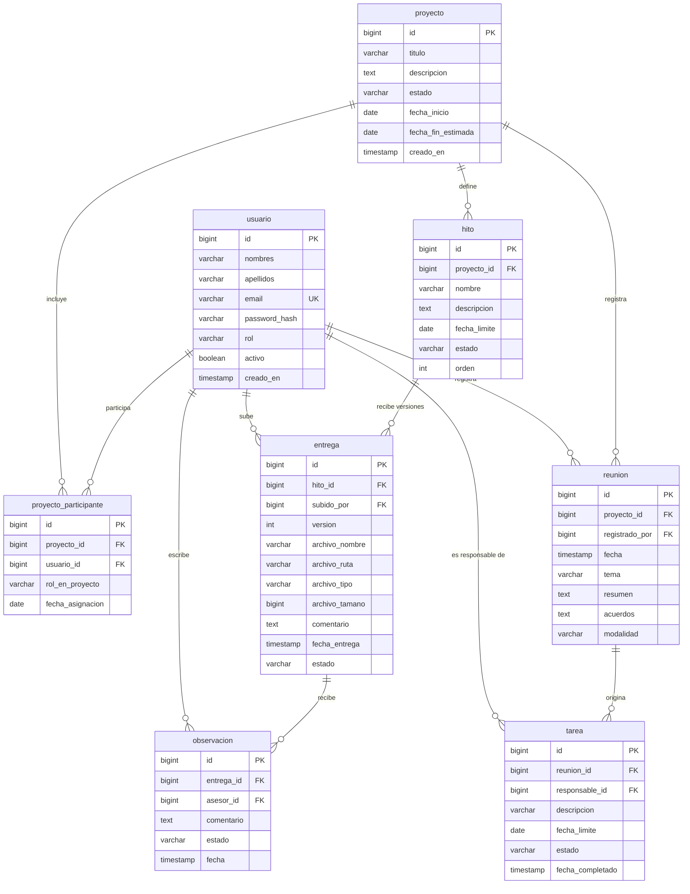

# Taller 1 — Exposición

> [!info] Qué es esta nota
> Recorte de [[Taller 1 - Base de datos desde cero]] con solo los tres puntos que van a exponer en clase: el ERD, el enunciado del caso de negocio y el script de creación del esquema. El resto (carga de datos, `UPDATE`/`DELETE`, consultas de negocio) queda en la nota completa — acá va lo que se muestra en la presentación.

---

## 1. Diagrama ERD



8 entidades · 8 PK · 11 FK · 1 relación N:M (`usuario`↔`proyecto`, resuelta en `proyecto_participante`) · 0 relaciones 1:1 (evaluadas y descartadas a propósito — ver el razonamiento en [[Taller 1 - Base de datos desde cero#4. Relaciones 1:1, 1:N y N:M]]).

> [!note] Si piden una imagen en vez del código Mermaid
> Pegar el bloque de arriba en [mermaid.live](https://mermaid.live) y exportar como PNG o SVG — ahí también se puede ajustar el layout a mano antes de exportar.

---

## 2. Enunciado del caso de negocio

### El problema

Durante el desarrollo de una tesis, estudiante y asesor generan mucha información: acuerdos de reuniones, tareas pendientes, fechas de entrega, versiones de documentos, observaciones de corrección. Hoy esa información **no vive en un solo lugar** — se reparte entre WhatsApp, correo electrónico y lo que cada quien recuerda de la última reunión. Nadie tiene una fuente única para saber en qué estado real está una tesis.

### La solución — TesisTrack

Una plataforma que centraliza dos flujos de trabajo alrededor de cada proyecto de tesis:

- **Seguimiento del documento**: `hito` → `entrega` (versiones) → `observacion`.
- **Seguimiento de las reuniones**: `reunion` → `tarea`.

### Usuarios

| Rol | Qué hace en el sistema |
|---|---|
| **Estudiante** | Consulta su proyecto e hitos, sube entregas, ve observaciones y tareas asignadas |
| **Asesor** | Gestiona hitos, revisa entregas, deja observaciones, registra reuniones y tareas |
| **Coordinador** | Consulta cualquier proyecto — solo lectura, no crea ni edita nada |

### Alcance de esta primera versión

**Incluye:**
- Registro de usuarios con rol (estudiante, asesor, coordinador)
- Un proyecto de tesis con uno o más estudiantes y un asesor (más un coasesor opcional), vía `proyecto_participante`
- Hitos ordenados y con fecha límite
- Reuniones de asesoría con acuerdos en texto libre
- Tareas que nacen de una reunión, con responsable y estado
- Entregas versionadas contra un hito, con su archivo referenciado
- Observaciones del asesor sobre una entrega puntual

**Fuera de alcance por ahora** (quedan para una iteración posterior, no son parte del modelo mínimo):
- Organización del asesor en carpetas/áreas para manejar varios grupos de tesistas a la vez
- Repartir una misma actividad a todos los asesorados de un área de una sola vez
- Almacenar el archivo binario de la entrega dentro de la base — acá se guarda la ruta, no el contenido
- Historial como tabla propia — se reconstruye con una consulta, no se persiste como evento

---

## 3. Script SQL — creación del esquema

```sql
-- ---------------------------------------------------------------
-- TesisTrack — Taller 1, esquema v1 (8 tablas)
-- ---------------------------------------------------------------

CREATE TABLE usuario (
    id            BIGSERIAL     PRIMARY KEY,
    nombres       VARCHAR(100)  NOT NULL,
    apellidos     VARCHAR(100)  NOT NULL,
    email         VARCHAR(150)  NOT NULL UNIQUE,
    password_hash VARCHAR(255)  NOT NULL,
    rol           VARCHAR(20)   NOT NULL
                  CHECK (rol IN ('ESTUDIANTE', 'ASESOR', 'COORDINADOR')),
    activo        BOOLEAN       NOT NULL DEFAULT TRUE,
    creado_en     TIMESTAMP     NOT NULL DEFAULT now()
);

CREATE TABLE proyecto (
    id                 BIGSERIAL    PRIMARY KEY,
    titulo             VARCHAR(250) NOT NULL,
    descripcion        TEXT,
    estado             VARCHAR(20)  NOT NULL DEFAULT 'EN_CURSO'
                       CHECK (estado IN ('EN_CURSO', 'PAUSADO', 'FINALIZADO', 'CANCELADO')),
    fecha_inicio       DATE         NOT NULL DEFAULT CURRENT_DATE,
    fecha_fin_estimada DATE,
    creado_en          TIMESTAMP    NOT NULL DEFAULT now()
);

-- Resuelve la N:M usuario<->proyecto. rol_en_proyecto distingue
-- estudiante, asesor o coasesor dentro de un mismo proyecto.
CREATE TABLE proyecto_participante (
    id               BIGSERIAL    PRIMARY KEY,
    proyecto_id      BIGINT       NOT NULL
                      REFERENCES proyecto (id) ON DELETE CASCADE ON UPDATE NO ACTION,
    usuario_id       BIGINT       NOT NULL
                      REFERENCES usuario (id) ON DELETE RESTRICT ON UPDATE NO ACTION,
    rol_en_proyecto  VARCHAR(20)  NOT NULL
                      CHECK (rol_en_proyecto IN ('ESTUDIANTE', 'ASESOR', 'COASESOR')),
    fecha_asignacion DATE         NOT NULL DEFAULT CURRENT_DATE,
    CONSTRAINT uk_participante UNIQUE (proyecto_id, usuario_id)
);

CREATE TABLE hito (
    id           BIGSERIAL    PRIMARY KEY,
    proyecto_id  BIGINT       NOT NULL
                 REFERENCES proyecto (id) ON DELETE CASCADE ON UPDATE NO ACTION,
    nombre       VARCHAR(150) NOT NULL,
    descripcion  TEXT,
    fecha_limite DATE         NOT NULL,
    estado       VARCHAR(20)  NOT NULL DEFAULT 'PENDIENTE'
                 CHECK (estado IN ('PENDIENTE', 'EN_PROGRESO', 'COMPLETADO', 'VENCIDO')),
    orden        INT          NOT NULL,
    CONSTRAINT uk_hito_orden UNIQUE (proyecto_id, orden)
);

CREATE TABLE reunion (
    id             BIGSERIAL    PRIMARY KEY,
    proyecto_id    BIGINT       NOT NULL
                    REFERENCES proyecto (id) ON DELETE CASCADE ON UPDATE NO ACTION,
    registrado_por BIGINT       NOT NULL
                    REFERENCES usuario (id) ON DELETE RESTRICT ON UPDATE NO ACTION,
    fecha          TIMESTAMP    NOT NULL,
    tema           VARCHAR(200) NOT NULL,
    resumen        TEXT,
    acuerdos       TEXT,
    modalidad      VARCHAR(20)
                   CHECK (modalidad IN ('PRESENCIAL', 'VIRTUAL'))
);

CREATE TABLE tarea (
    id               BIGSERIAL    PRIMARY KEY,
    reunion_id       BIGINT       NOT NULL
                      REFERENCES reunion (id) ON DELETE CASCADE ON UPDATE NO ACTION,
    responsable_id   BIGINT       NOT NULL
                      REFERENCES usuario (id) ON DELETE RESTRICT ON UPDATE NO ACTION,
    descripcion      VARCHAR(300) NOT NULL,
    fecha_limite     DATE,
    estado           VARCHAR(20)  NOT NULL DEFAULT 'PENDIENTE'
                      CHECK (estado IN ('PENDIENTE', 'COMPLETADA')),
    fecha_completado TIMESTAMP
);

CREATE TABLE entrega (
    id             BIGSERIAL    PRIMARY KEY,
    hito_id        BIGINT       NOT NULL
                    REFERENCES hito (id) ON DELETE CASCADE ON UPDATE NO ACTION,
    subido_por     BIGINT       NOT NULL
                    REFERENCES usuario (id) ON DELETE RESTRICT ON UPDATE NO ACTION,
    version        INT          NOT NULL,
    archivo_nombre VARCHAR(255) NOT NULL,
    archivo_ruta   VARCHAR(500) NOT NULL,
    archivo_tipo   VARCHAR(100),
    archivo_tamano BIGINT,
    comentario     TEXT,
    fecha_entrega  TIMESTAMP    NOT NULL DEFAULT now(),
    estado         VARCHAR(20)  NOT NULL DEFAULT 'ENVIADA'
                   CHECK (estado IN ('ENVIADA', 'EN_REVISION', 'OBSERVADA', 'APROBADA')),
    CONSTRAINT uk_entrega_version UNIQUE (hito_id, version)
);

CREATE TABLE observacion (
    id         BIGSERIAL   PRIMARY KEY,
    entrega_id BIGINT      NOT NULL
               REFERENCES entrega (id) ON DELETE CASCADE ON UPDATE NO ACTION,
    asesor_id  BIGINT      NOT NULL
               REFERENCES usuario (id) ON DELETE RESTRICT ON UPDATE NO ACTION,
    comentario TEXT        NOT NULL,
    estado     VARCHAR(20) NOT NULL DEFAULT 'PENDIENTE'
               CHECK (estado IN ('PENDIENTE', 'ATENDIDA')),
    fecha      TIMESTAMP   NOT NULL DEFAULT now()
);
```

El detalle de por qué cada `ON DELETE`/`ON UPDATE` es esa y no otra, más los índices recomendados, está en [[Taller 1 - Base de datos desde cero#Bloque 2 — Esquema]].

## Ver también
- [[Taller 1 - Diálogo de sustentación (Bloques 1 y 2)]] — este mismo contenido, en formato pregunta-respuesta para defender oralmente
- [[Taller 1 - Base de datos desde cero]] — nota completa, con carga de datos, `UPDATE`/`DELETE` y consultas de negocio
- [[Base de datos]] — el esquema de producción de TesisTrack, para contraste
