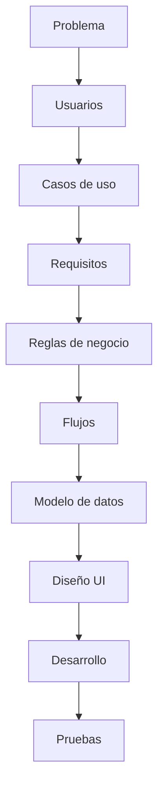

# TesisTrack

> [!abstract] Pregunta central
> ¿Cómo podemos facilitar el seguimiento de una tesis centralizando las asesorías, hitos, tareas, entregas y observaciones en un solo lugar?
>
> Si una funcionalidad no ayuda directamente a responder esa pregunta, evaluar si realmente pertenece al alcance de TesisTrack.

**Nombre completo:** TesisTrack – Plataforma web para el seguimiento de asesorías de tesis.

## Mapa del proyecto

### 01 - Proyecto
- [[Contexto]]
- [[Problema]]
- [[Objetivos]]
- [[Alcance]]
- [[Entregables y evaluación]]
- [[Entregable 0 - Conceptualización]] — el documento formal a entregar
- [[Auditoría de requisitos]] — qué falta contra el enunciado, y en qué orden conviene hacerlo

### 02 - Requisitos
- [[Funcionalidades]]
- [[Usuarios y roles]]
- [[Reglas de negocio]]

### 03 - Diseño
- [[Hitos]]
- [[Flujo del sistema]]
- [[Base de datos]]
- [[API]]
- [[Arquitectura]]

### 04 - Reuniones
- [[Feedback profesor]]

### 05 - Decisiones
- [[Decisiones pendientes]]

### 06 - Desarrollo
- [[Desarrollo]] — estado por entregable, cómo levantar el proyecto, usuarios de prueba

## Estado actual

> [!success] Al 2026-08-16 — Entregables 1 y 2 hechos, el 3 en curso
> - **Las 8 decisiones de alcance están cerradas**, más la 9, 10 y 11 que salieron durante el desarrollo. Las 4 preguntas que había dejado el profesor quedaron respondidas: hitos configurables por proyecto y creados por el asesor, plataforma general.
> - **Entregable 1 (Modelo de datos)** — ER y esquema en [[Base de datos]], verificado contra PostgreSQL.
> - **Entregable 2 (Backend)** — API REST documentada en [[API]], 31 pruebas end-to-end pasando.
> - **Entregable 3 (Full-stack)** 🔨 — andan landing, registro en dos pasos con política de privacidad, Dashboard, Proyectos, Hitos, Entregas, Observaciones, carpetas con código de invitación y Mis asesorados.

> [!warning] Auditoría del 2026-08-16 — el 45% de la nota está sin empezar
> Se contrastó lo construido contra el enunciado: los Entregables 1 y 2 están sólidos, pero el **4 (15%)** y la **Competencia Final (30%)** no tienen nada, y al 3 le faltan **Asesorías** y **Tareas**, que son funcionalidades listadas en [[Funcionalidades]].
>
> Además, varias cosas construidas últimamente **no las pide el enunciado**. El detalle, el veredicto de cada una y el orden sugerido están en [[Auditoría de requisitos]].

**Lo que sigue**, por nota por hora invertida: commitear lo que ya anda → **Asesorías + Tareas** (cierra el Entregable 3) → **Entregable 4** (CI/CD y despliegue) → preparar la **Competencia Final**.

## Enfoque de trabajo

No se quiere comenzar a programar sin antes cerrar definiciones de alcance, para evitar reescribir funcionalidades.
