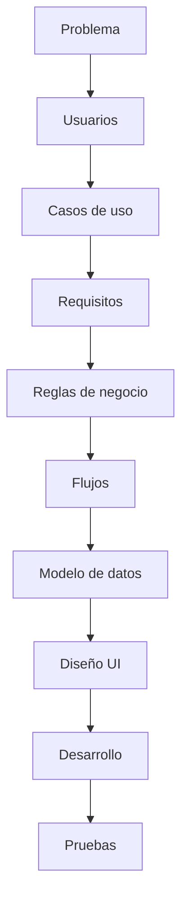

# TesisTrack

> [!abstract] Pregunta central
> ¿Cómo podemos facilitar el seguimiento de una tesis centralizando las asesorías, hitos, tareas, entregas y observaciones en un solo lugar?
>
> Si una funcionalidad no ayuda directamente a responder esa pregunta, evaluar si realmente pertenece al alcance de TesisTrack.

**Nombre completo:** TesisTrack – Plataforma web para el seguimiento de asesorías de tesis.

## Mapa del proyecto

### 01 - Proyecto
- [[Contexto]]
- [[Problema]]
- [[Objetivos]]
- [[Alcance]]
- [[Entregables y evaluación]]

### 02 - Requisitos
- [[Funcionalidades]]
- [[Usuarios y roles]]
- [[Reglas de negocio]]

### 03 - Diseño
- [[Hitos]]
- [[Flujo del sistema]]
- [[Base de datos]]
- [[API]]
- [[Arquitectura]]

### 04 - Reuniones
- [[Feedback profesor]]

### 05 - Decisiones
- [[Decisiones pendientes]]

### 06 - Desarrollo
- [[Desarrollo]] — estado por entregable, cómo levantar el proyecto, usuarios de prueba

## Estado actual

> [!success] Al 2026-08-16 — Entregables 1 y 2 hechos
> - **Las 8 decisiones pendientes están cerradas.** Las 4 preguntas que había dejado el profesor quedaron respondidas: hitos configurables por proyecto y creados por el asesor, plataforma general.
> - **Entregable 1 (Modelo de datos)** — ER y esquema en [[Base de datos]], 8 tablas verificadas contra PostgreSQL.
> - **Entregable 2 (Backend)** — API REST documentada en [[API]], 31 pruebas end-to-end pasando.
> - **Login** implementado y con diseño propio en el frontend.

Lo que sigue: **Entregable 3 — Aplicación full-stack**, conectando el frontend React a la API ya construida.

## Enfoque de trabajo

No se quiere comenzar a programar sin antes cerrar definiciones de alcance, para evitar reescribir funcionalidades.
