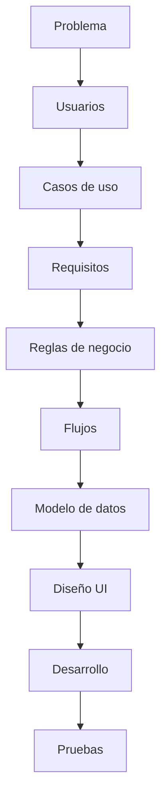

# TesisTrack

> [!abstract] Pregunta central
> ¿Cómo podemos facilitar el seguimiento de una tesis centralizando las asesorías, hitos, tareas, entregas y observaciones en un solo lugar?
>
> Si una funcionalidad no ayuda directamente a responder esa pregunta, evaluar si realmente pertenece al alcance de TesisTrack.

**Nombre completo:** TesisTrack – Plataforma web para el seguimiento de asesorías de tesis.

## Mapa del proyecto

### 01 - Proyecto
- [[Contexto]]
- [[Problema]]
- [[Objetivos]]
- [[Alcance]]
- [[Entregables y evaluación]]
- [[Entregable 0 - Conceptualización]] — el documento formal a entregar
- [[Auditoría de requisitos]] — qué falta contra el enunciado, y en qué orden conviene hacerlo

### 02 - Requisitos
- [[Funcionalidades]]
- [[Usuarios y roles]]
- [[Reglas de negocio]]

### 03 - Diseño
- [[Hitos]]
- [[Flujo del sistema]]
- [[Base de datos]]
- [[API]]
- [[Arquitectura]]

### 04 - Reuniones
- [[Feedback profesor]]

### 05 - Decisiones
- [[Decisiones pendientes]]

### 06 - Desarrollo
- [[Desarrollo]] — estado por entregable, cómo levantar el proyecto, usuarios de prueba

### 07 - Talleres
- [[Taller 1 - Enunciado]] — ejercicio de sesión, no calificado como entregable. Diseño hecho desde cero el 2026-08-19; las notas anteriores del taller (v1 de 8 tablas, exposición, diálogo de sustentación, v2 con catálogos) ya no están en el vault
- [[Taller 1 - Bloque 1 (Diseño)]] — caso, usuarios, entidades, relaciones y ERD
- [[Taller 1 - Bloque 2 (Esquema)]] — `CREATE TABLE`, constraints, acciones referenciales e índices
- [[Taller 1 - Bloque 3 (Carga y manipulación)]] — datos de prueba, `UPDATE`, `DELETE` y verificación de restricciones
- [[Taller 1 - Bloque 4 (Consultas)]] — preguntas de negocio, `JOIN`, `LEFT JOIN`, agregación y validación
- [[Taller 1 - Bloque 5 (Cierre y exposición)]] — guion de presentación, decisiones a defender y preguntas probables

## Estado actual

> [!success] Al 2026-10-07 — Entregables 1, 2 y 3 hechos en funcionalidad; el 4 empezado
> - **Decisiones 1 a 28 documentadas**. La Fase 1.5 agrega vocabulario, salón con pestañas, Dashboard agregado, privadas opcionales (ajuste D11) y vista previa por firma. La Fase 1.6 agrega el semáforo En riesgo (D26, ajusta la D23) y la guía visual (D27). Queda por confirmar un código personal para privadas y el umbral de riesgo de 3 días. Las 4 preguntas del profesor quedaron respondidas: hitos configurables creados por el asesor, plataforma general.
> - **Entregable 1 (Modelo de datos)** — esquema versionado con **Flyway** (`V1`) y validado por Hibernate; verificado contra un PostgreSQL vacío el 2026-10-07. Ver [[Base de datos]].
> - **Entregable 2 (Backend)** — API REST en [[API]]. Se re-verificó el 2026-10-07 con 371 comprobaciones HTTP (permisos, ciclo completo, coordinador de solo lectura, tesis grupal, borrado). **Esas pruebas todavía no están en el repo**: el único test es `contextLoads`.
> - **Entregable 3 (Full-stack)** — funcionalidad integrada; menú del coordinador verificado como Dashboard, Tesis e Hitos, con lectura global y sin gestión. **Taller 2** (Flyway, MapStruct, Lombok) entregado el 2026-09-20.
> - **Entregable 4 (CI/CD)** 🔨 — Dockerfiles, `docker-compose.yml` del stack completo y dos workflows que publican las imágenes en ghcr.io (en verde el 2026-10-03). Falta el CI con tests, el despliegue en AWS/Vercel y un `JWT_SECRET` real.

> [!info] En curso — tanda de cierre (2026-10-07)
> - ✅ **Fase 0** (errores): borrar espacio con actividades, títulos invisibles en modo oscuro y puerto de desarrollo — ver [[Desarrollo#Fase 0 - Errores corregidos (2026-10-07)]].
> - ✅ **Fase 1** (el espacio como aula): materiales en carpetas, sesiones y asesorías con enlace, y *Próximas reuniones* en los Dashboards — ver [[Desarrollo#Fase 1 - El espacio como aula (2026-10-07)]] y las decisiones [[Decisiones pendientes#Decisión 19 - Cómo se organizan los materiales del espacio|19]] y [[Decisiones pendientes#Decisión 20 - Reuniones con enlace - sesiones del espacio y asesorías programadas|20]].
> - ✅ **Fase 1.5**: clases con pestañas, Personas, Dashboard agregado, privadas opcionales y vista previa segura. 101 checks E2E propios, 62 de regresión, 52 de migración legacy; contraste sin incidencias. Ver [[Desarrollo#Fase 1.5 - Clases y vistas (2026-10-07)]]. Rama apilada sobre el #8, que depende del #6, lista para revisión.
> - ✅ **Fase 1.6** (rediseño visual): guía visual aplicada al panel con el logo y el login intactos (comprobado píxel a píxel), y semáforo Al día / En riesgo / Atrasado / Sin empezar. Además, el visor permite observar y aprobar. 76 checks propios más toda la regresión en verde. Ver [[Desarrollo#Fase 1.6 - Rediseño visual (2026-10-07)]]. Rama apilada sobre el #9.
> - ✅ **Mensajes privados** (pedido de Oscar): uno a uno entre quienes comparten una tesis; el coordinador no participa (D28, migración V4). Ver [[Desarrollo#Mensajes privados (2026-10-07)]]. Rama apilada sobre el #10.
> - ⏸️ **Fase 2**: primer ingreso del estudiante (y los asistentes de las maquetas 06 y 07), **sin empezar hasta el OK de Oscar**. “Tema por definir” ya tiene presentación; el asistente y los grupos con tope siguen pendientes.

> [!warning] La [[Auditoría de requisitos]] es del 2026-08-16 y quedó desfasada
> Su "45% de la nota sin empezar" ya no vale: el Entregable 4 tiene la parte de Docker y el pipeline de imágenes. Sigue vigente su regla de trabajo: **antes de construir, verificar si está en [[Funcionalidades]]**, y si no está, decidirlo a conciencia y anotarlo.

**Lo que sigue**, por nota por hora invertida: terminar la tanda de cierre → **CI con tests y despliegue** (Entregable 4) → preparar la **Competencia Final** (datos de demo limpios, guion y pitch).

## Enfoque de trabajo

```mermaid
graph TD
    A[Problema] --> B[Usuarios]
    B --> C[Casos de uso]
    C --> D[Requisitos]
    D --> E[Reglas de negocio]
    E --> F[Flujos]
    F --> G[Modelo de datos]
    G --> H[Diseño UI]
    H --> I[Desarrollo]
    I --> J[Pruebas]
```

No se quiere comenzar a programar sin antes cerrar definiciones de alcance, para evitar reescribir funcionalidades.
